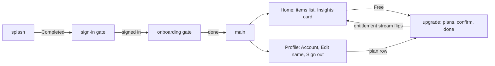

# Kotlin Multiplatform Tutorial Series: Duet in Nine Steps

The nine tutorials as Markdown, beside the step trees they build. The same
pages render with site navigation and search at
[docs.modaal.dev/tutorials/duet](https://docs.modaal.dev/tutorials/duet). Each page links the
two trees it uses; [the repository README](../README.md) lists every tree and
how to run its checks.

This series teaches Duet, Modaal's cross-platform parity framework for native iOS and Android apps, by building one app from its first feature to its analytics. You write each feature's logic once in Kotlin, mount it in a SwiftUI app and a Jetpack Compose app, and record its behavior so a CI gate replays the same recordings on both platforms. Nine tutorials, each with a starting tree you open and a finished tree you can compare against, all in the public [duet-tutorials repository](https://github.com/modaal-agent/duet-tutorials).

> [!NOTE]
> **The manual setup below is what Modaal automates.** Every tree this tutorial
> opens and every file it asks you to write is produced by the Duet templates in
> [Modaal](https://modaal.dev), and a coding agent working in Modaal writes the
> feature, records it and runs the checks for you. This series walks the same
> ground by hand so you know what the scaffold emits and why:
> [start a Duet project in Modaal](https://docs.modaal.dev/articles/new-project)
> when you would rather skip the setup.

## What will you build?

The app is **Foyer**: a splash screen with a safety net, a sign-in gate, a three-step onboarding gate, a home with one paid feature behind an entitlement check, a three-step upgrade flow, and a profile tree three levels deep. The screens are generic; the flows are the ones most consumer apps share. Every arrow in the diagram below is a delegate event received as a parent action, every screen is mounted from state, and the paid check reads one entitlement value that only an entitlement stream writes.

The backend is on the device: four ports (auth, purchases, items, account) with local implementations that persist to a JSON file. Running any tree needs no account, no store connection and no network.

## The nine tutorials

- **[Tutorial 1: Your First Feature](duet-01-first-feature.md)** — State, actions and effects as data; a pure reducer; a scenario recorded into four fixtures and replayed on the host lane; the test-clock suite. No UI.
- **[Tutorial 2: One Behavior, Two Apps](duet-02-two-apps.md)** — The Kotlin core built into an Apple framework, the four recordings replayed across the Swift boundary, then a SwiftUI app and a Compose app that play the same splash from the same core and land on the same placeholder screen.
- **[Tutorial 3: Composing Features](duet-03-composing-features.md)** — A parent level, children mounted from state, a child's delegate events received as parent actions, chain scenarios pinning the sign-in gate and a sign-out climbing four levels, and the four ports behind per-platform mock services.
- **[Tutorial 4: Workers](duet-04-workers.md)** — An on-device backend replacing the mock services one for one; session and entitlement streams observed by workers adopted at mount and tested with the worker harness; the entitlement projected down as a slice; the home's locked card unlocking from the stream.
- **[Tutorial 5: Navigation as State](duet-05-navigation-as-state.md)** — Route state, back as an action, process-death restore on Android, a deep link parsed into route state, and onboarding steps as siblings sharing their progress through lateral state.
- **[Tutorial 6: The Checks in CI](duet-06-checks-in-ci.md)** — Lanes and the manifest, the parity workflow in your own repository, and the mutation drill run both directions.
- **[Tutorial 7: Theming with Design Tokens](duet-07-theming.md)** — A token vocabulary, generated accessors on both platforms, and a second theme that changes no feature code.
- **[Tutorial 8: Localizing the App](duet-08-localization.md)** — String catalogs on iOS, resources on Android, semantic values in shared state, and recordings that do not change with a translation.
- **[Tutorial 9: Adding Analytics](duet-09-analytics.md)** — The app's event verbs emitted from reducers as effect data, a console sink worker, and events asserted in scenarios.

Tutorials 1 to 6 build on each other in order. Tutorials 7, 8 and 9 each start from Tutorial 6's finished tree, so you can take them in any order. Every starting tree from Tutorial 2 onward is the previous tutorial's finished tree plus one deliberately failing test, the closing exercise; Tutorial 1 starts from an empty project.

## What do you need installed?

- **macOS with Xcode 26.6.** Tutorial 1 uses none of it; Tutorial 2 onward builds the iOS app and the Kotlin/Native framework it consumes.
- **A JDK, version 25.** The Gradle wrapper in every tree fetches Gradle itself, and the Kotlin compiler arrives as a Gradle plugin; there is no separate Kotlin install.
- **Android Studio's SDK** from Tutorial 2 onward, for the Compose app. [Set up the Android toolchain](https://docs.modaal.dev/guides/setup-android) lists the components.
- **XcodeGen** (`brew install xcodegen`) from Tutorial 2 onward. The iOS app's Xcode project is generated from `src-ios/App/xcodegen.yml`.
- **The `duet` command-line tool** is fetched by each tree's `tools/duet` wrapper at the pinned version on first use.

## Which versions are the tutorials verified against?

Every tree resolves the same family set, written once in the repository's `pins.env`: Duet 0.7.0, duet-tools 0.24.0 and duet-services 0.11.1, with Kotlin 2.4.10 and Gradle 9.7.1. The repository's CI runs every tree's checks on every push, so a tree that stops passing at those versions fails the build there rather than on your machine. When the family moves, the trees are re-pinned in one change and the repository is tagged for the set they were verified against. Two pages add pins of their own: Tutorial 2 adds SKIE 0.10.14, the Swift projection of the Kotlin/Native framework, and Tutorial 3 adds the KSP mock processor 0.2.1 and the Sourcery mocks bundle 0.6.2.

## What does the series teach?

One loop, repeated per feature. Write the feature's state, actions and effect payloads as data and its reducer as a pure function in Kotlin. Describe its behavior as a scenario in the fixture-authoring language, and record the scenario into fixture files. The Kotlin lane replays the fixtures against the reducer; from Tutorial 2, the Apple boundary lane replays the same fixtures through the framework the iOS app consumes, and CI fails when either lane disagrees with the bytes on disk. Each app keeps its own native interface and its own platform code for anything the shared logic cannot own. The [Duet overview](https://docs.modaal.dev/articles/duet) states the architecture; the [glossary](https://docs.modaal.dev/articles/duet-glossary) defines each term the tutorials use. The pages call a recorded file a recording; the `duet` tool, the manifest and the `parity/fixtures/` directory call the same file a fixture.

The two tables below map each concept the series teaches to the tutorials that treat it, so you can open the step that introduces a concept without reading the series in order; each link lands on that step. The first table covers Duet's own vocabulary, each term defined in the [glossary](https://docs.modaal.dev/articles/duet-glossary).

| Duet concept | What the tutorials do with it | Tutorials |
| --- | --- | --- |
| Feature: state, actions, effect payloads and a pure reducer | The splash is written as one state field, three actions and two effect payloads; every later feature on the tree takes the same shape | [Tutorial 1](duet-01-first-feature.md#write-the-state-the-actions-and-the-effect-payloads), [Tutorial 3](duet-03-composing-features.md#write-the-sign-in-gate) |
| Effects as data, the environment and the effect handler | The reducer asks for a wait or a notification as a value; the handler, the module's only impure code, performs it through the environment interface; an analytics event is one more effect | [Tutorial 1](duet-01-first-feature.md#add-the-environment-and-the-runtime), [Tutorial 3](duet-03-composing-features.md#write-the-sign-in-gate), [Tutorial 9](duet-09-analytics.md#emit-them-as-track-effects) |
| Store, kernel and `TestStore` | The store factory both shells call, effect ids with cancel-in-flight semantics, and the exhaustive `finish()` that fails on an unreceived action or a running effect | [Tutorial 1](duet-01-first-feature.md#add-the-environment-and-the-runtime), [Tutorial 2](duet-02-two-apps.md#write-the-consumer-package-and-the-store-mirror) |
| Scenario and behavior recording | A given, `whenAction` steps and `then` checks, with branches over one given; recorded into fixture files, replayed by a golden test, and held to the scenario by `record --check` | [Tutorial 1](duet-01-first-feature.md#describe-the-behavior-as-a-scenario-and-record-it), [Tutorial 8](duet-08-localization.md#exercise-pin-the-receipt) |
| Chain recording | The seam between two features pinned as a `hop`: the delegate one reducer emits, received by the next as its action | [Tutorial 3](duet-03-composing-features.md#pin-the-seams-with-chain-recordings), [Tutorial 5](duet-05-navigation-as-state.md#exercise-record-the-entitlement-chain), [Tutorial 9](duet-09-analytics.md#assert-them-in-the-scenarios-and-re-record) |
| Feature spec and the manifest | `parity/manifest.yaml` names each feature's types, scenario and recordings; `parity/feature-specs/` describes the feature in prose the tool cross-checks | [Tutorial 1](duet-01-first-feature.md#declare-the-feature-in-the-manifest-and-write-its-spec), [Tutorial 6](duet-06-checks-in-ci.md#read-the-lanes-the-manifest-derives) |
| Shell and its three duties | Intents into actions, state into view state, the store's lifetime bracketed; mounting children from state is the fourth duty, and a shell never resolves a string | [Tutorial 2](duet-02-two-apps.md#write-the-swift-shell), [Tutorial 3](duet-03-composing-features.md#compose-the-tree-on-android), [Tutorial 8](duet-08-localization.md#move-the-shells-strings-into-the-views) |
| The Apple boundary | The Kotlin core as an XCFramework, SKIE's Swift projection, the recordings replayed across the boundary, the `BridgedStore` mirror, and Kotlin flows read as async sequences | [Tutorial 2](duet-02-two-apps.md#declare-the-apple-framework-module), [Tutorial 4](duet-04-workers.md#write-the-workers-on-ios), [Tutorial 9](duet-09-analytics.md#wire-the-sink-on-ios) |
| Host, mount and `ChildSlot` | A host builds a store, owns its slot and tears it down; a slot mounts at most one child from a state value, including a sheet | [Tutorial 2](duet-02-two-apps.md#build-the-ios-app), [Tutorial 3](duet-03-composing-features.md#compose-the-tree-on-android), [Tutorial 5](duet-05-navigation-as-state.md#mount-the-flow-in-each-platforms-idiom) |
| Delegate events received as parent actions | Every arrow up the tree is a child's delegate event, one case of the parent's action type | [Tutorial 3](duet-03-composing-features.md#write-the-root-level), [Tutorial 5](duet-05-navigation-as-state.md#write-the-upgrade-flow) |
| Composition: Dependency, Component and Builder | A per-level Dependency, a Component that forwards it and owns level-scoped objects, and a Builder constructed once per mount, on both platforms | [Tutorial 3](duet-03-composing-features.md#compose-the-tree-on-android), [Tutorial 4](duet-04-workers.md#delete-the-mock-services-one-for-one), [Tutorial 9](duet-09-analytics.md#wire-the-sink-on-android) |
| Ports | Callback-shaped interfaces the logic calls and each app implements, first as mock services, then as on-device repositories with streams | [Tutorial 3](duet-03-composing-features.md#declare-the-four-ports), [Tutorial 4](duet-04-workers.md#add-the-two-streams-to-the-ports) |
| Workers and `WorkerTester` | An object adopted at mount that observes a stream for the mount's lifetime and sends what it sees; tested behaviorally, never recorded | [Tutorial 4](duet-04-workers.md#write-the-workers-on-android), [Tutorial 5](duet-05-navigation-as-state.md#share-readiness-laterally), [Tutorial 9](duet-09-analytics.md#wire-the-sink-on-android) |
| Slices: state projected down | The root's entitlement reaches two tabs as an action of their own; the onboarding page reaches the progress row the same way | [Tutorial 4](duet-04-workers.md#project-the-entitlement-down-as-a-slice), [Tutorial 5](duet-05-navigation-as-state.md#share-readiness-laterally) |
| Lateral state between siblings | A worker owned by the lowest common ancestor, with a void update on one side and a sticky observation on the other | [Tutorial 5](duet-05-navigation-as-state.md#share-readiness-laterally) |
| Navigation as route state | Back as an action, a deep link parsed into a value and forwarded down the tree, a route spine saved before process death and applied as initial state | [Tutorial 5](duet-05-navigation-as-state.md#draw-the-routes-before-the-screens) |
| The checks and the lanes | `verify`, `lint`, `doctor`, `record --check`, `mocks --check`, `protocol-run` and the lanes report; what each proves and what its red names | [Tutorial 1](duet-01-first-feature.md#replay-the-recordings), [Tutorial 3](duet-03-composing-features.md#generate-the-swift-components-and-mocks), [Tutorial 6](duet-06-checks-in-ci.md#know-what-each-command-proves) |
| Generated code held by a check | Environment mocks from KSP, Swift Components and mocks from Sourcery, token vocabularies from one YAML file, each a build product with a drift check | [Tutorial 3](duet-03-composing-features.md#generate-the-kotlin-test-doubles), [Tutorial 7](duet-07-theming.md#read-what-was-generated) |
| Mutation drill | Rows that seed one defect each into a reducer; the recordings must catch every row, and a surviving row names the recording to write | [Tutorial 6](duet-06-checks-in-ci.md#write-the-first-mutation-rows) |
| Behavior versus presentation | What a recording sees and what it does not: a reveal animation, a sheet against a bottom sheet, a color token, a translated string | [Tutorial 2](duet-02-two-apps.md#write-the-swiftui-view), [Tutorial 5](duet-05-navigation-as-state.md#mount-the-flow-in-each-platforms-idiom), [Tutorial 7](duet-07-theming.md#bind-the-cards), [Tutorial 8](duet-08-localization.md#make-what-the-logic-says-a-value) |
| Design tokens and themes | A token vocabulary generated for both platforms, and a second theme as one mapping per platform | [Tutorial 7](duet-07-theming.md#declare-the-vocabulary) |
| Telemetry grammar and `Track` effects | Events emitted by the reducer that owns the transition, a console sink worker behind one fan-out per platform | [Tutorial 9](duet-09-analytics.md#declare-the-events-beside-the-reducers) |

The second table covers the engineering practice the series exercises along the way.

| Engineering practice | What the tutorials do with it | Tutorials |
| --- | --- | --- |
| Gradle multi-module project with a version catalog | One module per feature, a replay-runner application, an umbrella framework module, and pins written once | [Tutorial 1](duet-01-first-feature.md#declare-the-feature-module), [Tutorial 2](duet-02-two-apps.md#declare-the-apple-framework-module) |
| Unit tests on virtual time | `runTest`, `advanceTimeBy` and a clock seam, so a three-second timer and a thirty-minute session expiry both run in milliseconds | [Tutorial 1](duet-01-first-feature.md#pin-the-safety-nets-timing-on-a-test-clock), [Tutorial 2](duet-02-two-apps.md#test-the-host-on-the-jvm), [Tutorial 4](duet-04-workers.md#write-the-on-device-backend) |
| Golden tests | Recorded output replayed byte for byte, on the JVM and across the Swift boundary | [Tutorial 1](duet-01-first-feature.md#replay-the-recordings), [Tutorial 2](duet-02-two-apps.md#replay-the-recordings-across-the-boundary) |
| Test doubles | A hand-written double for one interface, generated doubles once there are several | [Tutorial 1](duet-01-first-feature.md#pin-the-safety-nets-timing-on-a-test-clock), [Tutorial 3](duet-03-composing-features.md#generate-the-kotlin-test-doubles) |
| Integration tests over a composition root | One headless walk through the whole tree on the JVM and one across the boundary in Swift, including a restore after process death | [Tutorial 3](duet-03-composing-features.md#test-the-composition-roots), [Tutorial 5](duet-05-navigation-as-state.md#gather-the-route-spine-and-restore-from-it) |
| Building a Kotlin/Native XCFramework | An umbrella module with `export`, an assemble script, SwiftPM binary targets, and an XcodeGen spec with a build pre-action | [Tutorial 2](duet-02-two-apps.md#assemble-the-framework-with-one-script) |
| Dependency injection with per-level interfaces | A Dependency per level kept as narrow as the level's reads, satisfied by the parent's Component at compile time | [Tutorial 3](duet-03-composing-features.md#compose-the-tree-on-android) |
| Persistence | An on-device backend persisting one JSON document through a two-function file port, with memory files in tests | [Tutorial 4](duet-04-workers.md#write-the-on-device-backend) |
| Reactive streams | `StateFlow` on Kotlin and async sequences on Swift, sticky values for late subscribers, and a fan-out over sinks | [Tutorial 4](duet-04-workers.md#add-the-two-streams-to-the-ports), [Tutorial 5](duet-05-navigation-as-state.md#share-readiness-laterally), [Tutorial 9](duet-09-analytics.md#wire-the-sink-on-android) |
| Idempotency guards | An arming latch, an in-flight latch and a late-completion guard, each pinned by a recording; three guards drilled by mutation rows | [Tutorial 1](duet-01-first-feature.md#write-the-reducer), [Tutorial 3](duet-03-composing-features.md#write-the-sign-in-gate), [Tutorial 6](duet-06-checks-in-ci.md#run-the-table-and-read-the-row-that-survives) |
| Deep links, state restoration and back handling | URL schemes on both platforms, the instance `Bundle` and the scene restoration activity, and a back policy as pure predicates with a test | [Tutorial 5](duet-05-navigation-as-state.md#grow-the-root-the-second-gate-and-the-deep-link) |
| Continuous integration on GitHub Actions | One workflow with a macOS job and an ubuntu job, a toolchain cache, a nightly job and a job summary | [Tutorial 6](duet-06-checks-in-ci.md#put-the-checks-in-a-workflow) |
| Mutation testing | Exact-string edits to reducers, run one at a time against the full suite | [Tutorial 6](duet-06-checks-in-ci.md#write-the-first-mutation-rows) |
| Code generation with a drift check | Generated files committed as build products and compared against an in-memory regeneration on every push | [Tutorial 3](duet-03-composing-features.md#generate-the-swift-components-and-mocks), [Tutorial 7](duet-07-theming.md#read-what-was-generated) |
| Accessibility | WCAG contrast ratios asserted in tests, Dynamic Type scaling, and a theme selected by the system's contrast setting | [Tutorial 7](duet-07-theming.md#link-the-engines-and-declare-the-main-theme) |
| Localization | String catalogs with a build-tool plugin, Android resources, plurals, positional placeholders, per-app language, and a completeness test per platform | [Tutorial 8](duet-08-localization.md#write-the-catalogs-and-link-the-generator) |
| Product analytics | An event taxonomy spelled for a dashboard, parameters that describe behavior and never content, and consent gated at the sink | [Tutorial 9](duet-09-analytics.md#mint-the-apps-verb) |

## Common questions

<b>Do I need to know Kotlin and Swift both?</b>

Tutorial 1 is Kotlin only. From Tutorial 2 each page shows the Swift and Kotlin halves of every per-platform step in tabs; the shared logic stays Kotlin throughout. Reading SwiftUI and Compose is enough to follow; the shells are short.

<b>Can I start at a later tutorial?</b>

Yes. Open that tutorial's `-start` tree from the repository; it is the previous tutorial's finished state plus the exercise stub. Tutorials 7 to 9 all start from Tutorial 6's finished tree.

<b>Why is the backend on the device?</b>

So every tree runs with no account, no store and no network, and so the feature logic reaches the outside world only through the four port interfaces. A real backend implements the same ports; nothing in the feature modules changes.

<b>What is the difference between this series and the Modaal templates?</b>

The trees the series opens have the shape the [Duet templates in Modaal](https://docs.modaal.dev/articles/new-project) emit. The series writes by hand what the scaffold and a coding agent produce for you, so you can read an emitted project and know what each file is for.

## Sources and further reading

- [The duet-tutorials repository](https://github.com/modaal-agent/duet-tutorials) — the step trees, their checks and the pins file.
- [The Duet framework repository](https://github.com/modaal-agent/duet) — the kernel, the test harness and the framework's contracts.
- [The duet-tools repository](https://github.com/modaal-agent/duet-tools) — the `duet` command-line tool the trees run their checks with, and the manifest grammar.
- [Kotlin Multiplatform documentation](https://kotlinlang.org/docs/multiplatform.html) — the technology under the shared core.

## Read next

- **[Tutorial 1: Your First Feature](duet-01-first-feature.md)** — Write the splash feature in Kotlin, record its behavior and verify it, with no UI yet.
- **[Duet: one shared core, two native apps](https://docs.modaal.dev/articles/duet)** — What Duet is, what you get, and the two project cards that scaffold it.
