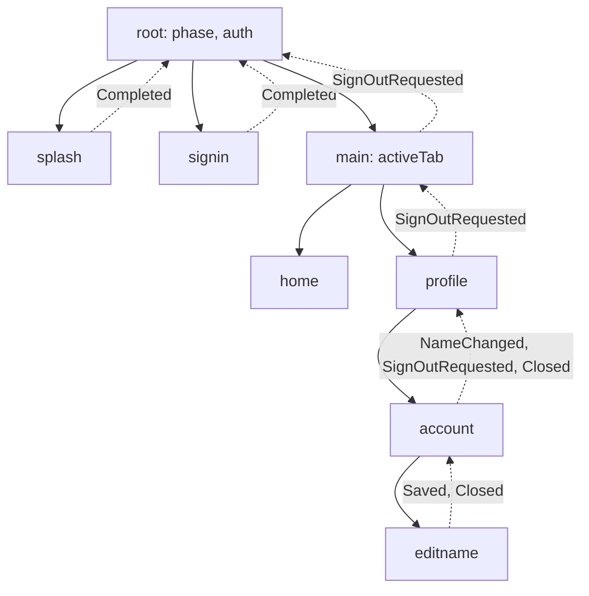
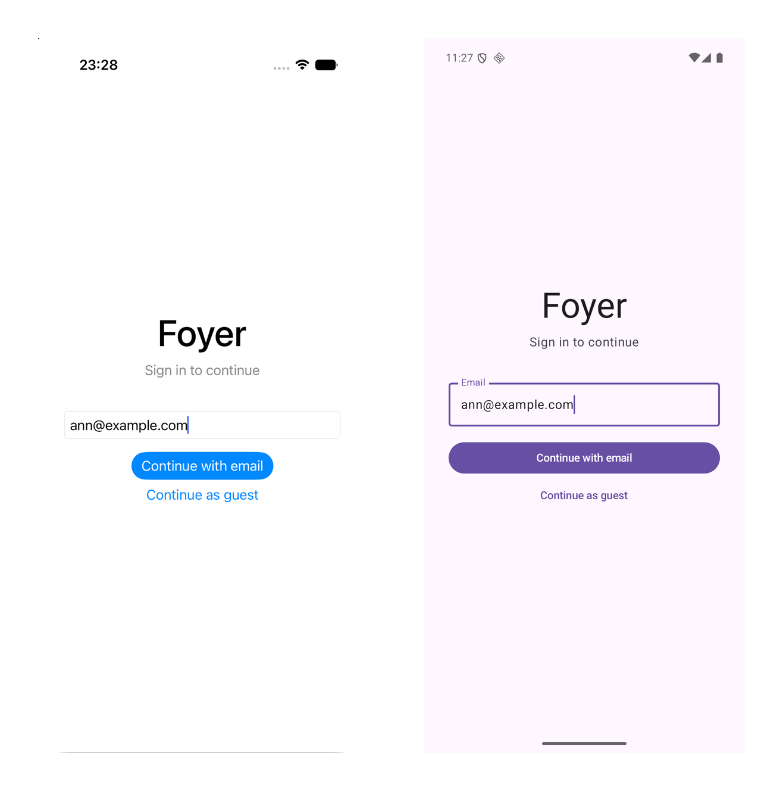
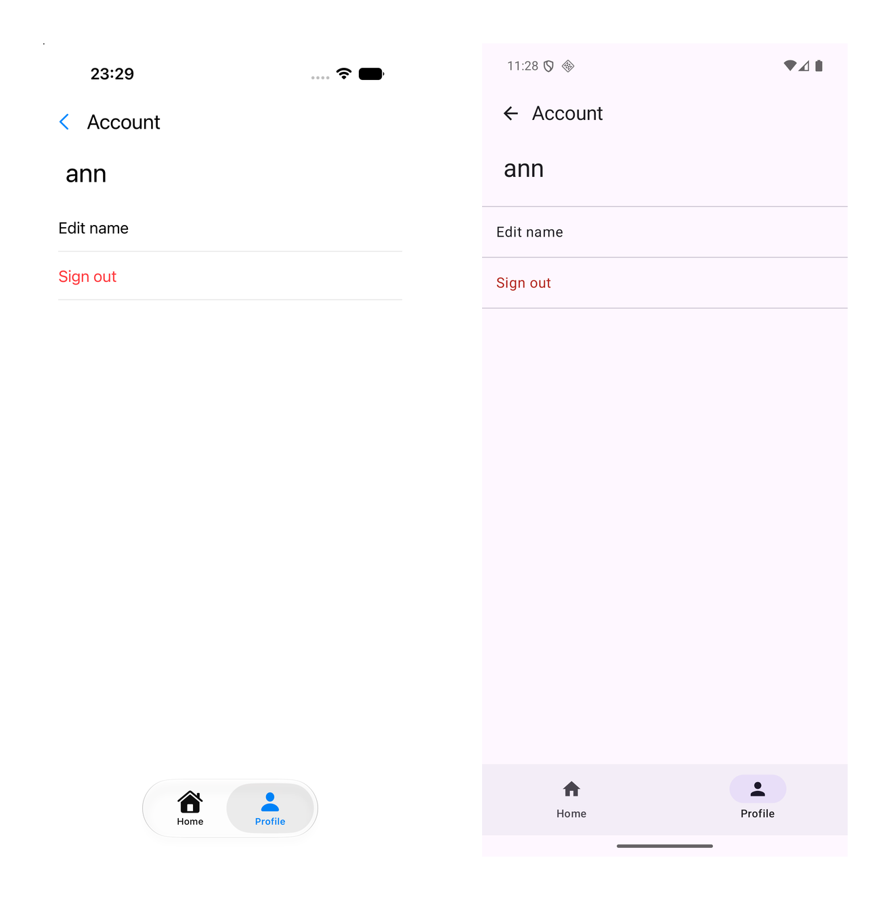

# Duet Tutorial 3: Composing Features

[Series overview](README.md) · [← Tutorial 2: One Behavior, Two Apps](duet-02-two-apps.md) · [Tutorial 4: Workers →](duet-04-workers.md) · [On docs.modaal.dev](https://docs.modaal.dev/tutorials/duet-03-composing-features)

Trees: [`tutorial3-start/`](../tutorial3-start) is what you open, [`tutorial3-complete/`](../tutorial3-complete) is what you have at the end. Run either tree's checks with `scripts/run-tree.sh tutorial3-start`.

In this tutorial you grow the splash from [Tutorial 2](duet-02-two-apps.md) into a tree of eight features. A `root` level mounts exactly one child from its phase: the splash, then a sign-in gate, then `main` with a home tab and a profile tab; the profile tab mounts an account screen, which mounts a name editor. Every arrow up the tree is a child's delegate event, received by the parent as one of its own actions; every arrow down is a mount decided by state. You write the composition triple, a Dependency, a Component and a Builder, at each level on both platforms, put four mock services behind four ports, and record the seams as chains so `tools/duet verify` fails when a shell forwards the wrong event. This is the third page of the [nine-tutorial series](README.md).

> [!NOTE]
> **The manual setup below is what Modaal automates.** Every tree this tutorial
> opens and every file it asks you to write is produced by the Duet templates in
> the [Modaal](https://modaal.dev) new-project wizard, and a coding agent working
> in Modaal writes the feature, records it and runs the checks for you. This
> series walks the same ground by hand so you know what the scaffold emits and
> why: [start a Duet project in the wizard](https://docs.modaal.dev/articles/new-project)
> when you would rather skip the setup.

## What will you build?

The tree below, in Kotlin, with a SwiftUI app and a Compose app mounting it from the same core. Each box is a feature module with its own state, actions, reducer and recordings; the solid arrows are mounts, the dashed ones are delegate events climbing back up.



The logic reaches the outside world through four ports: auth, purchases, items and account. In this tutorial each port is implemented by a mock service, a class with canned data written twice, once in Swift and once in Kotlin, as product sources of each app. [Tutorial 4](duet-04-workers.md#delete-the-mock-services-one-for-one) replaces them one for one with the on-device backend. Expect about three hours; the Swift half is the longer one.

You will have at the end:

- Eight feature modules under `src-kmp/subtrees/`, seven of them new, and a `ports` module, with 28 recordings under `parity/fixtures/`.
- Four chain recordings, `chain-root-splash`, `chain-root-signin`, `chain-main-signout` and `chain-profile-editname`, each pinning a seam between two features.
- Generated test doubles on both sides: `<Name>EnvironmentMock` classes from the KSP processor on the JVM, and `<Name>DependencyMock` classes and `<Name>Component` forwarders from `tools/duet mocks` in Swift.
- The composition triple at every level of the tree on both platforms, and a passing composition test on each: `RootFlowTest` on the JVM and `RootCompositionSpec` in the Swift shells lane.
- Both apps walking the same tree: splash, sign-in, the tabs, the account screen and the name editor.

## Where do you start?

Open `tutorial3-start` from the [duet-tutorials repository](https://github.com/modaal-agent/duet-tutorials). It is Tutorial 2's finished tree plus one failing test, the closing exercise, and it resolves Duet 0.7.0, duet-tools 0.24.0, duet-services 0.11.1 and the KSP mock processor 0.2.1. The toolchain is Tutorial 2's: Xcode 26.6, a JDK 25, XcodeGen and the Android SDK with platform 36. Run the checks once before you edit anything:

```sh
tools/duet verify
```

The Kotlin lane reports 11 tests with one failure, `Tutorial3ExerciseEditNameChainTest`; that is the exercise, and everything else is green. `TUTORIAL_SKIP_STUBS=1 tools/duet verify` leaves the stub out and ends with `duet verify: PASS`.

## The steps

### Declare the four ports

A port is an interface the logic calls and each app implements. The four live in one common-code module, `src-kmp/ports`, together with the value types they carry. Every operation starts the work and returns; the result comes back through a callback that fires exactly once. That shape is deliberate: a Swift class can implement a Kotlin interface across the framework boundary only when its members are plain functions, and a `suspend` member cannot be implemented from Swift.

**`src-kmp/ports/src/commonMain/kotlin/dev/modaal/foyer/ports/Ports.kt`**

```kotlin src-kmp/ports/src/commonMain/kotlin/dev/modaal/foyer/ports/Ports.kt
interface AuthPort {
  fun signIn(provider: SignInProvider, onOutcome: (SignInOutcome) -> Unit)

  fun signOut(onDone: () -> Unit)
}

interface PurchasesPort {
  fun plans(onPlans: (List<PlanOffer>) -> Unit)

  fun purchase(plan: Plan, onOutcome: (PurchaseOutcome) -> Unit)
}

interface ItemsPort {
  fun items(onItems: (List<Item>) -> Unit)
}

interface AccountPort {
  fun saveDisplayName(name: String, onSaved: () -> Unit)
}
```

The value types above them, `SignInProvider`, `SignInOutcome`, `Plan`, `PlanOffer`, `PurchaseOutcome` and `Item`, are `@Serializable` with the canonical sum serializers from Tutorial 1, because they appear inside feature state and actions and so inside the recordings. A one-line helper turns the callback shape back into a suspending call for the effect handlers:

**`src-kmp/ports/src/commonMain/kotlin/dev/modaal/foyer/ports/Callbacks.kt`**

```kotlin src-kmp/ports/src/commonMain/kotlin/dev/modaal/foyer/ports/Callbacks.kt
suspend fun <T> awaitCallback(start: (onResult: (T) -> Unit) -> Unit): T =
  suspendCancellableCoroutine { continuation -> start { continuation.resume(it) } }
```

Include the module in the settings file and check with `(cd src-kmp && ./gradlew :ports:compileKotlinJvm -q)`.

### Write the root level

The root is the app's spine. Its state is a phase that names exactly one child, an auth snapshot, and a latch for a splash that finishes before the session is known. Its actions are its children's delegate events, one case per child, plus the host's `AuthChanged` report.

**`src-kmp/subtrees/root/logic/src/commonMain/kotlin/dev/modaal/foyer/root/RootFeature.kt`**

```kotlin src-kmp/subtrees/root/logic/src/commonMain/kotlin/dev/modaal/foyer/root/RootFeature.kt
/** Which child the root mounts. Tutorial 5 adds `Onboarding`. */
@Serializable(with = RootPhaseSerializer::class)
sealed interface RootPhase {
  @Serializable @SerialName("splash") data object Splash : RootPhase

  @Serializable @SerialName("signIn") data object SignIn : RootPhase

  @Serializable @SerialName("main") data object Main : RootPhase
}

/** What the root knows about the session. Seeded by the host at mount. */
@Serializable(with = AuthSnapshotSerializer::class)
sealed interface AuthSnapshot {
  @Serializable @SerialName("unknown") data object Unknown : AuthSnapshot

  @Serializable @SerialName("signedOut") data object SignedOut : AuthSnapshot

  @Serializable @SerialName("signedIn") data class SignedIn(val displayName: String) : AuthSnapshot
}

@Serializable
data class RootState(
  val phase: RootPhase = RootPhase.Splash,
  val auth: AuthSnapshot = AuthSnapshot.Unknown,
  /** The splash finished before auth was known; the phase moves on `AuthChanged`. */
  val awaitingAuth: Boolean = false,
)
```

**`src-kmp/subtrees/root/logic/src/commonMain/kotlin/dev/modaal/foyer/root/RootFeature.kt`**

```kotlin src-kmp/subtrees/root/logic/src/commonMain/kotlin/dev/modaal/foyer/root/RootFeature.kt
sealed interface RootAction {
  /** The splash's delegate events, received as this level's actions. */
  @Serializable @SerialName("splash") data class Splash(val event: SplashDelegateEvent) : RootAction

  /** The sign-in gate's delegate events. */
  @Serializable @SerialName("signIn") data class SignIn(val event: SignInDelegateEvent) : RootAction

  /** The main level's delegate events. */
  @Serializable @SerialName("main") data class Main(val event: MainDelegateEvent) : RootAction

  /** Host report: the session changed. Tutorial 4's session worker sends this. */
  @Serializable @SerialName("authChanged") data class AuthChanged(val auth: AuthSnapshot) : RootAction
}
```

The reducer routes. A finished splash goes to the gate or straight to main by the snapshot, or sets the latch when the snapshot is still unknown; the gate's completion signs the session in; a `SignOutRequested` climbing from anywhere under main raises the gate again. A `Completed` that arrives after the splash phase is inert, because both splash paths notify and only the first one may move the app.

**`src-kmp/subtrees/root/logic/src/commonMain/kotlin/dev/modaal/foyer/root/RootFeature.kt`**

```kotlin src-kmp/subtrees/root/logic/src/commonMain/kotlin/dev/modaal/foyer/root/RootFeature.kt
fun rootReducer(state: RootState, action: RootAction): Reduced<RootState, RootEffectPayload> =
  when (action) {
    is RootAction.Splash ->
      when {
        state.phase != RootPhase.Splash -> Reduced(state)
        state.auth == AuthSnapshot.Unknown -> Reduced(state.copy(awaitingAuth = true))
        else -> Reduced(state.copy(phase = phaseAfterSplash(state.auth)))
      }

    is RootAction.AuthChanged -> {
      val next = state.copy(auth = action.auth)
      if (next.awaitingAuth && action.auth != AuthSnapshot.Unknown) {
        Reduced(next.copy(phase = phaseAfterSplash(action.auth), awaitingAuth = false))
      } else {
        Reduced(next)
      }
    }

    is RootAction.SignIn ->
      when (val event = action.event) {
        is SignInDelegateEvent.Completed ->
          if (state.phase != RootPhase.SignIn) {
            Reduced(state)
          } else {
            Reduced(
              state.copy(phase = RootPhase.Main, auth = AuthSnapshot.SignedIn(event.displayName)))
          }
      }

    is RootAction.Main ->
      when (action.event) {
        MainDelegateEvent.SignOutRequested ->
          Reduced(state.copy(phase = RootPhase.SignIn, auth = AuthSnapshot.SignedOut))
      }
  }

/** Where a finished splash goes: the gate when signed out, main when signed in. */
private fun phaseAfterSplash(auth: AuthSnapshot): RootPhase =
  if (auth is AuthSnapshot.SignedIn) RootPhase.Main else RootPhase.SignIn
```

The root has no effects yet, so `RootEffectPayload` is a sealed interface with no cases and the handler returns an empty flow; the type exists so the root has the kernel's full shape and replays like every other feature. The module depends on the three children it mounts, `splash`, `signin` and `main`, because their delegate event types are its action payloads. Its scenario has five branches, one per row of the reducer; `tools/duet record --feature root` writes them.

### Write the sign-in gate

The gate is one leaf written in full here; the other five, `main`, `home`, `profile`, `account` and `editname`, follow the same shape and are in the tree. The state holds an in-flight latch, the last failure and the provider in flight; the actions are the shell's `ContinueTapped` and the environment's `SignInFinished`.

**`src-kmp/subtrees/signin/logic/src/commonMain/kotlin/dev/modaal/foyer/signin/SignInFeature.kt`**

```kotlin src-kmp/subtrees/signin/logic/src/commonMain/kotlin/dev/modaal/foyer/signin/SignInFeature.kt
data class SignInState(
  /** The in-flight latch: one sign-in at a time. */
  val isSigningIn: Boolean = false,
  /** The last failure to show, cleared by the next attempt. */
  val failure: String? = null,
  /** The provider in flight, so a nameless outcome still gets a display name. */
  val pending: SignInProvider? = null,
)
```

**`src-kmp/subtrees/signin/logic/src/commonMain/kotlin/dev/modaal/foyer/signin/SignInFeature.kt`**

```kotlin src-kmp/subtrees/signin/logic/src/commonMain/kotlin/dev/modaal/foyer/signin/SignInFeature.kt
sealed interface SignInAction {
  /** Shell report: the user chose a provider and tapped Continue. */
  @Serializable
  @SerialName("continueTapped")
  data class ContinueTapped(val provider: SignInProvider) : SignInAction

  /** Environment report: the auth port answered. */
  @Serializable
  @SerialName("signInFinished")
  data class SignInFinished(val outcome: SignInOutcome) : SignInAction
}
```

The delegate event carries the display name the root will show, and the delegate effect's serial name is `notifyListener`. That name is a convention of the chain runner: at a hop it looks for the previous step's `notifyListener` payload and decodes the delegate out of it. The splash from [Tutorial 1](duet-01-first-feature.md#register-the-serializers) renamed its serial name to match in this tree; its Kotlin class and environment method keep their names.

**`src-kmp/subtrees/signin/logic/src/commonMain/kotlin/dev/modaal/foyer/signin/SignInFeature.kt`**

```kotlin src-kmp/subtrees/signin/logic/src/commonMain/kotlin/dev/modaal/foyer/signin/SignInFeature.kt
/** What the gate tells its host: who signed in. */
@Serializable(with = SignInDelegateEventSerializer::class)
sealed interface SignInDelegateEvent {
  @Serializable
  @SerialName("completed")
  data class Completed(val displayName: String) : SignInDelegateEvent
}

// MARK: - Effect payloads

@Serializable(with = SignInEffectPayloadSerializer::class)
sealed interface SignInEffectPayload {
  /** Ask the auth port to sign in; the answer re-enters as `SignInFinished`. */
  @Serializable @SerialName("signIn") data class SignIn(val provider: SignInProvider) : SignInEffectPayload

  /**
   * Hand a delegate event to the host. The serial name `notifyListener` is
   * the one the chain runner looks for when a hop crosses this seam.
   */
  @Serializable
  @SerialName("notifyListener")
  data class NotifyHost(val event: SignInDelegateEvent) : SignInEffectPayload
}
```

An empty address never reaches the port, a second tap while one sign-in is in flight is inert, and a success completes the gate with a name: the account's saved one when the outcome carries it, and otherwise the email's local part or `Guest`.

**`src-kmp/subtrees/signin/logic/src/commonMain/kotlin/dev/modaal/foyer/signin/SignInFeature.kt`**

```kotlin src-kmp/subtrees/signin/logic/src/commonMain/kotlin/dev/modaal/foyer/signin/SignInFeature.kt
fun signInReducer(
  state: SignInState,
  action: SignInAction,
): Reduced<SignInState, SignInEffectPayload> =
  when (action) {
    is SignInAction.ContinueTapped ->
      when {
        state.isSigningIn -> Reduced(state)
        action.provider.isEmptyAddress ->
          Reduced(state.copy(failure = SignInMessages.EMPTY_ADDRESS))
        else ->
          Reduced(
            state.copy(isSigningIn = true, failure = null, pending = action.provider),
            listOf(Effect.Run(SignInEffectPayload.SignIn(action.provider))))
      }

    is SignInAction.SignInFinished ->
      when (val outcome = action.outcome) {
        is SignInOutcome.SignedIn ->
          Reduced(
            state.copy(isSigningIn = false, pending = null),
            listOf(
              Effect.Run(
                SignInEffectPayload.NotifyHost(
                  SignInDelegateEvent.Completed(
                    outcome.displayName ?: defaultDisplayName(state.pending))))))
        is SignInOutcome.Failed ->
          Reduced(state.copy(isSigningIn = false, pending = null, failure = outcome.reason))
      }
  }

private val SignInProvider.isEmptyAddress: Boolean
  get() = this is SignInProvider.Email && address.isBlank()

/** The name the app shows when the account has none saved. */
fun defaultDisplayName(provider: SignInProvider?): String =
  when (provider) {
    is SignInProvider.Email -> provider.address.substringBefore('@')
    SignInProvider.Guest, null -> "Guest"
  }
```

The environment is the feature's own seam, narrower than the auth port behind it; the effect handler waits on the port's one callback and turns it into an action.

**`src-kmp/subtrees/signin/logic/src/commonMain/kotlin/dev/modaal/foyer/signin/SignInEnvironment.kt`**

```kotlin src-kmp/subtrees/signin/logic/src/commonMain/kotlin/dev/modaal/foyer/signin/SignInEnvironment.kt
interface SignInEnvironment {
  /** Start a sign-in; `onOutcome` fires once with the port's answer. */
  fun signIn(provider: SignInProvider, onOutcome: (SignInOutcome) -> Unit)

  /** Hand a delegate event to the host. */
  fun notifyHost(event: SignInDelegateEvent)
}
```

**`src-kmp/subtrees/signin/logic/src/commonMain/kotlin/dev/modaal/foyer/signin/SignInRuntime.kt`**

```kotlin src-kmp/subtrees/signin/logic/src/commonMain/kotlin/dev/modaal/foyer/signin/SignInRuntime.kt
fun signInEffectHandler(
  environment: SignInEnvironment,
): (SignInEffectPayload) -> Flow<SignInAction> = { payload ->
  flow {
    when (payload) {
      is SignInEffectPayload.SignIn -> {
        val outcome =
          awaitCallback<SignInOutcome> { onOutcome ->
            environment.signIn(payload.provider, onOutcome)
          }
        emit(SignInAction.SignInFinished(outcome))
      }
      is SignInEffectPayload.NotifyHost -> environment.notifyHost(payload.event)
    }
  }
```

Write the serializers file as in Tutorial 1, the scenario with its four branches, and the golden test with one row per branch. The email branch pins the latch and the derived name:

**`src-kmp/subtrees/signin/logic/src/jvmTest/kotlin/dev/modaal/foyer/signin/SignInScenarioTest.kt`**

```kotlin src-kmp/subtrees/signin/logic/src/jvmTest/kotlin/dev/modaal/foyer/signin/SignInScenarioTest.kt
        branch("email signs in") {
          whenAction("continue with an email", SignInAction.ContinueTapped(ann))
          then("signing in, the provider held") { it.isSigningIn && it.pending == ann }
          thenEffects("exactly the sign-in call") {
            it == effectsOf<SignInEffectPayload>(Effect.Run(SignInEffectPayload.SignIn(ann)))
          }
          whenAction("a second tap while in flight", SignInAction.ContinueTapped(ann))
          thenEffects("nothing: one sign-in at a time") { it.isEmpty() }
          whenAction(
            "the port signs the account in with no saved name",
            SignInAction.SignInFinished(SignInOutcome.SignedIn(displayName = null)))
          then("the latch is released") { !it.isSigningIn && it.pending == null }
          thenEffects("the host hears the local part of the address") {
            it == completed("ann")
          }
        }
```

Add the manifest row and `parity/feature-specs/signin.md`, then `tools/duet record --feature signin`. Repeat for the other five leaves; when all seven rows are in, `tools/duet lint` reports 8 features and 28 fixtures.

### Generate the Kotlin test doubles

[Tutorial 1](duet-01-first-feature.md#pin-the-safety-nets-timing-on-a-test-clock) wrote its environment double by hand. From here the family's KSP processor generates one per environment interface at test compilation, into `build/generated/ksp`, so nothing is committed and a member added to the interface fails the next test compile. Wire it in each module that has an environment worth driving:

**`src-kmp/subtrees/signin/logic/build.gradle.kts`**

```kotlin src-kmp/subtrees/signin/logic/build.gradle.kts
dependencies {
  "kspJvmTest"(libs.mocks.processor)
}

ksp {
  arg("kspMocksTargets", "dev.modaal.foyer.signin.SignInEnvironment")
}
```

The generated `SignInEnvironmentMock` records every call and is seeded through one handler per method. The test-store suite drives the effect handler through it: the mock's callback re-enters as `SignInFinished`, and the delegate reaches the sink.

**`src-kmp/subtrees/signin/logic/src/jvmTest/kotlin/dev/modaal/foyer/signin/SignInTestStoreTest.kt`**

```kotlin src-kmp/subtrees/signin/logic/src/jvmTest/kotlin/dev/modaal/foyer/signin/SignInTestStoreTest.kt
  fun thePortsAnswerReentersAsAnAction() = runTest {
    val environment = SignInEnvironmentMock()
    environment.signInHandler = { _, onOutcome -> onOutcome(SignInOutcome.SignedIn("Ann")) }
    val store =
      TestStore(
        initialState = SignInState(),
        reducer = ::signInReducer,
        handler = signInEffectHandler(environment),
        scope = this,
      )

    val ann = SignInProvider.Email("ann@example.com")
    store.send(SignInAction.ContinueTapped(ann)) { it.copy(isSigningIn = true, pending = ann) }
    store.expectEffects(listOf(Effect.Run(SignInEffectPayload.SignIn(ann))))
    runCurrent()

    store.receive(SignInAction.SignInFinished(SignInOutcome.SignedIn("Ann"))) {
      it.copy(isSigningIn = false, pending = null)
    }
    store.expectEffects(
      listOf(Effect.Run(SignInEffectPayload.NotifyHost(SignInDelegateEvent.Completed("Ann")))))
    runCurrent()
    store.finish()

    assertEquals(listOf<SignInProvider>(ann), environment.signInArgs)
    assertEquals(
      listOf<SignInDelegateEvent>(SignInDelegateEvent.Completed("Ann")),
      environment.notifyHostArgs)
  }
```

Run `(cd src-kmp && ./gradlew :subtrees:signin:logic:jvmTest -q)`; the module reports 7 tests passing.

### Pin the seams with chain recordings

A leaf recording pins one reducer. A chain recording pins the seam between two: the delegate one feature emits, received as the next feature's action. Each `hop` states the forwarding the parent's shell performs in production; the recording marks the emitting step, and `verify` re-derives the mapping from the replayed payload, so an edited seam fails as structure drift. Node handles carry each node's starting state, and the scenario names its fixture explicitly, because the toolchain finds the test by that quoted name.

**`src-kmp/subtrees/root/logic/src/jvmTest/kotlin/dev/modaal/foyer/root/RootChainsTest.kt`**

```kotlin src-kmp/subtrees/root/logic/src/jvmTest/kotlin/dev/modaal/foyer/root/RootChainsTest.kt
  private val root =
    ChainNode(
      "root",
      RootState(auth = AuthSnapshot.SignedOut),
      RootState.serializer(),
      RootActionSerializer,
      RootEffectPayloadSerializer,
      ::rootReducer)

  private val splash =
    ChainNode(
      "splash",
      SplashState(isArmed = true),
      SplashState.serializer(),
      SplashActionSerializer,
      SplashEffectPayloadSerializer,
      ::splashReducer)

  @Test
  fun theSplashSeam() {
    val chain =
      chainScenario(
        chain = "root-splash",
        fixture = "chain-root-splash",
        description =
          "The splash's Completed crosses into the root as Splash(event); a " +
            "signed-out root raises the gate.",
        source =
          "src-kmp/subtrees/root/logic/src/jvmTest/kotlin/" +
            "dev/modaal/foyer/root/RootChainsTest.kt",
      ) {
        whenAction(splash, "the ceremony ends", SplashAction.CeremonyFinished)
        thenEffects(splash, "exactly the Completed delegate, by the ceremony path") {
          it ==
            effectsOf<SplashEffectPayload>(
              Effect.Run(
                SplashEffectPayload.NotifyHost(
                  SplashDelegateEvent.Completed(SplashCompletionPath.Ceremony))))
        }
        hop(
          "the splash's delegate is the root's action",
          from = splash,
          to = root,
          delegateSerializer = SplashDelegateEventSerializer,
        ) { event ->
          RootAction.Splash(event)
        }
        then(root, "the gate is up") { it.phase == RootPhase.SignIn }
      }

    ChainScenarioRunner.verifyOrRecord(chain)
  }
```

The same file records `chain-root-signin` and `chain-main-signout`, the sign-out climbing from `account` through `profile` and `main` to the root in three hops. They live in the root module's tests because the chain's last node is the root and the module already depends on every participant. Declare the fixtures in the manifest:

**`parity/manifest.yaml`**

```yaml parity/manifest.yaml
chains:
  - chain-root-splash
  - chain-root-signin
  - chain-main-signout
  - chain-profile-editname
```

Record them with `tools/duet record --chain chain-root-splash` and the two others; each participating feature's spec must mention the chain by name, which `verify` checks. `TUTORIAL_SKIP_STUBS=1 tools/duet verify` now reports 31 fixtures and ends with `duet verify: PASS`.

### Write the mock services

Each port gets a mock service per platform: a class with canned data, answering inside the call, living in the app's product sources. The two `MockAuth` classes duplicate their rules on purpose. A shared mock-data module would outlive its content, and the mocks are deleted in Tutorial 4; drift between them fails no check because behavior is pinned by the recordings, not by the data.

**`src-ios/Libraries/FoyerKit/Sources/FoyerServices/MockAuth.swift`**

```swift src-ios/Libraries/FoyerKit/Sources/FoyerServices/MockAuth.swift
public final class MockAuth: NSObject, AuthPort {
  public override init() {}

  public func signIn(
    provider: SignInProvider, onOutcome: @escaping (SignInOutcome) -> Void
  ) {
    switch onEnum(of: provider) {
    case .email(let email):
      if email.address.trimmingCharacters(in: .whitespaces).isEmpty {
        onOutcome(SignInOutcomeFailed(reason: "Enter an email address."))
      } else {
        onOutcome(SignInOutcomeSignedIn(displayName: nil))
      }
    case .guest:
      onOutcome(SignInOutcomeSignedIn(displayName: nil))
    }
  }

  public func signOut(onDone: @escaping () -> Void) {
    onDone()
  }
}
```

**`src-kmp/app/src/main/kotlin/dev/modaal/foyer/app/services/MockAuth.kt`**

```kotlin src-kmp/app/src/main/kotlin/dev/modaal/foyer/app/services/MockAuth.kt
class MockAuth : AuthPort {
  override fun signIn(provider: SignInProvider, onOutcome: (SignInOutcome) -> Unit) {
    onOutcome(
      when (provider) {
        is SignInProvider.Email ->
          if (provider.address.isBlank()) SignInOutcome.Failed("Enter an email address.")
          else SignInOutcome.SignedIn(displayName = null)
        SignInProvider.Guest -> SignInOutcome.SignedIn(displayName = null)
      })
  }

  override fun signOut(onDone: () -> Unit) = onDone()
}
```

The Swift mocks live in a `FoyerServices` target of the consumer package and conform to the port protocols the framework exports, which is why the umbrella module now exports `:ports` alongside the feature modules. `MockItems` carries twelve rows, `MockAccount` holds the saved name in memory, and `MockPurchases` answers two plans that nothing reads until Tutorial 4.

### Compose the tree on Android

Every level gets the same three parts in one file named for the Builder. The Dependency names exactly what the level consumes from its parent; the Component forwards it in one `by` clause, owns what is scoped to the level, and assembles the environment from its own members; the Builder constructs the Component once per mount and resolves nothing itself.

**`src-kmp/app/src/main/kotlin/dev/modaal/foyer/app/SignInBuilder.kt`**

```kotlin src-kmp/app/src/main/kotlin/dev/modaal/foyer/app/SignInBuilder.kt
interface SignInDependency {
  val auth: AuthPort
}

/**
 * The Component: forwards its whole Dependency in one clause, owns what is
 * scoped to this level (nothing yet), and assembles the level's environment
 * from its own members.
 */
class SignInComponent(dependency: SignInDependency) : SignInDependency by dependency {
  fun environment(onDelegate: (SignInDelegateEvent) -> Unit): SignInEnvironment =
    object : SignInEnvironment {
      override fun signIn(provider: SignInProvider, onOutcome: (SignInOutcome) -> Unit) =
        auth.signIn(provider, onOutcome)

      override fun notifyHost(event: SignInDelegateEvent) = onDelegate(event)
    }
}

/**
 * The Builder: constructs the Component once per mount, builds the store on
 * the host's scope, and resolves nothing itself.
 */
class SignInBuilder(private val dependency: SignInDependency) {
  fun buildSignIn(onDelegate: (SignInDelegateEvent) -> Unit, scope: CoroutineScope): SignInStore {
    val component = SignInComponent(dependency)
    return makeSignInStore(environment = component.environment(onDelegate), scope = scope)
  }
}
```

A parent supplies a child's Dependency by conforming its own Component to it. `AccountComponent` conforms to `EditNameDependency`, `ProfileComponent` to `AccountDependency`, `MainComponent` to both tabs' Dependencies, and the root Component, which owns the four services, to `SignInDependency` and `MainDependency`. Delete a member from any Dependency and the parent's conformance stops compiling; that is what keeps the interfaces honest.

**`src-kmp/app/src/main/kotlin/dev/modaal/foyer/app/RootBuilder.kt`**

```kotlin src-kmp/app/src/main/kotlin/dev/modaal/foyer/app/RootBuilder.kt
class RootComponent(dependency: RootDependency) :
  RootDependency by dependency, SignInDependency, MainDependency {
  override val auth: AuthPort = MockAuth()
  override val items: ItemsPort = MockItems()
  override val account: AccountPort = MockAccount()

  /** Not consumed yet: Tutorial 4's entitlement stream and Tutorial 5's upgrade flow read it. */
  val purchases: PurchasesPort = MockPurchases()
}
```

Mounting from state is the fourth shell duty, after the three from [Tutorial 2](duet-02-two-apps.md#write-the-swift-shell), and `ChildSlot` from the shells package does it: at most one child, built when the key appears, torn down when it changes or clears. The root builder registers a slot keyed on the phase and observes the store with `StateTransitions`; each child's delegate events route to the root store as actions, so the composition holds no listener of its own.

**`src-kmp/app/src/main/kotlin/dev/modaal/foyer/app/RootBuilder.kt`**

```kotlin src-kmp/app/src/main/kotlin/dev/modaal/foyer/app/RootBuilder.kt
    val child =
      host.adopt(
        ChildSlot<RootPhase, RootChildMount>(
          build = { phase ->
            when (phase) {
              RootPhase.Splash ->
                RootChildMount.Splash(
                  SplashBuilder()
                    .buildSplash(onDelegate = { store.send(RootAction.Splash(it)) }, scope = scope))
              RootPhase.SignIn ->
                RootChildMount.SignIn(
                  SignInBuilder(component)
                    .buildSignIn(onDelegate = { store.send(RootAction.SignIn(it)) }, scope = scope))
              RootPhase.Main ->
                RootChildMount.Main(
                  MainBuilder(component)
                    .buildMain(
                      displayName = store.state.value.auth.displayNameOrGuest,
                      onDelegate = { store.send(RootAction.Main(it)) },
                      scope = scope,
                    ))
            }
          },
          teardown = {
            when (it) {
              is RootChildMount.Splash -> it.store.teardown()
              is RootChildMount.SignIn -> it.store.teardown()
              is RootChildMount.Main -> it.mount.teardown()
            }
          },
        ))
    host.adopt(
      StateTransitions(scope, store.state) { _, state ->
        child.reconcile(state.phase)
        mount.publish(child.activeHandle)
      })
```

`ProfileBuilder` and `AccountBuilder` register the same kind of slot on `state.child`; `MainBuilder` builds both tabs at once, because they live for the level's lifetime. Each level's mount class exposes its store and a `StateFlow` of the child it currently holds, and the composables render whatever is there. Run `(cd src-kmp && ./gradlew :app:testDebugUnitTest -q)` after the next step's test; for now `:app:assembleDebug` compiles.

### Compose the tree on iOS

The Swift triple is the same three parts in the shell target of each feature. The Dependency carries two annotations for the mocks pipeline of the step after this one; the Component's forwarders are generated from it, so the hand-written file holds the Dependency, the live environment, the environment factory as a Component member, and the Builder.

**`src-ios/Libraries/FoyerKit/Sources/SignInShell/SignInBuilder.swift`**

```swift src-ios/Libraries/FoyerKit/Sources/SignInShell/SignInBuilder.swift
/// sourcery: DuetComponent
/// sourcery: CreateMock
public protocol SignInDependency: AnyObject {
  var auth: any AuthPort { get }
}
```

**`src-ios/Libraries/FoyerKit/Sources/SignInShell/SignInBuilder.swift`**

```swift src-ios/Libraries/FoyerKit/Sources/SignInShell/SignInBuilder.swift
final class LiveSignInEnvironment: NSObject, SignInEnvironment {
  private let auth: any AuthPort
  private let onDelegate: (SignInDelegateEvent) -> Void

  init(auth: any AuthPort, onDelegate: @escaping (SignInDelegateEvent) -> Void) {
    self.auth = auth
    self.onDelegate = onDelegate
  }

  func signIn(provider: SignInProvider, onOutcome: @escaping (SignInOutcome) -> Void) {
    auth.signIn(provider: provider, onOutcome: onOutcome)
  }

  func notifyHost(event: SignInDelegateEvent) {
    onDelegate(event)
  }
}
```

**`src-ios/Libraries/FoyerKit/Sources/SignInShell/SignInBuilder.swift`**

```swift src-ios/Libraries/FoyerKit/Sources/SignInShell/SignInBuilder.swift
public final class SignInBuilder {
  private let dependency: SignInDependency

  public init(dependency: SignInDependency) {
    self.dependency = dependency
  }

  @MainActor
  public func buildSignIn(
    onDelegate: @escaping (SignInDelegateEvent) -> Void
  ) -> SignInChild {
    let component = SignInComponent(dependency: dependency)
    let scope = mainImmediateStoreScope()
    let store = makeSignInStore(
      environment: component.environment(onDelegate: onDelegate),
      scope: scope)
    let bridged = SignInKitStore(
      state: signInStateFlow(store: store),
      send: { store.send(action: $0) },
      teardown: {
        store.teardown()
        cancelStoreScope(scope: scope)
      })
    return SignInChild(shell: SignInViewShell(store: bridged))
  }
}
```

The root's Component is hand-written because it owns objects, and a generated Component only forwards. Its two conformances are empty extensions: the members already line up.

**`src-ios/Libraries/FoyerKit/Sources/RootShell/RootComposition.swift`**

```swift src-ios/Libraries/FoyerKit/Sources/RootShell/RootComposition.swift
final class RootComponent {
  private let dependency: RootDependency

  init(dependency: RootDependency) {
    self.dependency = dependency
  }

  let auth: any AuthPort = MockAuth()
  let items: any ItemsPort = MockItems()
  let account: any AccountPort = MockAccount()

  /// Not consumed yet: Tutorial 4's entitlement stream and Tutorial 5's
  /// upgrade flow read it.
  let purchases: any PurchasesPort = MockPurchases()
}

extension RootComponent: SignInDependency {}
extension RootComponent: MainDependency {}
```

A parent shell mounts its child inside its own `bind()`, through a `ChildSlot` adopted between the store and the projection, so teardown unwinds the projection first, the child next and the store's effects last. The root shell reads the state being applied rather than the mirror's `state`, because a `@Published` property publishes before it assigns and the mirror still holds the previous phase during the projection.

**`src-ios/Libraries/FoyerKit/Sources/RootShell/RootViewShell.swift`**

```swift src-ios/Libraries/FoyerKit/Sources/RootShell/RootViewShell.swift
  private func build(_ key: PhaseKey) -> RootChildMount {
    switch key {
    case .splash:
      let child = mounter.mountSplash { [weak self] event in
        self?.store.send(RootActionSplash(event: event))
      }
      child.shell.activate()
      return .splash(child)
    case .signIn:
      let child = mounter.mountSignIn { [weak self] event in
        self?.store.send(RootActionSignIn(event: event))
      }
      child.shell.activate()
      return .signIn(child)
    case .main:
      let auth = (applying ?? store.state).auth
      let child = mounter.mountMain(displayName: displayName(of: auth)) {
        [weak self] event in
        self?.store.send(RootActionMain(event: event))
      }
      child.shell.activate()
      return .main(child)
    }
  }
```

**`src-ios/Libraries/FoyerKit/Sources/RootShell/RootViewShell.swift`**

```swift src-ios/Libraries/FoyerKit/Sources/RootShell/RootViewShell.swift
  private func apply(_ state: RootState) {
    applying = state
    defer { applying = nil }
    let key: PhaseKey =
      switch onEnum(of: state.phase) {
      case .splash: .splash
      case .signIn: .signIn
      case .main: .main
      }
    child?.reconcile(key: key)
    viewState.child = child?.activeHandle
  }
```

`AccountViewShell` and `ProfileViewShell` do the same over `state.child`, with a factory closure the Builder hands them over the level's Component; `MainViewShell` activates both tabs in its `bind()` and adopts their deactivation. Add one shell target and one test target per feature to `Package.swift`, and re-point the app's XcodeGen spec at the `RootShell` product.

### Generate the Swift Components and mocks

`tools/duet mocks` runs the family's Sourcery templates over the shell targets from rows in the manifest: one row generates a level's Component from its `DuetComponent`-annotated Dependency into the target, another generates the Dependency's test double from `CreateMock` into the test target. The bundle tag pins the release that carries the engine, the templates and the CLI together.

**`parity/manifest.yaml`**

```yaml parity/manifest.yaml
mocks:
  bundle: 0.6.2
  generators:
    signin_components:
      output: src-ios/Libraries/FoyerKit/Sources/SignInShell/Generated/SignInShellComponents.swift
      template: Component.swifttemplate
      sources:
        - src-ios/Libraries/FoyerKit/Sources/SignInShell
      args:
        - import=FoyerKit
    signin_mocks:
      output: src-ios/Libraries/FoyerKit/Tests/SignInShellTests/Generated/SignInShellMocks.swift
      template: Mocks.swifttemplate
      sources:
        - src-ios/Libraries/FoyerKit/Sources/SignInShell
      args:
        - import=SignInShell
        - import=FoyerKit
```

Run `tools/duet mocks` once; it downloads the bundle and writes thirteen files under `Generated/`. A generated Component is one forwarder per member, in name order:

**`src-ios/Libraries/FoyerKit/Sources/MainShell/Generated/MainShellComponents.swift`**

```swift src-ios/Libraries/FoyerKit/Sources/MainShell/Generated/MainShellComponents.swift
// MARK: - MainComponent
final class MainComponent: MainDependency {
    private let dependency: MainDependency

    init(dependency: MainDependency) {
        self.dependency = dependency
    }
    var account: any AccountPort { dependency.account }
    var auth: any AuthPort { dependency.auth }
    var items: any ItemsPort { dependency.items }
}
```

The files are build products with a fingerprint block; `tools/duet mocks --check` re-hashes the inputs and fails on a hand edit or a stale file without running the engine. The per-tree gate runs it whenever the manifest has a `mocks:` section.

### Render the tree

The render layer on each platform is one switch over the child the root holds. Each child's view takes its own shell; nothing here decides anything.

**`src-ios/Libraries/FoyerKit/Sources/RootShell/RootView.swift`**

```swift src-ios/Libraries/FoyerKit/Sources/RootShell/RootView.swift
public struct RootView: View {
  @ObservedObject var viewState: RootViewState
  let shell: RootViewShell

  public init(viewState: RootViewState, shell: RootViewShell) {
    self.viewState = viewState
    self.shell = shell
  }

  public var body: some View {
    switch viewState.child {
    case .splash(let child):
      SplashView(viewState: child.shell.viewState, shell: child.shell)
    case .signIn(let child):
      SignInView(viewState: child.shell.viewState, shell: child.shell)
    case .main(let child):
      MainView(viewState: child.shell.viewState, shell: child.shell)
    case nil:
      EmptyView()
    }
  }
}
```

**`src-kmp/app/src/main/kotlin/dev/modaal/foyer/app/AppRoot.kt`**

```kotlin src-kmp/app/src/main/kotlin/dev/modaal/foyer/app/AppRoot.kt
@Composable
fun AppRoot(root: RootMount) {
  val child by root.child.collectAsState()
  MaterialTheme(
    colorScheme = if (isSystemInDarkTheme()) darkColorScheme() else lightColorScheme()
  ) {
    Surface(Modifier.fillMaxSize(), color = MaterialTheme.colorScheme.background) {
      Box(Modifier.fillMaxSize().windowInsetsPadding(WindowInsets.safeDrawing)) {
        when (val current = child) {
          is RootChildMount.Splash -> SplashScreen(current.store)
          is RootChildMount.SignIn -> SignInScreen(current.store)
          is RootChildMount.Main -> MainScreen(current.mount)
          null -> Unit
        }
      }
    }
  }
}
```

The iOS app target shrinks to three files. `SceneComponent` is the root Dependency's conformer, two lines; the scene delegate builds the root over it, hosts `RootView`, and activates the root shell once the window is visible.

**`src-ios/App/Foyer/SceneDelegate.swift`**

```swift src-ios/App/Foyer/SceneDelegate.swift
    let root = RootBuilder(dependency: SceneComponent()).buildRoot()
    window.rootViewController = UIHostingController(
      rootView: RootView(viewState: root.shell.viewState, shell: root.shell))
    window.makeKeyAndVisible()

    // Activate after the window is visible: activation runs the shell's
    // bind(), which mounts the splash and starts its Kotlin effect loop.
    root.shell.activate()
```

On Android, `MainActivity` keeps the root mount on the retained scope as in Tutorial 2 and renders `AppRoot` over it. Build both apps: `xcodegen generate` and an Xcode build for the iOS app, `./gradlew :app:assembleDebug` for the Android one. Both show the splash, then the gate.



*The sign-in gate with an address typed, on an iPhone 17 simulator (left) and a Pixel 8 API 36 emulator (right); tutorial3-complete at Duet 0.7.0, duet-tools 0.24.0.*

### Test the composition roots

Each composition root gets one walk through the whole tree over the generated dependency mock. On the JVM the walk is headless, with every store on the test scope; in Swift it crosses the boundary on real time and settles on each phase change.

**`src-kmp/app/src/test/kotlin/dev/modaal/foyer/app/RootFlowTest.kt`**

```kotlin src-kmp/app/src/test/kotlin/dev/modaal/foyer/app/RootFlowTest.kt
  fun theTreeMountsFromStateAndTheSignOutClimbsToTheGate() = runTest {
    val root = RootBuilder(TestRootDependency).buildRoot(backgroundScope)
    runCurrent()
    assertEquals(AuthSnapshot.SignedOut, root.store.state.value.auth)
    val splash = assertIs<RootChildMount.Splash>(root.child.value)

    // The splash completes; the root raises the gate and the splash is gone.
    splash.store.send(SplashAction.Appeared)
    splash.store.send(SplashAction.CeremonyFinished)
    runCurrent()
    assertEquals(RootPhase.SignIn, root.store.state.value.phase)
    val gate = assertIs<RootChildMount.SignIn>(root.child.value)

    // The gate completes through the mock auth service; main mounts with the
    // derived display name, both tabs built.
    gate.store.send(SignInAction.ContinueTapped(SignInProvider.Email("ann@example.com")))
    runCurrent()
    assertEquals(AuthSnapshot.SignedIn("ann"), root.store.state.value.auth)
    val main = assertIs<RootChildMount.Main>(root.child.value).mount
    assertEquals("ann", main.profile.store.state.value.displayName)
    assertNull(main.profile.account.value)

    // The profile tab mounts the account screen from its state.
    main.profile.store.send(ProfileAction.AccountTapped)
    runCurrent()
    val account = assertNotNull(main.profile.account.value)
    assertEquals("ann", account.store.state.value.displayName)

    // The sign-out climbs four levels; the gate is up and main is torn down.
    account.store.send(AccountAction.SignOutTapped)
    runCurrent()
    assertEquals(RootPhase.SignIn, root.store.state.value.phase)
    assertEquals(AuthSnapshot.SignedOut, root.store.state.value.auth)
    assertIs<RootChildMount.SignIn>(root.child.value)

    root.teardown()
  }
```

**`src-ios/Libraries/FoyerKit/Tests/RootShellTests/RootCompositionSpec.swift`**

```swift src-ios/Libraries/FoyerKit/Tests/RootShellTests/RootCompositionSpec.swift
  func testTheTreeMountsFromThePhaseAndTheSignOutClimbsToTheGate() async {
    let root = RootBuilder(dependency: RootDependencyMock()).buildRoot()
    let shell = root.shell
    shell.activate()
    defer { shell.deactivate() }

    guard case .splash(let splash) = shell.viewState.child else {
      return XCTFail("the splash is mounted first")
    }
    splash.shell.appeared()
    splash.shell.ceremonyFinished()
    await settle(until: isSignIn(shell.viewState.child), "the gate came up")

    guard case .signIn(let gate) = shell.viewState.child else { return }
    gate.shell.continueWithEmail("ann@example.com")
    await settle(until: isMain(shell.viewState.child), "main came up")

    guard case .main(let main) = shell.viewState.child,
      let profile = main.shell.profile
    else { return }
    XCTAssertEqual(profile.shell.viewState.displayName, "ann")

    profile.shell.accountTapped()
    guard let account = profile.shell.viewState.account else {
      return XCTFail("the account screen is mounted")
    }
    account.shell.signOutTapped()
    await settle(until: isSignIn(shell.viewState.child), "the gate came back up")
  }
```

Each shell target also has a spec over its own generated mock: `AccountViewShellSpec` mounts the editor from state and watches a save climb back as `NameChanged`. Run `parity/scripts/apple-boundary-lane.sh`; it assembles the framework, replays all 28 recordings across the boundary (30 tests with the two error-channel rows), and reports `shells: 14 test(s) executed`. Then `(cd src-kmp && ./gradlew :app:testDebugUnitTest -q)` for the two JVM walks. Sign in on both apps, open the Profile tab and the Account row:



*The account screen inside the profile tree, on an iPhone 17 simulator (left) and a Pixel 8 API 36 emulator (right); tutorial3-complete at Duet 0.7.0, duet-tools 0.24.0.*

## What you now have

- Eight feature modules and the `ports` module, each with its scenario, golden test and recordings; 28 leaf fixtures and four chain fixtures under `parity/fixtures/`.
- The composition triple at every level on both platforms, with `ChildSlot` mounting the root's, the profile tab's and the account screen's children from state.
- Four mock services per platform behind the four ports, in product sources, to be replaced in Tutorial 4.
- Generated doubles on both sides, and a green `tools/duet mocks --check`.
- Two composition tests walking the whole tree, and both apps walking it too. The tree is the app; the screens are its projection.

## Exercise: record the edit-name chain

`tutorial3-start` carries `Tutorial3ExerciseEditNameChainTest`, a failing placeholder in the splash module. Delete it and write `ProfileEditNameChainTest` in the profile module's `jvmTest`, where the chain's last node lives. The chain starts at the editor with a save in flight and pins two hops: `Saved("Ann B")` crossing into the account screen as `EditName(event)`, whose reducer takes the name and emits `NameChanged`, then that delegate crossing into the profile tab as `Account(event)`, whose header shows the new name and emits nothing. Add `chain-profile-editname` to the manifest's `chains:` list and to the three participating specs, then run `tools/duet record --chain chain-profile-editname`. The finished hop reads:

**`src-kmp/subtrees/profile/logic/src/jvmTest/kotlin/dev/modaal/foyer/profile/ProfileEditNameChainTest.kt`**

```kotlin src-kmp/subtrees/profile/logic/src/jvmTest/kotlin/dev/modaal/foyer/profile/ProfileEditNameChainTest.kt
        then(account, "the account screen took the name and dismissed the editor") {
          it.displayName == "Ann B" && it.child == null
        }
        thenEffects(account, "exactly the NameChanged delegate") {
          it ==
            effectsOf<AccountEffectPayload>(
              Effect.Run(AccountEffectPayload.NotifyHost(AccountDelegateEvent.NameChanged("Ann B"))))
        }
        hop(
          "the account screen's delegate is the profile tab's action",
          from = account,
          to = profile,
          delegateSerializer = AccountDelegateEventSerializer,
        ) { event ->
          ProfileAction.Account(event)
        }
        then(profile, "the header shows the new name") { it.displayName == "Ann B" }
        thenEffects(profile, "nothing climbs further") { it.isEmpty() }
```

Run `tools/duet verify`; the Kotlin lane replays 32 fixtures and the run ends with `duet verify: PASS`. `tutorial3-complete` carries the finished test.

## Common questions

<details>
<summary><b>Why a Dependency per level rather than one app-wide interface?</b></summary>

A hub gives every consumer every member, so every test double implements all of them, and it gives level-scoped objects no home. A per-level Dependency stays as narrow as the level's reads, its double is a constructor-seeded bag of exactly those members, and deleting a member breaks the parent's conformance at compile time. The Component is where a level's own objects live, with the level's lifetime; the Builder constructs it once per mount so nothing owned outlives the mount.

</details>

<details>
<summary><b>Why do the ports use callbacks instead of suspend functions?</b></summary>

Because the Swift mock services implement the same Kotlin interfaces across the framework boundary, and a `suspend` member cannot be implemented from Swift. A plain function with a one-shot callback can, and `awaitCallback` turns it back into a suspending call inside the effect handler. Tutorial 4's Kotlin repositories keep the shape so the ports do not change when the mocks go.

</details>

<details>
<summary><b>Why are the mock services written twice?</b></summary>

Each mock is a product source of one app, native to its platform, holding its own data. A shared mock-data module would be a module that outlives its content: the mocks are deleted in Tutorial 4 as the repositories land. Drift between the two `MockAuth` classes fails no check because behavior is pinned by the recordings; the mocks only answer.

</details>

<details>
<summary><b>Why does the root have no effects?</b></summary>

In this tree the root routes: every action it receives is a child's delegate event or the host's auth report, and every transition is a state write. `RootEffectPayload` has no cases so that the root keeps the kernel's shape and replays through the same runner as every leaf; [Tutorial 5](duet-05-navigation-as-state.md#grow-the-root-the-second-gate-and-the-deep-link) adds its first case, the deep-link forward.

</details>

<details>
<summary><b>Why does the chain runner need the serial name notifyListener?</b></summary>

A hop decodes the delegate out of the previous step's effects, and it finds the right effect by that case name. Naming it once per feature is what makes the hop mapping re-derivable at verify time from the recorded bytes rather than from a typed mapping the test author could get wrong. The Kotlin class can be called anything; `NotifyHost` stays.

</details>

<details>
<summary><b>Where does the display name come from?</b></summary>

One source. The gate's reducer computes it when the outcome carries no saved name, the root keeps it in the auth snapshot, and the root shell reads it at the moment main is mounted and hands it down through the Builders to the profile tab and the account screen. A name saved in the editor climbs back as `NameChanged`. From [Tutorial 4](duet-04-workers.md#write-the-workers-on-android) the session stream carries it, so every reader updates through `AuthChanged`.

</details>

## Sources and further reading

- [The Duet framework repository](https://github.com/modaal-agent/duet) — `docs/composition.md`, the Dependency, Component and Builder rule this page applies; `ChildSlot`, `ChildStores` and `StateTransitions` in the shells packages; the chain scenario dialect in `kernel-test` and `DuetTesting`; `contracts/mock-dialect-v1.md`, the member vocabulary both generated doubles share.
- [The duet-tools repository](https://github.com/modaal-agent/duet-tools) — `contracts/manifest.md` for the `chains:` and `mocks:` sections, and the `record --chain`, `mocks` and `mocks --check` verbs.
- [kotlin-ksp-mocks](https://github.com/modaal-agent/kotlin-ksp-mocks) — the KSP processor behind `kspMocksTargets`.
- [swift-sourcery-templates](https://github.com/modaal-agent/swift-sourcery-templates) — the `Component` and `Mocks` templates `tools/duet mocks` runs.
- [The duet-tutorials repository](https://github.com/modaal-agent/duet-tutorials) — `tutorial3-start` and `tutorial3-complete`, and the checks CI runs on them.
- [The Duet glossary](https://docs.modaal.dev/articles/duet-glossary) — [delegate](https://docs.modaal.dev/articles/duet-glossary#delegate), [mount](https://docs.modaal.dev/articles/duet-glossary#mount), [host](https://docs.modaal.dev/articles/duet-glossary#host), [scenario](https://docs.modaal.dev/articles/duet-glossary#scenario) and [fixture](https://docs.modaal.dev/articles/duet-glossary#fixture).

## Read next

- **[Tutorial 2: One Behavior, Two Apps](duet-02-two-apps.md)** — The framework boundary and the splash shells this tree grows from.
- **[Tutorial 4: Workers](duet-04-workers.md)** — The on-device backend replacing these mock services, its two streams observed by workers adopted at mount, and the card that unlocks from a stream.
- **[The Duet tutorial series](README.md)** — The nine tutorials, the app they build, the prerequisites and the versions they are verified against.
