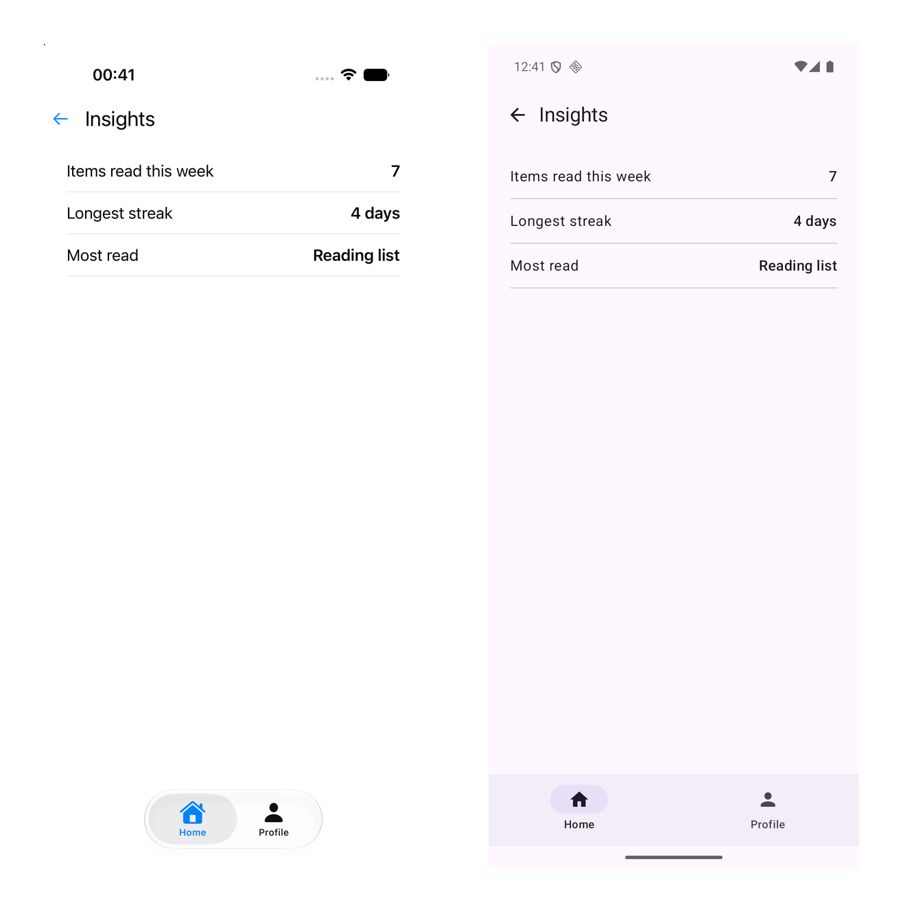

# Duet Tutorial 4: Workers

[Series overview](README.md) · [← Tutorial 3: Composing Features](duet-03-composing-features.md) · [Tutorial 5: Navigation as State →](duet-05-navigation-as-state.md) · [On docs.modaal.dev](https://docs.modaal.dev/tutorials/duet-04-workers)

Trees: [`tutorial4-start/`](../tutorial4-start) is what you open, [`tutorial4-complete/`](../tutorial4-complete) is what you have at the end. Run either tree's checks with `scripts/run-tree.sh tutorial4-start`.

In this tutorial you replace the four mock services from [Tutorial 3](duet-03-composing-features.md) with Foyer's backend, four repositories written once in Kotlin and persisted on device, and you meet the worker: an object adopted at a mount that observes a stream for the mount's lifetime and reports each value into a store as an action. Two workers observe the backend's two streams, the session and the entitlement; the root projects the entitlement down to the home and profile tabs as a slice; the home's *Insights* card is locked while the entitlement is Free and unlocks when the stream says Premium, never when the purchase's own answer comes back. Workers carry no recordings. They are tested with `WorkerTester`, the harness that fails a worker whose `run()` survives its cancellation. This is the fourth page of the [nine-tutorial series](README.md).

> [!NOTE]
> **The manual setup below is what Modaal automates.** Every tree this tutorial
> opens and every file it asks you to write is produced by the Duet templates in
> the [Modaal](https://modaal.dev) new-project wizard, and a coding agent working
> in Modaal writes the feature, records it and runs the checks for you. This
> series walks the same ground by hand so you know what the scaffold emits and
> why: [start a Duet project in the wizard](https://docs.modaal.dev/articles/new-project)
> when you would rather skip the setup.

## What will you build?

The same app, with the mocks gone. Every port now has one implementation in `src-kmp/backend-local`, a Kotlin module both apps consume: `LocalAuth`, `LocalPurchases`, `LocalItems` and `LocalAccount`, persisted through one `KeyValueFile` port as a JSON document under each app's private storage. The auth port gains a `sessions` stream and the purchases port an `entitlements` stream; both are sticky, so a late subscriber sees the current value first. A session worker turns each session value into the root's `AuthChanged`, an entitlement worker turns each entitlement value into `EntitlementChanged`, and the root keeps the entitlement as the one value the paid check reads. A guest session expires after thirty minutes and the expiry raises the gate from wherever the user is. Expect about two and a half hours.

You will have at the end:

- A `backend-local` module with the four repositories, the file port with its two platform implementations, and five unit tests running the guest expiry and the purchase delay on virtual time.
- No `Mock*` service anywhere: `grep -r 'class Mock' .` prints nothing in the finished tree.
- Two workers on each platform, adopted at the root mount, with `WorkerTester` suites on both sides and a pure transform pinned once in the root module.
- Seven new recordings: two for the root, four for the home tab, one for the profile tab, 39 in all.
- Both apps showing the *Insights* card locked, the promo behind it, the card unlocking after the purchase, and the summary behind the unlocked card.

## Where do you start?

Open `tutorial4-start` from the [duet-tutorials repository](https://github.com/modaal-agent/duet-tutorials). It is Tutorial 3's finished tree plus one failing test, the closing exercise, and it resolves Duet 0.7.0, duet-tools 0.24.0, duet-services 0.11.1 and the KSP mock processor 0.2.1 with Tutorial 3's toolchain. Run the checks once before you edit anything:

```sh
tools/duet verify
```

The Kotlin lane reports one failure, `Tutorial4ExerciseSessionExpiryTest`; that is the exercise, and everything else is green. `TUTORIAL_SKIP_STUBS=1 tools/duet verify` leaves the stub out and ends with `duet verify: PASS`.

## The steps

### Add the two streams to the ports

A stream is a port member of a different shape from a call: it answers "what is true now", and it keeps answering. Two value types join the ports module, and two ports gain a `StateFlow` each.

**`src-kmp/ports/src/commonMain/kotlin/dev/modaal/foyer/ports/Ports.kt`**

```kotlin src-kmp/ports/src/commonMain/kotlin/dev/modaal/foyer/ports/Ports.kt
sealed interface Session {
  data object SignedOut : Session

  /** `displayName` is the account's saved name, or the default derived from the provider. */
  data class SignedIn(val displayName: String) : Session
}
```

**`src-kmp/ports/src/commonMain/kotlin/dev/modaal/foyer/ports/Ports.kt`**

```kotlin src-kmp/ports/src/commonMain/kotlin/dev/modaal/foyer/ports/Ports.kt
sealed interface Entitlement {
  @Serializable @SerialName("free") data object Free : Entitlement

  @Serializable @SerialName("premium") data class Premium(val plan: Plan) : Entitlement
}
```

**`src-kmp/ports/src/commonMain/kotlin/dev/modaal/foyer/ports/Ports.kt`**

```kotlin src-kmp/ports/src/commonMain/kotlin/dev/modaal/foyer/ports/Ports.kt
interface AuthPort {
  /** The session, sticky: a late subscriber sees the current value first. */
  val sessions: StateFlow<Session>

  fun signIn(provider: SignInProvider, onOutcome: (SignInOutcome) -> Unit)

  fun signOut(onDone: () -> Unit)
}

interface PurchasesPort {
  /** The entitlement, sticky; the only writer of the value the paid check reads. */
  val entitlements: StateFlow<Entitlement>

  fun plans(onPlans: (List<PlanOffer>) -> Unit)

  fun purchase(plan: Plan, onOutcome: (PurchaseOutcome) -> Unit)
}
```

`Entitlement` is `@Serializable` with a canonical sum serializer, because it lives inside three features' state and so inside the recordings; `Session` is not, because no feature state holds it. The default display name rule, the email's local part or "Guest", moves from the sign-in module to this one, because the backend needs it too. One more file re-exposes the two streams as functions:

**`src-kmp/ports/src/commonMain/kotlin/dev/modaal/foyer/ports/Streams.kt`**

```kotlin src-kmp/ports/src/commonMain/kotlin/dev/modaal/foyer/ports/Streams.kt
fun sessionsFlow(auth: AuthPort): StateFlow<Session> = auth.sessions

fun entitlementsFlow(purchases: PurchasesPort): StateFlow<Entitlement> = purchases.entitlements
```

A stream declared on an interface crosses the Apple boundary as the raw Kotlin flow type. A top-level function's return type crosses as the Swift async sequence the workers iterate, the same reason [Tutorial 2](duet-02-two-apps.md#write-the-swift-shell)'s `splashStateFlow(store:)` exists. The Kotlin workers read the members directly.

### Write the on-device backend

The module `src-kmp/backend-local` holds one implementation of each port. They are product code, named `Local*`: the apps run on them, the composition roots construct them, and nothing replaces them later. The backend persists through a port of its own, two plain functions, so each app hands it a file it owns and a test hands it memory:

**`src-kmp/backend-local/src/commonMain/kotlin/dev/modaal/foyer/backend/KeyValueFile.kt`**

```kotlin src-kmp/backend-local/src/commonMain/kotlin/dev/modaal/foyer/backend/KeyValueFile.kt
interface KeyValueFile {
  /** The document's text, or null when nothing was written yet. */
  fun read(): String?

  fun write(text: String)
}
```

`JsonFile(path)` implements it once per platform, in the module's `jvmMain` and `appleMain` source sets, through `java.io.File` and `NSString`; `MemoryFile` implements it in common code for the test suites and the composition specs. One `@Serializable` record is the whole document, and `LocalStorage` reads it once and writes it whole on every update. The auth repository owns the session stream:

**`src-kmp/backend-local/src/commonMain/kotlin/dev/modaal/foyer/backend/LocalAuth.kt`**

```kotlin src-kmp/backend-local/src/commonMain/kotlin/dev/modaal/foyer/backend/LocalAuth.kt
object LocalAuthConfig {
  /** How long a guest session lasts. Shorten it to watch the expiry raise the gate. */
  const val GUEST_SESSION_MINUTES = 30L
}
```

**`src-kmp/backend-local/src/commonMain/kotlin/dev/modaal/foyer/backend/LocalAuth.kt`**

```kotlin src-kmp/backend-local/src/commonMain/kotlin/dev/modaal/foyer/backend/LocalAuth.kt
  override fun signIn(provider: SignInProvider, onOutcome: (SignInOutcome) -> Unit) {
    if (provider is SignInProvider.Email && provider.address.isBlank()) {
      onOutcome(SignInOutcome.Failed("Enter an email address."))
      return
    }
    val saved = storage.record.displayName
    val record = SessionRecord(saved ?: defaultDisplayName(provider), provider == SignInProvider.Guest)
    storage.update { it.copy(session = record) }
    mutableSessions.value = Session.SignedIn(record.displayName)
    if (record.guest) armExpiry()
    onOutcome(SignInOutcome.SignedIn(saved))
  }
```

**`src-kmp/backend-local/src/commonMain/kotlin/dev/modaal/foyer/backend/LocalAuth.kt`**

```kotlin src-kmp/backend-local/src/commonMain/kotlin/dev/modaal/foyer/backend/LocalAuth.kt
  private fun armExpiry() {
    expiry?.cancel()
    expiry =
      scope.launch {
        clock.sleep(LocalAuthConfig.GUEST_SESSION_MINUTES * 60 * 1_000_000_000L)
        endSession()
      }
  }

  private fun endSession() {
    expiry?.cancel()
    expiry = null
    storage.update { it.copy(session = null) }
    mutableSessions.value = Session.SignedOut
  }
```

The expiry waits on the kernel's clock seam, `KernelClock.sleep`, in the scope the composition root hands the backend; the window restarts at each launch, because the seam carries a sleep and no wall-clock reading. The purchases repository does the same with a one-second delay, so the promo's in-flight state is visible, and it writes the entitlement stream before it answers the call:

**`src-kmp/backend-local/src/commonMain/kotlin/dev/modaal/foyer/backend/LocalPurchases.kt`**

```kotlin src-kmp/backend-local/src/commonMain/kotlin/dev/modaal/foyer/backend/LocalPurchases.kt
  override fun purchase(plan: Plan, onOutcome: (PurchaseOutcome) -> Unit) {
    scope.launch {
      clock.sleep(LocalPurchasesConfig.PURCHASE_MILLIS * 1_000_000L)
      storage.update { it.copy(plan = plan) }
      mutableEntitlements.value = Entitlement.Premium(plan)
      onOutcome(PurchaseOutcome.Purchased(plan))
    }
  }
```

The account repository persists the saved name and hands it to the auth repository, so a live session carries the new name and every reader of the session stream sees it. One class constructs all four over one document:

**`src-kmp/backend-local/src/commonMain/kotlin/dev/modaal/foyer/backend/LocalBackend.kt`**

```kotlin src-kmp/backend-local/src/commonMain/kotlin/dev/modaal/foyer/backend/LocalBackend.kt
class LocalBackend(file: KeyValueFile, scope: CoroutineScope, clock: KernelClock) {
  constructor(file: KeyValueFile, scope: CoroutineScope) : this(file, scope, LiveClock)

  private val storage = LocalStorage(file)
  private val localAuth = LocalAuth(storage, clock, scope)

  val auth: AuthPort = localAuth
  val purchases: PurchasesPort = LocalPurchases(storage, clock, scope)
  val items: ItemsPort = LocalItems()
  val account: AccountPort = LocalAccount(storage, localAuth)
}
```

The module's `jvmTest` runs the repositories on a memory file. Under `runTest`, `LiveClock` sleeps on the scheduler's virtual time, so the thirty-minute expiry is an `advanceTimeBy`:

**`src-kmp/backend-local/src/jvmTest/kotlin/dev/modaal/foyer/backend/LocalAuthTest.kt`**

```kotlin src-kmp/backend-local/src/jvmTest/kotlin/dev/modaal/foyer/backend/LocalAuthTest.kt
  fun aGuestSessionExpiresOnTheClockSeam() = runTest {
    val backend = LocalBackend(MemoryFile(), backgroundScope, LiveClock)
    backend.auth.signIn(SignInProvider.Guest) {}
    assertEquals(Session.SignedIn("Guest"), backend.auth.sessions.value)

    advanceTimeBy(LocalAuthConfig.GUEST_SESSION_MINUTES * 60_000 - 1)
    runCurrent()
    assertEquals(Session.SignedIn("Guest"), backend.auth.sessions.value)

    advanceTimeBy(1)
    runCurrent()
    assertEquals(Session.SignedOut, backend.auth.sessions.value)
  }
```

Include the module in the settings file, export it from the umbrella module so the Swift composition root can construct it, and run `(cd src-kmp && ./gradlew :backend-local:jvmTest)`.

### Delete the mock services, one for one

Each mock leaves as its repository lands, and nothing else on the tree references it. Out: `src-kmp/app/src/main/kotlin/dev/modaal/foyer/app/services/` with its four files, and the `FoyerServices` target of the consumer package with its four files. In: the root Component on each side owns one `LocalBackend` and hands its members down as the ports it satisfied with mocks before. The root's Dependency names, for the first time, something the platform supplies: the file.

**`src-ios/Libraries/FoyerKit/Sources/RootShell/RootComposition.swift`**

```swift src-ios/Libraries/FoyerKit/Sources/RootShell/RootComposition.swift
public protocol RootDependency: AnyObject {
  var storage: any KeyValueFile { get }
}
```

**`src-kmp/app/src/main/kotlin/dev/modaal/foyer/app/RootBuilder.kt`**

```kotlin src-kmp/app/src/main/kotlin/dev/modaal/foyer/app/RootBuilder.kt
interface RootDependency {
  val storage: KeyValueFile
}
```

**`src-ios/Libraries/FoyerKit/Sources/RootShell/RootComposition.swift`**

```swift src-ios/Libraries/FoyerKit/Sources/RootShell/RootComposition.swift
final class RootComponent {
  private let dependency: RootDependency
  private let backend: LocalBackend

  init(dependency: RootDependency, scope: any Kotlinx_coroutines_coreCoroutineScope) {
    self.dependency = dependency
    backend = LocalBackend(file: dependency.storage, scope: scope)
  }

  var auth: any AuthPort { backend.auth }
  var items: any ItemsPort { backend.items }
  var account: any AccountPort { backend.account }
  var purchases: any PurchasesPort { backend.purchases }
}
```

**`src-kmp/app/src/main/kotlin/dev/modaal/foyer/app/RootBuilder.kt`**

```kotlin src-kmp/app/src/main/kotlin/dev/modaal/foyer/app/RootBuilder.kt
class RootComponent(dependency: RootDependency, scope: CoroutineScope) :
  RootDependency by dependency, SignInDependency, MainDependency {
  private val backend = LocalBackend(storage, scope)

  override val auth: AuthPort = backend.auth
  override val items: ItemsPort = backend.items
  override val account: AccountPort = backend.account
  override val purchases: PurchasesPort = backend.purchases
}
```

Each app's conformer supplies a `JsonFile` under its private storage: the scene's `Documents` directory on iOS, the Activity's `filesDir` on Android. The host tests supply a `MemoryFile`. The main level's Dependency gains `purchases`, because the home tab now buys through it; the home's gains it too. Regenerate the Swift Components and doubles with `tools/duet mocks`, then confirm the deletion:

```sh
grep -r 'class Mock' src-kmp src-ios
```

The command prints nothing. Every test that used a mock now builds a `LocalBackend` over a `MemoryFile` and passes the members it needs into the generated Dependency double.

### Grow the root

The root keeps the entitlement as the one value the paid check reads, and receives two worker reports as actions. The sign-out rule gains a twin: a session ending while main is up raises the gate, which is what a guest expiry does from wherever the user is.

**`src-kmp/subtrees/root/logic/src/commonMain/kotlin/dev/modaal/foyer/root/RootFeature.kt`**

```kotlin src-kmp/subtrees/root/logic/src/commonMain/kotlin/dev/modaal/foyer/root/RootFeature.kt
data class RootState(
  val phase: RootPhase = RootPhase.Splash,
  val auth: AuthSnapshot = AuthSnapshot.Unknown,
  /** The splash finished before auth was known; the phase moves on `AuthChanged`. */
  val awaitingAuth: Boolean = false,
  /** The paid check's one value. The entitlement worker is its only writer; `home` and `profile` read it as a slice. */
  val entitlement: Entitlement = Entitlement.Free,
)
```

**`src-kmp/subtrees/root/logic/src/commonMain/kotlin/dev/modaal/foyer/root/RootFeature.kt`**

```kotlin src-kmp/subtrees/root/logic/src/commonMain/kotlin/dev/modaal/foyer/root/RootFeature.kt
  /** The session worker's report: the auth port's stream emitted. */
  @Serializable @SerialName("authChanged") data class AuthChanged(val auth: AuthSnapshot) : RootAction

  /** The entitlement worker's report: the purchases port's stream emitted. */
  @Serializable
  @SerialName("entitlementChanged")
  data class EntitlementChanged(val entitlement: Entitlement) : RootAction
}
```

**`src-kmp/subtrees/root/logic/src/commonMain/kotlin/dev/modaal/foyer/root/RootFeature.kt`**

```kotlin src-kmp/subtrees/root/logic/src/commonMain/kotlin/dev/modaal/foyer/root/RootFeature.kt
    is RootAction.AuthChanged -> {
      val next = state.copy(auth = action.auth)
      when {
        next.awaitingAuth && action.auth != AuthSnapshot.Unknown ->
          Reduced(next.copy(phase = phaseAfterSplash(action.auth), awaitingAuth = false))
        state.phase == RootPhase.Main && action.auth == AuthSnapshot.SignedOut ->
          Reduced(next.copy(phase = RootPhase.SignIn))
        else -> Reduced(next)
      }
    }

    is RootAction.EntitlementChanged -> Reduced(state.copy(entitlement = action.entitlement))
```

The transform from a session to an auth snapshot is a pure function in the root module, so the two native workers share it and one unit test pins it:

**`src-kmp/subtrees/root/logic/src/commonMain/kotlin/dev/modaal/foyer/root/SessionProjection.kt`**

```kotlin src-kmp/subtrees/root/logic/src/commonMain/kotlin/dev/modaal/foyer/root/SessionProjection.kt
fun authSnapshot(session: Session): AuthSnapshot =
  when (session) {
    Session.SignedOut -> AuthSnapshot.SignedOut
    is Session.SignedIn -> AuthSnapshot.SignedIn(session.displayName)
  }
```

Add `entitlement changes` to the root scenario, list `root.entitlement-changes` in the manifest and re-record the root with `tools/duet record --feature root`; the five existing leaves re-record too, because the state gained a field. The three chains through the root are unchanged, since a chain carries no state.

### Write the workers on Android

A worker is one method: `run()` is its whole life. The host adopts it at mount, which starts `run()` in a coroutine on the host's scope, and cancels that coroutine at teardown; `collect` returns on the cancellation, and there is no `stop()` to forget. A worker decides nothing. It reads a stream and sends.

**`src-kmp/app/src/main/kotlin/dev/modaal/foyer/app/workers/SessionWorker.kt`**

```kotlin src-kmp/app/src/main/kotlin/dev/modaal/foyer/app/workers/SessionWorker.kt
class SessionWorker(
  private val auth: AuthPort,
  private val relay: Relay<RootAction>,
) : Working {
  override suspend fun run() {
    auth.sessions.collect { session -> relay.send(RootAction.AuthChanged(authSnapshot(session))) }
  }
}
```

The report enters the root store through a `Relay`, the shells package's settable event funnel: the composition root creates it, hands it to the workers it builds, and points its sink at the store once the store exists. The two adoptions sit at the end of `buildRoot`, after the child slot and the projection are in place:

**`src-kmp/app/src/main/kotlin/dev/modaal/foyer/app/RootBuilder.kt`**

```kotlin src-kmp/app/src/main/kotlin/dev/modaal/foyer/app/RootBuilder.kt
    val relay = Relay<RootAction>()
    relay.sink = store::send
    host.adopt(SessionWorker(component.auth, relay))
    host.adopt(EntitlementWorker(component.purchases, relay))
```

The `AuthChanged(SignedOut)` seed that `buildRoot` sent in [Tutorial 3](duet-03-composing-features.md#compose-the-tree-on-android) is gone: the session stream is sticky, so the session worker's first report is the current session, and a persisted one skips the gate after the splash.

### Test the workers with the harness

Workers carry behavioral tests through `WorkerTester` and no recordings. Parity is never gated at a worker: a worker that exists on both platforms is two native implementations, one over a `Flow` and one over an async sequence, sharing the pure transform from the step before, and the transform is where the cross-platform test concentrates. The harness is the adopt bracket, test-side: `start` on the test scope, drive the backend, read what reached the relay, `finish`.

**`src-kmp/app/src/test/kotlin/dev/modaal/foyer/app/workers/SessionWorkerTest.kt`**

```kotlin src-kmp/app/src/test/kotlin/dev/modaal/foyer/app/workers/SessionWorkerTest.kt
  fun theStickyStreamSeedsTheRootAndEveryChangeFollows() = runTest {
    val backend = LocalBackend(MemoryFile(), backgroundScope, LiveClock)
    val relay = Relay<RootAction>()
    val reported = mutableListOf<RootAction>()
    relay.sink = reported::add
    val tester = WorkerTester(SessionWorker(backend.auth, relay))

    tester.start(backgroundScope)
    runCurrent()
    assertEquals(listOf<RootAction>(RootAction.AuthChanged(AuthSnapshot.SignedOut)), reported)

    backend.auth.signIn(SignInProvider.Email("ann@example.com")) {}
    runCurrent()
    assertEquals(RootAction.AuthChanged(AuthSnapshot.SignedIn("ann")), reported.last())

    backend.account.saveDisplayName("Ann B") {}
    runCurrent()
    assertEquals(RootAction.AuthChanged(AuthSnapshot.SignedIn("Ann B")), reported.last())

    tester.finish()
    assertTrue(tester.isFinished)
  }
```

`finish()` cancels the worker's coroutine, yields until `run()` returns, and fails the test if it never does. That is the leak class a `stop()` convention cannot catch, made a harness guarantee. A second test in the same file advances virtual time past the guest window and reads `AuthChanged(SignedOut)` off the relay. Add `testImplementation(libs.duet.kernel.test)` to the app module and run `(cd src-kmp && ./gradlew :app:testDebugUnitTest)`.

### Write the workers on iOS

The Swift worker is the same shape over `for await`. It is `@MainActor`, so its state needs no lock and the report lands on the main-confined store; `Working` needs only a nonisolated `run()`, which a main-actor method witnesses. The stream is read through the ports module's `sessionsFlow`, whose return type crossed the boundary as the async sequence.

**`src-ios/Libraries/FoyerKit/Sources/RootShell/Workers.swift`**

```swift src-ios/Libraries/FoyerKit/Sources/RootShell/Workers.swift
final class SessionWorker: Working {
  private let auth: any AuthPort
  private let relay: Relay<any RootAction>

  init(auth: any AuthPort, relay: Relay<any RootAction>) {
    self.auth = auth
    self.relay = relay
  }

  func run() async {
    for await session in sessionsFlow(auth: auth) {
      relay.send(RootActionAuthChanged(auth: authSnapshot(session: session)))
    }
  }
}
```

The Builder creates the relay, binds its sink to the store mirror with a weak hold, and hands the two workers to the shell:

**`src-ios/Libraries/FoyerKit/Sources/RootShell/RootBuilder.swift`**

```swift src-ios/Libraries/FoyerKit/Sources/RootShell/RootBuilder.swift
    let relay = Relay<any RootAction>()
    relay.bindSink(bridged) { store, action in store.send(action) }
    let shell = RootViewShell(
      store: bridged,
      mounter: RootChildMounter(component: component),
      workers: RootWorkers(
        session: SessionWorker(auth: component.auth, relay: relay),
        entitlement: EntitlementWorker(purchases: component.purchases, relay: relay)))
```

The shell adopts them in `bind()`, after the store and the projection, so the first report of each sticky stream lands on a store whose projection is already bound; the host cancels them first at teardown, in the reverse of adoption order.

**`src-ios/Libraries/FoyerKit/Sources/RootShell/RootViewShell.swift`**

```swift src-ios/Libraries/FoyerKit/Sources/RootShell/RootViewShell.swift
    // Adopted last, so the first report of each sticky stream lands on a
    // store whose projection is already bound; cancelled first at teardown.
    host.adopt(workers.session)
    host.adopt(workers.entitlement)
```

The Swift suite, `WorkersSpec` in the root shell's test target, drives the same three rows through `WorkerTester` from the `DuetTesting` product, which the test target now depends on. Its purchase row waits a real second, because the backend sleeps on the wall clock outside `runTest`. The composition spec asserts `shell.host.liveWorkerCount == 2` while the tree is up: the host's ledger of adopted workers whose `run()` has not returned.

### Project the entitlement down as a slice

Two tabs read the entitlement and neither owns it. The root publishes the value as a slice, the main level projects the slice into both tabs as an action of their own, and a tab's reducer writes what it received. State travels down as a value; nothing below the root holds the root's store. On Android the slice is a `StateFlow` on the root mount and the projection is a `StateTransitions`:

**`src-kmp/app/src/main/kotlin/dev/modaal/foyer/app/MainBuilder.kt`**

```kotlin src-kmp/app/src/main/kotlin/dev/modaal/foyer/app/MainBuilder.kt
    host.adopt(
      StateTransitions(scope, entitlement) { _, value ->
        home.send(HomeAction.EntitlementChanged(value))
        profile.store.send(ProfileAction.EntitlementChanged(value))
      })
```

On iOS the bridge target gains `Projected`, a slice the parent writes and the child observes; the observation is a `HostedObservation`, so the host retains it for the mount and cancels it at teardown.

**`src-ios/Libraries/FoyerKit/Sources/FoyerBridge/Projected.swift`**

```swift src-ios/Libraries/FoyerKit/Sources/FoyerBridge/Projected.swift
  public func project(_ value: Value) {
    if (subject.value as AnyObject).isEqual(value) { return }
    subject.send(value)
  }

  /// The child's read: `sink` runs with the current value now and with every
  /// change after, until the returned observation is cancelled.
  public func observe(_ sink: @escaping @MainActor (Value) -> Void) -> ProjectedObservation {
    ProjectedObservation(
      subject.sink { value in
        MainActor.assumeIsolated { sink(value) }
      })
  }
```

**`src-ios/Libraries/FoyerKit/Sources/MainShell/MainViewShell.swift`**

```swift src-ios/Libraries/FoyerKit/Sources/MainShell/MainViewShell.swift
    // State down: the slice reaches both tabs as an action of their own.
    // The first delivery is the current value, at mount.
    host.adopt(
      entitlement.observe { [weak self] value in
        self?.home?.shell.entitlementChanged(value)
        self?.profile?.shell.entitlementChanged(value)
      })
```

The root shell writes the slice at the top of `apply`, before it reconciles the child, so a main level built in the same projection reads the current value. Each tab's shell gains one intent for it:

**`src-ios/Libraries/FoyerKit/Sources/HomeShell/HomeViewShell.swift`**

```swift src-ios/Libraries/FoyerKit/Sources/HomeShell/HomeViewShell.swift
  /// The parent's projection: the root's entitlement slice, as this tab's action.
  public func entitlementChanged(_ entitlement: Entitlement) {
    store.send(HomeActionEntitlementChanged(entitlement: entitlement))
  }
```

The profile tab's reducer writes `entitlement` and its header gains a plan row reading "Free" or "Premium · Monthly"; the leaf `profile.plan-row-follows-the-stream` pins the write.

### Lock the Insights card

The home tab gains the paid surface. Its state carries the slice, what is presented over the list, and the promo's in-flight latch; the card opens the promo while Free and the summary once Premium; the promo's one button buys the monthly plan.

**`src-kmp/subtrees/home/logic/src/commonMain/kotlin/dev/modaal/foyer/home/HomeFeature.kt`**

```kotlin src-kmp/subtrees/home/logic/src/commonMain/kotlin/dev/modaal/foyer/home/HomeFeature.kt
data class HomeState(
  val items: List<Item> = emptyList(),
  val isLoading: Boolean = false,
  /** The slice the root projects down. The reducer reads it and never writes it on its own. */
  val entitlement: Entitlement = Entitlement.Free,
  val presented: HomePresentation? = null,
  /** The in-flight latch for the promo's one-tap purchase. */
  val isPurchasing: Boolean = false,
  /** The last purchase failure to show, cleared by the next attempt. */
  val failure: String? = null,
)
```

**`src-kmp/subtrees/home/logic/src/commonMain/kotlin/dev/modaal/foyer/home/HomeFeature.kt`**

```kotlin src-kmp/subtrees/home/logic/src/commonMain/kotlin/dev/modaal/foyer/home/HomeFeature.kt
    HomeAction.InsightsTapped ->
      Reduced(
        state.copy(
          presented =
            if (state.entitlement is Entitlement.Premium) HomePresentation.Insights
            else HomePresentation.Promo))

    HomeAction.PurchaseTapped ->
      if (state.isPurchasing) {
        Reduced(state)
      } else {
        Reduced(
          state.copy(isPurchasing = true, failure = null),
          listOf(Effect.Run(HomeEffectPayload.Purchase(Plan.Monthly))))
      }

    is HomeAction.PurchaseFinished ->
      when (val outcome = action.outcome) {
        is PurchaseOutcome.Purchased -> Reduced(state.copy(isPurchasing = false, presented = null))
        is PurchaseOutcome.Failed ->
          Reduced(state.copy(isPurchasing = false, failure = outcome.reason))
      }

    HomeAction.Dismissed -> Reduced(state.copy(presented = null))
```

A finished purchase closes the promo and nothing more. The entitlement has one writer, the stream, and it reaches this reducer only as `EntitlementChanged` through the slice; the scenario's branch pins that the card is unlocked before the purchase's own answer arrives and that the answer writes no entitlement:

**`src-kmp/subtrees/home/logic/src/jvmTest/kotlin/dev/modaal/foyer/home/HomeScenarioTest.kt`**

```kotlin src-kmp/subtrees/home/logic/src/jvmTest/kotlin/dev/modaal/foyer/home/HomeScenarioTest.kt
        branch("purchase flips through the stream") {
          whenAction("the Insights card, while Free", HomeAction.InsightsTapped)
          whenAction("the promo's button", HomeAction.PurchaseTapped)
          then("a purchase is in flight") { it.isPurchasing && it.failure == null }
          thenEffects("exactly the monthly purchase") {
            it == effectsOf<HomeEffectPayload>(Effect.Run(HomeEffectPayload.Purchase(Plan.Monthly)))
          }
          whenAction("a second tap while in flight", HomeAction.PurchaseTapped)
          thenEffects("nothing: one purchase at a time") { it.isEmpty() }
          whenAction(
            "the entitlement stream emits first",
            HomeAction.EntitlementChanged(Entitlement.Premium(Plan.Monthly)))
          then("the card is unlocked, the promo still up") {
            it.entitlement == Entitlement.Premium(Plan.Monthly) &&
              it.presented == HomePresentation.Promo
          }
          whenAction(
            "the port answers",
            HomeAction.PurchaseFinished(PurchaseOutcome.Purchased(Plan.Monthly)))
          then("the promo closes; the entitlement was never written here") {
            !it.isPurchasing && it.presented == null && it.entitlement == Entitlement.Premium(Plan.Monthly)
          }
        }
```

The environment gains `purchase(plan, onOutcome)`, so the generated `HomeEnvironmentMock` gains `purchaseHandler` and `purchaseArgs`, and the test-store suite gains the round trip. Record the four new leaves with `tools/duet record --feature home`. The screens are the same on both platforms: a card with a lock and "Premium" while locked, the promo and the summary each replacing the tab's content while `presented` names them.


*The Insights card locked (top) and unlocked after the purchase (bottom), on an iPhone 17 simulator (left) and a Pixel 8 API 36 emulator (right); tutorial4-complete at Duet 0.7.0, duet-tools 0.24.0.*

### Run both apps

Build and run each app, sign in as a guest, and tap the card: the promo opens, the button reads "Purchasing…" for a second, the promo closes and the card is unlocked. Tap it again for the summary. Relaunch: the session and the plan are back from the document before the splash ends. Sign out and back in as a guest, shorten `GUEST_SESSION_MINUTES` to one, and watch the gate come up from the profile tab a minute later; the reducer rule from the root step is what moves the phase, and the worker only reported the value.



*The Insights summary behind the unlocked card, presented the same way on both platforms; tutorial4-complete at Duet 0.7.0, duet-tools 0.24.0.*

The Kotlin host test `RootFlowTest` walks the same path headless, including the expiry on virtual time and the relaunch over the same memory file; the Swift `RootCompositionSpec` does the same across the boundary on real time.

## What you now have

- A `backend-local` module with one implementation per port, persisted as one JSON document behind a two-function file port, and no mock service on the tree.
- Two streams on the ports, two workers per platform observing them for the root mount's lifetime, and one relay carrying their reports into the root store.
- `WorkerTester` suites on both sides, a pure transform pinned once, and no recording for a worker.
- The entitlement written by one action from one stream, projected down to two tabs as a slice, and read by a locked card that unlocks from the stream.
- Seven new recordings, 39 in all, and every check green: `tools/duet verify`, `tools/duet mocks --check`, the backend's tests, the Android unit tests and the Apple lane.

## Exercise: record the session expiry

`tutorial4-start` carries `Tutorial4ExerciseSessionExpiryTest`, a failing placeholder in the root module. Delete it, add a branch `session expiry returns to gate` to the root scenario, list `root.session-expiry-returns-to-gate` in the manifest and in the root's feature spec, and add its row to `RootGoldenTest`. The branch starts from a signed-in session, completes the splash into main, then sends `AuthChanged(SignedOut)` as the session worker would after the guest window, and pins the gate. Without the reducer rule from the root step the recording shows the phase staying on main, which is the point of writing the branch first. The finished reducer clause reads:

**`src-kmp/subtrees/root/logic/src/commonMain/kotlin/dev/modaal/foyer/root/RootFeature.kt`**

```kotlin src-kmp/subtrees/root/logic/src/commonMain/kotlin/dev/modaal/foyer/root/RootFeature.kt
        state.phase == RootPhase.Main && action.auth == AuthSnapshot.SignedOut ->
          Reduced(next.copy(phase = RootPhase.SignIn))
```

Run `tools/duet record --feature root`, then `tools/duet verify`; the Kotlin lane replays 39 fixtures and the run ends with `duet verify: PASS`. `tutorial4-complete` carries the finished branch.

## Common questions

<details>
<summary><b>Why do workers carry no recordings?</b></summary>

A recording pins a reducer: the same action on the same state gives the same state and effects, on both platforms, byte for byte. A worker has no reducer. It is native per platform, it observes a platform stream, and its one duty is to send what it saw. What a recording would pin is the transform from a stream value to an action, and that transform is a pure function in the root module with its own unit test. The worker's test is behavioral: start it, drive its source, read the relay, finish.

</details>

<details>
<summary><b>Why is each stream sticky?</b></summary>

A worker adopted at mount subscribes after the backend already knows the answer. A sticky stream, a `StateFlow` on Kotlin, replays its current value to a late subscriber, so the first report is the current session or the current entitlement and the root needs no seed of its own. An event stream would deliver only what changes after the subscription, and a relaunch would start the app signed out with a plan it owns. The workers page in the framework repository names the two shapes: a sticky flag and an event tick.

</details>

<details>
<summary><b>Why does the purchase's answer not write the entitlement?</b></summary>

Because then the value would have two writers, and the second one is wrong in the case that matters: a restored purchase, a purchase made on another device, a refund. The stream is the backend's statement of what the user is entitled to now, and the entitlement worker is its only path into feature state. The promo's answer closes the promo; the card unlocks when the stream says so, and the scenario branch pins that order. [Tutorial 5](duet-05-navigation-as-state.md#write-the-upgrade-flow)'s upgrade flow keeps the rule.

</details>

<details>
<summary><b>Why a JSON file and not the platform's preferences?</b></summary>

One implementation shape on both platforms, readable by you: open the document under the app's storage and the session, the saved name and the plan are there in plain text. The port is two functions, so the choice is local; a preferences-backed `KeyValueFile` is a small class in each app and nothing in the backend changes. [Tutorial 5](duet-05-navigation-as-state.md#gather-the-route-spine-and-restore-from-it) relies on the document surviving process death for the restore demonstration.

</details>

<details>
<summary><b>Why does the Swift worker call sessionsFlow(auth:) instead of reading auth.sessions?</b></summary>

The Kotlin/Native framework exports an interface's `StateFlow` member as the raw Kotlin flow type, which Swift cannot iterate with `for await`. A top-level function's return type is exported through the Swift-friendly projection as the async sequence. `sessionsFlow` and `entitlementsFlow` are that projection for the two streams, two lines in the ports module, and the Kotlin workers read the members directly.

</details>

<details>
<summary><b>Why does the guest window restart at launch?</b></summary>

The kernel's clock seam is a sleep, not a wall-clock reading, so the backend can wait thirty minutes on it, on virtual time in a test, but it cannot store a deadline and compare it later. Restarting the window at each launch keeps the expiry testable through the seam alone. A backend that needs a real deadline adds a `now` to its own port, outside the kernel's seam.

</details>

## Sources and further reading

- [The Duet framework repository](https://github.com/modaal-agent/duet) — `docs/workers.md`, the worker contract this page applies: one bracket, one life, no silent ingress, logical tests only; `Working`, `StoreHost.adopt` and `Relay` in the shells packages; `WorkerTester` in `DuetTesting` and `kernel-test`; `KernelClock`, the clock seam the backend waits on.
- [The duet-tools repository](https://github.com/modaal-agent/duet-tools) — `contracts/manifest.md` and the `record` verb, for the re-recorded features.
- [kotlinx.coroutines: StateFlow](https://kotlinlang.org/api/kotlinx.coroutines/kotlinx-coroutines-core/kotlinx.coroutines.flow/-state-flow/) — the sticky stream both ports carry, and its conflation.
- [SKIE: Flows](https://skie.touchlab.co/features/flows) — how a Kotlin flow becomes a Swift async sequence, and where the conversion applies.
- [The duet-tutorials repository](https://github.com/modaal-agent/duet-tutorials) — `tutorial4-start` and `tutorial4-complete`, and the checks CI runs on them.
- [The Duet glossary](https://docs.modaal.dev/articles/duet-glossary) — [worker](https://docs.modaal.dev/articles/duet-glossary#worker), [mount](https://docs.modaal.dev/articles/duet-glossary#mount), [host](https://docs.modaal.dev/articles/duet-glossary#host) and [golden recording](https://docs.modaal.dev/articles/duet-glossary#golden-fixture).

## Read next

- **[Tutorial 5: Navigation as State](duet-05-navigation-as-state.md)** — The onboarding gate, the upgrade flow in a sheet slot, deep links and the route spine that survives process death.
- **[Tutorial 3: Composing Features](duet-03-composing-features.md)** — The tree these workers report into, and the mock services this page replaces.
- **[The Duet tutorial series](README.md)** — The nine tutorials, the app they build, the prerequisites and the versions they are verified against.
