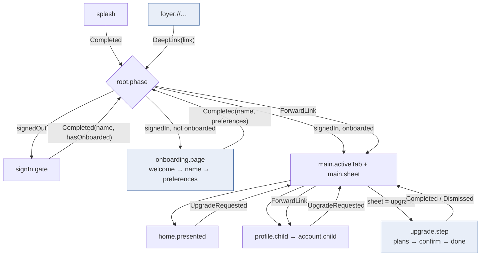
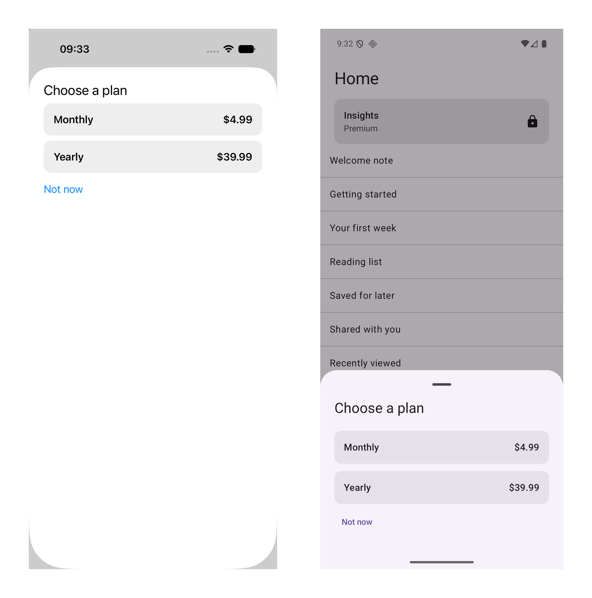
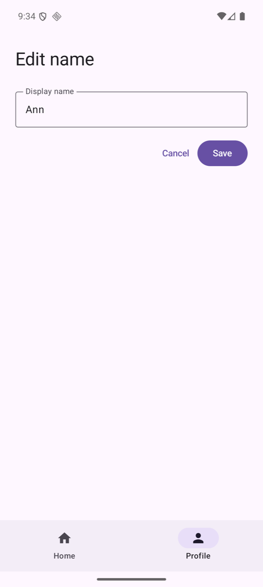
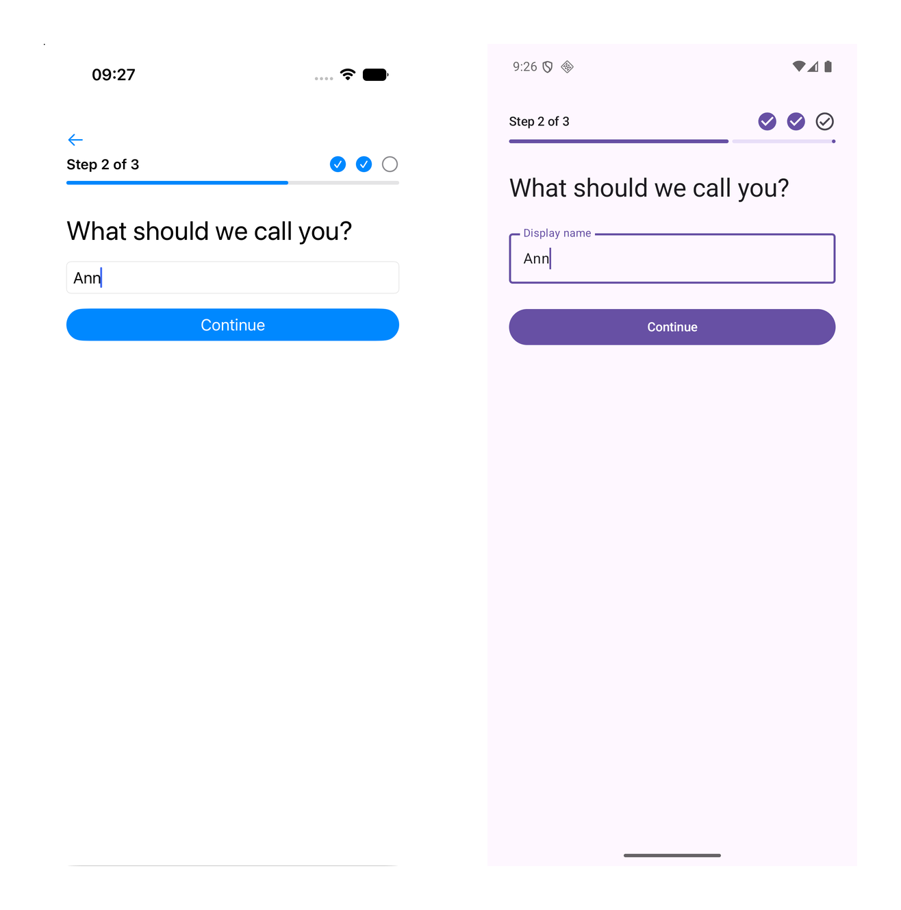

# Duet Tutorial 5: Navigation as State

[Series overview](README.md) · [← Tutorial 4: Workers](duet-04-workers.md) · [Tutorial 6: The Checks in CI →](duet-06-checks-in-ci.md) · [On docs.modaal.dev](https://docs.modaal.dev/tutorials/duet-05-navigation-as-state)

Trees: [`tutorial5-start/`](../tutorial5-start) is what you open, [`tutorial5-complete/`](../tutorial5-complete) is what you have at the end. Run either tree's checks with `scripts/run-tree.sh tutorial5-start`.

In this tutorial you make every screen of Foyer reachable from state alone. [Tutorial 4](duet-04-workers.md#lock-the-insights-card) left the app with two gates and a locked card; here the root gains an onboarding gate with three steps and a progress row, the main level gains a sheet slot that mounts an upgrade flow from either tab, the app answers two deep links, and each level's route sliver is gathered into one value that both apps save before the process dies and rebuild the tree from afterwards. Back is an action on the level that owns the page. The progress row learns each step's readiness through a seam between siblings, not through the parent. This is the fifth page of the [nine-tutorial series](README.md).

> [!NOTE]
> **The manual setup below is what Modaal automates.** Every tree this tutorial
> opens and every file it asks you to write is produced by the Duet templates in
> the [Modaal](https://modaal.dev) new-project wizard, and a coding agent working
> in Modaal writes the feature, records it and runs the checks for you. This
> series walks the same ground by hand so you know what the scaffold emits and
> why: [start a Duet project in the wizard](https://docs.modaal.dev/articles/new-project)
> when you would rather skip the setup.

## What will you build?

Six new features and a new phase. The `onboarding` level owns a page and mounts one of three step leaves, `welcome`, `name` and `preferences`, beside a `progress` leaf that lives for the level's lifetime; the session carries whether the account finished the steps, and the root mounts the gate from that fact. The `upgrade` flow walks plans, confirm and done as route state, buys through the purchases port and completes through its delegate; the `main` level mounts it in a sheet slot when either tab asks, and the card still unlocks from the entitlement stream and nothing else. Two links, `foyer://upgrade` and `foyer://profile/account`, are parsed into a value and forwarded down the tree one level at a time. A `RouteSpine` gathers the phase, the tab, the profile tree's depth, the home tab's presented screen, the flow's step and the onboarding page; Android saves it in the instance `Bundle`, iOS in the scene's restoration activity, and both rebuild the tree from it. Expect about three hours.

You will have at the end:

- Six new logic modules with 20 recordings, 33 re-recorded for the five that changed, 72 fixtures on the tree, and three new chains, one of them the closing exercise.
- A readiness worker per platform, owned by the onboarding level's composition, with a `WorkerTester` suite on each side.
- The upgrade flow presented as a sheet on iOS and a modal bottom sheet on Android from the same `sheet` value.
- Both deep links opening on both platforms, from a cold start and while the app runs.
- The Android app resumed inside the name editor after process death, and an Android back policy pinned by a test.

## Where do you start?

Open `tutorial5-start` from the [duet-tutorials repository](https://github.com/modaal-agent/duet-tutorials). It is Tutorial 4's finished tree plus one failing test, the closing exercise, and it resolves Duet 0.7.0, duet-tools 0.24.0, duet-services 0.11.1 and the KSP mock processor 0.2.1 with Tutorial 4's toolchain. Run the checks once before you edit anything:

```sh
tools/duet verify
```

The Kotlin lane reports one failure, `Tutorial5ExerciseUpgradeEntitlementChainTest`; that is the exercise, and everything else is green. `TUTORIAL_SKIP_STUBS=1 tools/duet verify` leaves the stub out and ends with `duet verify: PASS`.

## The steps

### Draw the routes before the screens

Every screen in Foyer is the consequence of a value: the root's `phase`, the main level's `activeTab` and `sheet`, the profile tab's `child`, the home tab's `presented`, the flow's `step`, the onboarding level's `page`. This tutorial adds the values in the shaded boxes; the arrows are delegate events received as the parent's actions, as in [Tutorial 3](duet-03-composing-features.md#write-the-root-level).



Nothing on the diagram is a navigation call. A level changes its own route value in its reducer, and the shell mounts and unmounts children from that value with the same reconciler [Tutorial 3](duet-03-composing-features.md#compose-the-tree-on-android) introduced. Back, a deep link and a restore are three more ways a route value changes; none of them needs a second mechanism.

### Carry the onboarding fact on the session

The root needs one fact to pick between main and the onboarding gate: whether this account finished the steps. The backend owns the fact and the session stream carries it, the same way the stream carries a saved name in [Tutorial 4](duet-04-workers.md#write-the-on-device-backend), so no feature seeds it and no second read can disagree with it.

**`src-kmp/ports/src/commonMain/kotlin/dev/modaal/foyer/ports/Ports.kt`**

```kotlin src-kmp/ports/src/commonMain/kotlin/dev/modaal/foyer/ports/Ports.kt
sealed interface Session {
  data object SignedOut : Session

  /**
   * `displayName` is the account's saved name, or the default derived from the
   * provider; `hasOnboarded` is whether the account finished the onboarding
   * steps, the fact the root's onboarding gate reads.
   */
  data class SignedIn(val displayName: String, val hasOnboarded: Boolean) : Session
}
```

The sign-in outcome and the gate's `Completed` carry the same flag, so the root learns it from the gate at the moment the gate completes, without waiting for the stream's next value. The account port gains one void call, the onboarding write; the session stream carries its result.

**`src-kmp/ports/src/commonMain/kotlin/dev/modaal/foyer/ports/Ports.kt`**

```kotlin src-kmp/ports/src/commonMain/kotlin/dev/modaal/foyer/ports/Ports.kt
interface AccountPort {
  fun saveDisplayName(name: String, onSaved: () -> Unit)

  /**
   * The onboarding steps finished: persist the name and the preferences and
   * mark the account onboarded. No callback: the session stream carries the
   * result, as it carries a saved name.
   */
  fun completeOnboarding(name: String, preferences: List<String>)
}
```

**`src-kmp/backend-local/src/commonMain/kotlin/dev/modaal/foyer/backend/LocalAccount.kt`**

```kotlin src-kmp/backend-local/src/commonMain/kotlin/dev/modaal/foyer/backend/LocalAccount.kt
  override fun completeOnboarding(name: String, preferences: List<String>) {
    storage.update { it.copy(displayName = name, hasOnboarded = true, preferences = preferences) }
    auth.sessionRenamed(name)
    auth.sessionOnboarded()
  }
```

`LocalRecord` gains `hasOnboarded` and `preferences`, and `LocalAuth` builds every session value from the record, so a relaunch reports the fact with the stream's first value. `LocalAccountTest` pins the write, the stream and the next sign-in in one test. Re-record `signin`, whose `Completed` event grew a field.

### Write the onboarding level and its steps

The level's state is its page and the two answers the steps hand up. Each step's `Continued` arrives as the level's action and moves the page; the last one climbs `Completed`; Back moves the page back and is inert on the first page.

**`src-kmp/subtrees/onboarding/logic/src/commonMain/kotlin/dev/modaal/foyer/onboarding/OnboardingFeature.kt`**

```kotlin src-kmp/subtrees/onboarding/logic/src/commonMain/kotlin/dev/modaal/foyer/onboarding/OnboardingFeature.kt
data class OnboardingState(
  /** Which step is mounted. The shell mounts from this value and projects it to the progress row. */
  val page: OnboardingPage = OnboardingPage.Welcome,
  /** What the name step handed up, once it did. */
  val name: String? = null,
  /** What the preferences step handed up, once it did. */
  val preferences: List<String> = emptyList(),
)
```

**`src-kmp/subtrees/onboarding/logic/src/commonMain/kotlin/dev/modaal/foyer/onboarding/OnboardingFeature.kt`**

```kotlin src-kmp/subtrees/onboarding/logic/src/commonMain/kotlin/dev/modaal/foyer/onboarding/OnboardingFeature.kt
    OnboardingAction.Back ->
      when (state.page) {
        OnboardingPage.Welcome -> Reduced(state)
        OnboardingPage.Name -> Reduced(state.copy(page = OnboardingPage.Welcome))
        OnboardingPage.Preferences -> Reduced(state.copy(page = OnboardingPage.Name))
      }
```

The page value itself lives in the ports module, because the steps and the progress row name it too:

**`src-kmp/ports/src/commonMain/kotlin/dev/modaal/foyer/ports/Onboarding.kt`**

```kotlin src-kmp/ports/src/commonMain/kotlin/dev/modaal/foyer/ports/Onboarding.kt
enum class OnboardingPage {
  @SerialName("welcome") Welcome,
  @SerialName("name") Name,
  @SerialName("preferences") Preferences,
}
```

The three step leaves are the smallest features on the tree. The name step reuses the editor's validation through one shared function, `validateDisplayName`, added to the `editname` module, so the two screens that accept a display name never disagree:

**`src-kmp/subtrees/name/logic/src/commonMain/kotlin/dev/modaal/foyer/name/NameFeature.kt`**

```kotlin src-kmp/subtrees/name/logic/src/commonMain/kotlin/dev/modaal/foyer/name/NameFeature.kt
fun nameReducer(state: NameState, action: NameAction): Reduced<NameState, NameEffectPayload> =
  when (action) {
    is NameAction.DraftChanged -> {
      val ready = validateDisplayName(action.text) == null
      val next = state.copy(draft = action.text, isReady = ready, validation = null)
      if (ready == state.isReady) {
        Reduced(next)
      } else {
        Reduced(
          next,
          listOf(Effect.Run(NameEffectPayload.PublishReadiness(OnboardingPage.Name, ready))))
      }
    }

    NameAction.ContinueTapped ->
      when (val validation = validateDisplayName(state.draft)) {
        null ->
          Reduced(
            state,
            listOf(
              Effect.Run(
                NameEffectPayload.NotifyHost(NameDelegateEvent.Continued(state.draft.trim())))))
        else -> Reduced(state.copy(validation = validation))
      }
  }
```

Each edit re-validates the draft and publishes the readiness when it changed. That publish is the next step's subject. Write the `welcome` and `preferences` leaves the same way (the finished tree has both), add the five modules to the settings file, the umbrella's exports and both replay registries, write their scenarios, and record them: `tools/duet record --feature onboarding`, and the same for `welcome`, `name`, `preferences`.

### Share readiness laterally

The progress row shows "step n of 3" and a tick per step that is ready to continue. The page reaches it the way the entitlement reached the tabs in [Tutorial 4](duet-04-workers.md#project-the-entitlement-down-as-a-slice): projected down from the level that owns it. The readiness cannot reach it that way, because the level does not have it; each step does, and a step never holds a sibling's store. The shape for a value that must cross between siblings is one worker, owned by their lowest common ancestor, with a void update on one side and a sticky observation on the other. Neither side names the other; each sees one narrow port.

**`src-kmp/ports/src/commonMain/kotlin/dev/modaal/foyer/ports/Onboarding.kt`**

```kotlin src-kmp/ports/src/commonMain/kotlin/dev/modaal/foyer/ports/Onboarding.kt
/** The producer's side: a step publishes its readiness. Void; the stream carries the result. */
interface ReadinessUpdating {
  fun updateReadiness(step: OnboardingPage, ready: Boolean)
}

/**
 * The consumer's side: the progress row observes every step's readiness.
 * Sticky: `onChange` fires now with each step's current value, then on every
 * change, until the returned subscription is cancelled.
 */
interface ReadinessObserving {
  fun observeReadiness(onChange: (StepReadiness) -> Unit): ReadinessSubscription
}

fun interface ReadinessSubscription {
  fun cancel()
}
```

A step's reducer emits `PublishReadiness(step, ready)` and its handler makes the one call; nothing re-enters. The progress row's reducer starts the observation once, on its first appearance, and its handler keeps the flow open for the store's lifetime, turning every delivery into one action:

**`src-kmp/subtrees/progress/logic/src/commonMain/kotlin/dev/modaal/foyer/progress/ProgressRuntime.kt`**

```kotlin src-kmp/subtrees/progress/logic/src/commonMain/kotlin/dev/modaal/foyer/progress/ProgressRuntime.kt
fun progressEffectHandler(
  environment: ProgressEnvironment,
): (ProgressEffectPayload) -> Flow<ProgressAction> = { payload ->
  when (payload) {
    ProgressEffectPayload.ObserveReadiness ->
      callbackFlow {
        val subscription =
          environment.observeReadiness { readiness ->
            trySend(ProgressAction.ReadinessChanged(readiness.step, readiness.ready))
          }
        awaitClose { subscription.cancel() }
      }
  }
}
```

The store's teardown cancels the flow, which cancels the subscription; `ProgressTestStoreTest` pins that with the generated environment double and a hand-written sticky source behind its handler. The worker itself is native per platform. On Android it is a `MutableStateFlow` behind both ports, adopted by the level's host; on iOS the worker is main-bound and holds a `CurrentValueSubject` behind the two ports:

**`src-ios/Libraries/FoyerKit/Sources/OnboardingShell/OnboardingProgressWorker.swift`**

```swift src-ios/Libraries/FoyerKit/Sources/OnboardingShell/OnboardingProgressWorker.swift
final class ReadinessSeam: NSObject, ReadinessUpdating, ReadinessObserving {
  private let readiness = CurrentValueSubject<[OnboardingPage: Bool], Never>([:])

  func updateReadiness(step: OnboardingPage, ready: Bool) {
    var current = readiness.value
    current[step] = ready
    readiness.send(current)
  }

  func observeReadiness(onChange: @escaping (StepReadiness) -> Void) -> any ReadinessSubscription {
    var delivered: [OnboardingPage: Bool] = [:]
    let cancellable = readiness.sink { current in
      for (step, ready) in current where delivered[step] != ready {
        delivered[step] = ready
        onChange(StepReadiness(step: step, ready: ready))
      }
```

**`src-kmp/app/src/main/kotlin/dev/modaal/foyer/app/workers/OnboardingProgressWorker.kt`**

```kotlin src-kmp/app/src/main/kotlin/dev/modaal/foyer/app/workers/OnboardingProgressWorker.kt
class OnboardingProgressWorker(private val scope: CoroutineScope) :
  Working, ReadinessUpdating, ReadinessObserving {
  private val readiness = MutableStateFlow<Map<OnboardingPage, Boolean>>(emptyMap())

  override fun updateReadiness(step: OnboardingPage, ready: Boolean) {
    readiness.value = readiness.value + (step to ready)
  }

  override fun observeReadiness(onChange: (StepReadiness) -> Unit): ReadinessSubscription {
    val delivered = mutableMapOf<OnboardingPage, Boolean>()
    val job =
      scope.launch {
        readiness.collect { current ->
          for ((step, ready) in current) {
            if (delivered[step] == ready) continue
            delivered[step] = ready
            onChange(StepReadiness(step, ready))
          }
        }
      }
    return ReadinessSubscription { job.cancel() }
  }

  override suspend fun run() = untilCancelled()
}
```

The level's Component owns the worker `lazy` and answers both Dependencies with it; the steps' Dependency has `readinessUpdates`, the row's has `readinessObservation`. The level's composition adopts the worker last, after the row and the step slot, as the root adopts its two workers in [Tutorial 4](duet-04-workers.md#write-the-workers-on-ios):

**`src-ios/Libraries/FoyerKit/Sources/OnboardingShell/OnboardingBuilder.swift`**

```swift src-ios/Libraries/FoyerKit/Sources/OnboardingShell/OnboardingBuilder.swift
final class OnboardingComponent: StepDependency, ProgressDependency {
  private let dependency: OnboardingDependency
  private(set) lazy var progressWorker = OnboardingProgressWorker()

  init(dependency: OnboardingDependency) {
    self.dependency = dependency
  }
```

**`src-kmp/app/src/main/kotlin/dev/modaal/foyer/app/OnboardingBuilder.kt`**

```kotlin src-kmp/app/src/main/kotlin/dev/modaal/foyer/app/OnboardingBuilder.kt
class OnboardingComponent(dependency: OnboardingDependency, scope: CoroutineScope) :
  OnboardingDependency by dependency, StepDependency, ProgressDependency {
  val progressWorker: OnboardingProgressWorker by lazy { OnboardingProgressWorker(scope) }

  override val readinessUpdates: ReadinessUpdating
    get() = progressWorker

  override val readinessObservation: ReadinessObserving
    get() = progressWorker

  fun environment(onDelegate: (OnboardingDelegateEvent) -> Unit): OnboardingEnvironment =
    object : OnboardingEnvironment {
      override fun notifyHost(event: OnboardingDelegateEvent) = onDelegate(event)
    }
}

/** The step the level has mounted, as the render layer sees it. */
sealed interface OnboardingStepMount {
  data class Welcome(val store: WelcomeStore) : OnboardingStepMount

  data class Name(val store: NameStore) : OnboardingStepMount

  data class Preferences(val store: PreferencesStore) : OnboardingStepMount
}
```

**`src-ios/Libraries/FoyerKit/Sources/OnboardingShell/OnboardingViewShell.swift`**

```swift src-ios/Libraries/FoyerKit/Sources/OnboardingShell/OnboardingViewShell.swift
  private func apply(_ state: OnboardingState) {
    // State down: the page reaches the row as its own action.
    progress.shell.pageChanged(state.page)
    viewState.canGoBack = state.page != .welcome
    step?.reconcile(key: state.page)
    viewState.step = step?.activeHandle
  }
```

**`src-kmp/app/src/main/kotlin/dev/modaal/foyer/app/OnboardingBuilder.kt`**

```kotlin src-kmp/app/src/main/kotlin/dev/modaal/foyer/app/OnboardingBuilder.kt
      StateTransitions(scope, store.state) { _, state ->
        // State down: the page reaches the progress row as its own action.
        progress.send(ProgressAction.PageChanged(state.page))
        step.reconcile(state.page)
        mount.publish(step.activeHandle)
      })
    // The seam's worker, adopted for the level's lifetime: the ancestor
    // brackets it, the steps and the row only hold their ports to it.
    host.adopt(component.progressWorker)
```

The worker has no recording and no scenario; its one contract is behavioral, that a late subscriber sees the current value first, and `WorkerTester` pins it on both sides:

**`src-ios/Libraries/FoyerKit/Tests/OnboardingShellTests/OnboardingProgressWorkerSpec.swift`**

```swift src-ios/Libraries/FoyerKit/Tests/OnboardingShellTests/OnboardingProgressWorkerSpec.swift
  func testALateSubscriberSeesTheCurrentValueThenEveryChange() async {
    let worker = OnboardingProgressWorker()
    let seam = worker.seam
    let tester = WorkerTester(worker)
    tester.start()

    // Published before anyone observes.
    seam.updateReadiness(step: .welcome, ready: true)
    seam.updateReadiness(step: .name, ready: false)

    var received: [StepReadiness] = []
    let subscription = seam.observeReadiness { received.append($0) }
    XCTAssertEqual(received.count, 2, "the current value per step, first")
```

**`src-kmp/app/src/test/kotlin/dev/modaal/foyer/app/workers/OnboardingProgressWorkerTest.kt`**

```kotlin src-kmp/app/src/test/kotlin/dev/modaal/foyer/app/workers/OnboardingProgressWorkerTest.kt
  fun aLateSubscriberSeesTheCurrentValueThenEveryChange() = runTest {
    val worker = OnboardingProgressWorker(backgroundScope)
    val tester = WorkerTester(worker)
    tester.start(backgroundScope)

    // Published before anyone observes.
    worker.updateReadiness(OnboardingPage.Welcome, true)
    worker.updateReadiness(OnboardingPage.Name, false)
    runCurrent()

    val received = mutableListOf<StepReadiness>()
    val subscription = worker.observeReadiness { received.add(it) }
    runCurrent()
    assertEquals(
      listOf(StepReadiness(OnboardingPage.Welcome, true), StepReadiness(OnboardingPage.Name, false)),
      received,
      "the current value per step, first")
```

Run `tools/duet record --feature progress` and `tools/duet verify`. The two shapes now sit on one screen: the page comes down from the parent as a projection, the readiness comes across from siblings through the seam, and the row's reducer treats both as plain actions.

### Write the upgrade flow

The flow's step is route state with three cases, and Back is an action the reducer reads against the step: from confirm it returns to the plans, on the plans it climbs `Dismissed`, on done it climbs `Completed`. The purchase goes through the purchases port and its answer moves the step. No entitlement appears anywhere in this module.

**`src-kmp/subtrees/upgrade/logic/src/commonMain/kotlin/dev/modaal/foyer/upgrade/UpgradeFeature.kt`**

```kotlin src-kmp/subtrees/upgrade/logic/src/commonMain/kotlin/dev/modaal/foyer/upgrade/UpgradeFeature.kt
sealed interface UpgradeStep {
  @Serializable @SerialName("plans") data object Plans : UpgradeStep

  @Serializable @SerialName("confirm") data class Confirm(val plan: Plan) : UpgradeStep

  @Serializable @SerialName("done") data object Done : UpgradeStep
}
```

**`src-kmp/subtrees/upgrade/logic/src/commonMain/kotlin/dev/modaal/foyer/upgrade/UpgradeFeature.kt`**

```kotlin src-kmp/subtrees/upgrade/logic/src/commonMain/kotlin/dev/modaal/foyer/upgrade/UpgradeFeature.kt
    is UpgradeAction.PurchaseFinished ->
      when (val outcome = action.outcome) {
        is PurchaseOutcome.Purchased ->
          Reduced(state.copy(isPurchasing = false, step = UpgradeStep.Done))
        is PurchaseOutcome.Failed ->
          Reduced(state.copy(isPurchasing = false, failure = outcome.reason))
      }

    UpgradeAction.Back ->
      when (state.step) {
        is UpgradeStep.Confirm ->
          if (state.isPurchasing) Reduced(state)
          else Reduced(state.copy(step = UpgradeStep.Plans, failure = null))
        UpgradeStep.Plans -> Reduced(state, listOf(dismissed))
        UpgradeStep.Done -> Reduced(state, listOf(completed))
```

The scenario's `select confirm purchase done` branch pins the walk and the `back walks the steps` branch pins Back on two steps. The home tab's promo loses its one-tap purchase: `UpgradeTapped` closes the promo and climbs `UpgradeRequested`, and the profile tab's plan row climbs the same event from `PlanTapped`. The main level gains the slot both reach:

**`src-kmp/subtrees/main/logic/src/commonMain/kotlin/dev/modaal/foyer/main/MainFeature.kt`**

```kotlin src-kmp/subtrees/main/logic/src/commonMain/kotlin/dev/modaal/foyer/main/MainFeature.kt
sealed interface MainSheet {
  @Serializable @SerialName("upgrade") data object Upgrade : MainSheet
}
```

**`src-kmp/subtrees/main/logic/src/commonMain/kotlin/dev/modaal/foyer/main/MainFeature.kt`**

```kotlin src-kmp/subtrees/main/logic/src/commonMain/kotlin/dev/modaal/foyer/main/MainFeature.kt
    is MainAction.Home ->
      when (action.event) {
        HomeDelegateEvent.UpgradeRequested -> Reduced(state.copy(sheet = MainSheet.Upgrade))
      }

    is MainAction.Profile ->
      when (action.event) {
        ProfileDelegateEvent.UpgradeRequested -> Reduced(state.copy(sheet = MainSheet.Upgrade))
        ProfileDelegateEvent.SignOutRequested ->
          Reduced(
            state,
            listOf(Effect.Run(MainEffectPayload.NotifyHost(MainDelegateEvent.SignOutRequested))))
      }

    is MainAction.Upgrade ->
      when (action.event) {
        UpgradeDelegateEvent.Completed,
        UpgradeDelegateEvent.Dismissed -> Reduced(state.copy(sheet = null))
      }
```

The flow's `Completed` clears the sheet and climbs nothing, which is the point the closing exercise pins: the card unlocks when the entitlement stream emits, through the root's slice, as in [Tutorial 4](duet-04-workers.md#project-the-entitlement-down-as-a-slice). Record `upgrade`, re-record `home`, `profile` and `main`, and delete the two home fixtures the promo's purchase owned; `tools/duet lint` names them.

### Mount the flow in each platform's idiom

The main level's composition mounts the flow from `state.sheet` through a single-slot reconciler, exactly as the profile tab mounts the account screen. The one difference from every other screen in the series is the presentation: the slot takes each platform's idiom with no extra code, a `.sheet` on iOS and a `ModalBottomSheet` on Android. The recordings do not change; the difference is manner, not behavior, and the [presentation ledger](https://docs.modaal.dev/articles/cross-platform-ui-parity#divergence-is-ledgered-not-forbidden) has no entry for it.

**`src-ios/Libraries/FoyerKit/Sources/MainShell/MainView.swift`**

```swift src-ios/Libraries/FoyerKit/Sources/MainShell/MainView.swift
    .sheet(
      isPresented: Binding(
        get: { viewState.upgrade != nil },
        set: { presented in
          if !presented { viewState.upgrade?.shell.dismissed() }
        })
    ) {
      if let upgrade = viewState.upgrade {
        UpgradeView(viewState: upgrade.shell.viewState, shell: upgrade.shell)
      }
    }
  }
}
```

**`src-kmp/app/src/main/kotlin/dev/modaal/foyer/app/MainScreen.kt`**

```kotlin src-kmp/app/src/main/kotlin/dev/modaal/foyer/app/MainScreen.kt
  // The sheet slot, composed after the tabs so its back handler wins while
  // the flow is up: the platform's modal bottom sheet over whichever tab.
  upgrade?.let { UpgradeSheet(it) }
```

Each idiom's own dismissal reaches the flow as `DismissTapped`: the sheet's swipe on iOS through the presentation binding, the bottom sheet's swipe and the system back press on Android through `onDismissRequest`. The flow decides what a dismissal means on each step: `Dismissed` before a purchase, `Completed` after one. The Back button inside the flow walks the steps.



*The upgrade flow's plans step over the home tab, the one surface shown in each platform's idiom: a sheet on iOS, a modal bottom sheet on Android, both mounted from the same main.sheet value; tutorial5-complete at Duet 0.7.0, duet-tools 0.24.0.*

### Grow the root: the second gate and the deep link

The root's phase gains `Onboarding`, and one function decides where a signed-in session goes. The gate's `Completed` and the stream's `AuthChanged` both feed it; the onboarding gate's `Completed` writes through the account port and mounts main.

**`src-kmp/subtrees/root/logic/src/commonMain/kotlin/dev/modaal/foyer/root/RootFeature.kt`**

```kotlin src-kmp/subtrees/root/logic/src/commonMain/kotlin/dev/modaal/foyer/root/RootFeature.kt
/** Where a finished splash goes: the sign-in gate, the onboarding gate, or main. */
private fun phaseAfterSplash(auth: AuthSnapshot): RootPhase =
  when (auth) {
    is AuthSnapshot.SignedIn -> if (auth.hasOnboarded) RootPhase.Main else RootPhase.Onboarding
    AuthSnapshot.SignedOut,
    AuthSnapshot.Unknown -> RootPhase.SignIn
  }
```

**`src-kmp/subtrees/root/logic/src/commonMain/kotlin/dev/modaal/foyer/root/RootFeature.kt`**

```kotlin src-kmp/subtrees/root/logic/src/commonMain/kotlin/dev/modaal/foyer/root/RootFeature.kt
    is RootAction.Onboarding ->
      when (val event = action.event) {
        is OnboardingDelegateEvent.Completed ->
          if (state.phase != RootPhase.Onboarding) {
            Reduced(state)
          } else {
            val entered =
              enter(
                state.copy(auth = AuthSnapshot.SignedIn(event.name, hasOnboarded = true)),
                RootPhase.Main)
            Reduced(
              entered.state,
              listOf(Effect.Run(RootEffectPayload.CompleteOnboarding(event.name, event.preferences))) +
                entered.effects)
          }
      }
```

A deep link is the one input the operating system hands the app after launch. Both shells parse the URL with the same function and send the value to the root, which forwards it down as one effect when main is up and holds it otherwise; entering main releases the held link.

**`src-kmp/ports/src/commonMain/kotlin/dev/modaal/foyer/ports/DeepLink.kt`**

```kotlin src-kmp/ports/src/commonMain/kotlin/dev/modaal/foyer/ports/DeepLink.kt
fun parseDeepLink(url: String): DeepLink? {
  val prefix = "${DeepLinkConfig.SCHEME}://"
  if (!url.startsWith(prefix)) return null
  return when (url.removePrefix(prefix).trimEnd('/')) {
    "upgrade" -> DeepLink.Upgrade
    "profile/account" -> DeepLink.ProfileAccount
    else -> null
  }
```

**`src-kmp/subtrees/root/logic/src/commonMain/kotlin/dev/modaal/foyer/root/RootFeature.kt`**

```kotlin src-kmp/subtrees/root/logic/src/commonMain/kotlin/dev/modaal/foyer/root/RootFeature.kt
    is RootAction.DeepLink ->
      if (state.phase == RootPhase.Main) {
        Reduced(state, listOf(Effect.Run(RootEffectPayload.ForwardLink(action.link))))
      } else {
        Reduced(state.copy(pendingLink = action.link))
      }
  }
```

**`src-kmp/subtrees/root/logic/src/commonMain/kotlin/dev/modaal/foyer/root/RootFeature.kt`**

```kotlin src-kmp/subtrees/root/logic/src/commonMain/kotlin/dev/modaal/foyer/root/RootFeature.kt
/** Move to a phase; entering main releases a held link as one forward. */
private fun enter(state: RootState, phase: RootPhase): Reduced<RootState, RootEffectPayload> {
  val link = state.pendingLink
  return if (phase == RootPhase.Main && link != null) {
    Reduced(
      state.copy(phase = phase, pendingLink = null),
      listOf(Effect.Run(RootEffectPayload.ForwardLink(link))))
  } else {
    Reduced(state.copy(phase = phase))
  }
}
```

The root gains its first environment, two void calls: `forwardLink` and `completeOnboarding`. The main level handles `OpenLink` by setting its sheet or its tab and forwarding the account link on down to the profile tab, whose `OpenLink` mounts the account screen exactly as the row does. Each shell registers the scheme and hands the URL over: Android through an intent filter and `onNewIntent` under `singleTask`, iOS through `CFBundleURLTypes` and the scene's `openURLContexts`.

**`src-ios/App/Foyer/SceneDelegate.swift`**

```swift src-ios/App/Foyer/SceneDelegate.swift
  /// The URL as a link, if it is one the app answers; the root routes it from there.
  private func openLink(_ url: URL) {
    guard let link = parseDeepLink(url: url.absoluteString) else { return }
    root?.shell.openLink(link)
  }
```

**`src-kmp/app/src/main/kotlin/dev/modaal/foyer/app/MainActivity.kt`**

```kotlin src-kmp/app/src/main/kotlin/dev/modaal/foyer/app/MainActivity.kt
  /** The intent's URL as a link, if it is one the app answers; the root routes it from there. */
  private fun openLink(intent: Intent?) {
    val link = intent?.dataString?.let(::parseDeepLink) ?: return
    retained.component.store.send(RootAction.DeepLink(link))
  }
```

The `forwardLink` effect can run before the shell has applied the phase change that mounts main, so each root mount holds a forwarded link until its main child is published. Re-record `root`; add the `link forwards under main` and `link waits for main` branches first, and the `gate picks onboarding` and `onboarding completes into main` branches. The chain `chain-root-onboarding` in `RootChainsTest` pins the second gate's seam.

### Gather the route spine and restore from it

Process death loses every store. What must survive is each level's route sliver and nothing else: the items reload, the session and the entitlement arrive through the streams, and the answers already persisted. One value in the root module gathers the slivers, encoded by one function and decoded tolerantly, so a stale payload restores nothing and never fails a launch.

**`src-kmp/subtrees/root/logic/src/commonMain/kotlin/dev/modaal/foyer/root/RouteSpine.kt`**

```kotlin src-kmp/subtrees/root/logic/src/commonMain/kotlin/dev/modaal/foyer/root/RouteSpine.kt
data class RouteSpine(
  val phase: RootPhase = RootPhase.Splash,
  val activeTab: @Serializable(with = MainTabSerializer::class) MainTab? = null,
  val profilePath: @Serializable(with = ProfilePathSerializer::class) ProfilePath? = null,
  val homePresented: @Serializable(with = HomePresentationSerializer::class) HomePresentation? = null,
  val upgradeStep: @Serializable(with = UpgradeStepSerializer::class) UpgradeStep? = null,
  val onboardingPage: OnboardingPage? = null,
)

fun encodeRouteSpine(spine: RouteSpine): String =
  CanonicalSerializers.json.encodeToString(RouteSpine.serializer(), spine)

/** The spine, or null for text this version does not read. A saved string never fails a launch. */
fun decodeRouteSpine(text: String?): RouteSpine? =
  text?.let { runCatching { CanonicalSerializers.json.decodeFromString(RouteSpine.serializer(), it) }.getOrNull() }
```

`RouteSpineTest` pins the encoding as a golden string and the tolerant decode. Each composition reads the spine from its live stores when the platform asks, and applies it as each store's initial state when it builds: every `make*Store` gained a parameter for its sliver, and the reconcilers mount from those initial values without any imperative unwind. The splash replays on a restore, and the spine's phase says whether the slivers below it apply.

**`src-ios/App/Foyer/SceneDelegate.swift`**

```swift src-ios/App/Foyer/SceneDelegate.swift
  /// What the scene saves before the process may die: each level's route
  /// sliver, encoded once by the Kotlin core.
  func stateRestorationActivity(for scene: UIScene) -> NSUserActivity? {
    guard let root else { return nil }
    let activity = NSUserActivity(activityType: Self.spineActivityType)
    activity.addUserInfoEntries(from: [Self.spineKey: encodeRouteSpine(spine: root.shell.routeSpine())])
    return activity
  }
```

**`src-kmp/app/src/main/kotlin/dev/modaal/foyer/app/MainActivity.kt`**

```kotlin src-kmp/app/src/main/kotlin/dev/modaal/foyer/app/MainActivity.kt
  override fun onSaveInstanceState(outState: Bundle) {
    super.onSaveInstanceState(outState)
    outState.putString(SPINE_KEY, encodeRouteSpine(retained.component.routeSpine()))
  }
```

**`src-kmp/app/src/main/kotlin/dev/modaal/foyer/app/RootBuilder.kt`**

```kotlin src-kmp/app/src/main/kotlin/dev/modaal/foyer/app/RootBuilder.kt
            // The spine applies to the first child after the splash, and only
            // when that child is the one the spine names; otherwise it is dropped.
            var restoreFor: RouteSpine? = null
            if (phase != RootPhase.Splash) {
              restoreFor = pendingRestore?.takeIf { it.phase == phase }
              pendingRestore = null
            }
```

The host test `RootFlowTest` walks it: sign in, onboard, open the profile tab, the account screen and the editor, encode the spine, tear the tree down, rebuild it from the decoded spine over the same memory file, and find the editor mounted after the splash; a payload from another version restores the default tree. `RootCompositionSpec` does the same across the boundary. To watch it on a device, open the editor, background the app and kill the process:

```sh
adb shell am kill dev.modaal.foyer
```

Reopen the app from the launcher. After the splash, the editor is on screen with the name in its field.



*The Android app after process death, restored from the saved route spine inside Account with the name editor mounted; tutorial5-complete at Duet 0.7.0, duet-tools 0.24.0.*

### Make back an action on Android

A back press on Android reaches the last composed enabled `BackHandler`. The tree composes its handlers shallow to deep with the sheet last, and every handler is enabled by one predicate in a pure table, so the winner per state is a function of the spine and a test replays it.

**`src-kmp/app/src/main/kotlin/dev/modaal/foyer/app/BackPolicy.kt`**

```kotlin src-kmp/app/src/main/kotlin/dev/modaal/foyer/app/BackPolicy.kt
  /** The handler a back press reaches for this spine, or null when the system handles it. */
  fun winner(spine: RouteSpine): Level? =
    when (spine.phase) {
      RootPhase.Splash,
      RootPhase.SignIn -> null
      RootPhase.Onboarding ->
        Level.ONBOARDING.takeIf { onboardingEnabled(spine.onboardingPage ?: OnboardingPage.Welcome) }
      RootPhase.Main ->
        COMPOSITION_ORDER.lastOrNull { level ->
          when (level) {
            Level.ONBOARDING -> false
            Level.HOME_PRESENTED ->
              spine.activeTab == MainTab.Home && homePresentedEnabled(spine.homePresented)
            Level.ACCOUNT -> spine.activeTab == MainTab.Profile && accountEnabled(spine.profilePath)
            Level.EDIT_NAME -> spine.activeTab == MainTab.Profile && editNameEnabled(spine.profilePath)
            Level.UPGRADE -> upgradeEnabled(spine.upgradeStep?.let { MainSheet.Upgrade })
          }
        }
    }
}
```

Each handler sends one action into one store: `OnboardingAction.Back` on the level, `HomeAction.Dismissed`, `AccountAction.CloseTapped`, `EditNameAction.CancelTapped`; the sheet's own back handling sends `UpgradeAction.DismissTapped`. The splash and the sign-in gate install no handler and the onboarding gate's first page installs none, so back on a gate leaves the app. `BackPolicyTest` pins that a hidden tab's handlers are dead and that the sheet wins over everything below it. iOS has no system back; its screens offer their own Back buttons, which send the same actions.

### Run both apps

Build and run each app as in [Tutorial 2](duet-02-two-apps.md#declare-the-targets-and-run-both-apps). Sign in with a new address and the onboarding gate comes up: the progress row shows step 1 of 3 with the first tick already filled, because the welcome step published its readiness when it appeared. Type a name and the second tick fills while you type; clear it and the tick empties.



*The name step with a valid name typed, the progress row showing step 2 of 3 and the tick from the lateral value; the same layout on both platforms; tutorial5-complete at Duet 0.7.0, duet-tools 0.24.0.*

Finish the steps and main comes up with the name you entered. Open the promo from the locked card and buy through the flow; the card unlocks when the stream emits, and the plan row shows the plan. Then try the links:

```sh
xcrun simctl openurl booted foyer://profile/account
adb shell am start -a android.intent.action.VIEW -d foyer://upgrade
```

Each opens the screen it names on the app that receives it, with the app running or from a cold start; on a cold start the link waits through the splash. `scripts/run-tree.sh tutorial5-complete` runs every check on the tree; the Android job's unit tests include the restore, the back policy and the worker.

## What you now have

- Six new logic modules, 72 fixtures on the tree and three new chains; the onboarding gate and the upgrade flow as route state, with Back as an action on the level that owns the page.
- A readiness worker per platform, owned once by the onboarding level's composition, with the sticky delivery pinned by `WorkerTester` on both sides and no recording.
- The flow presented in each platform's idiom from one `sheet` value, and the card unlocking from the stream alone.
- Two deep links parsed by one function, forwarded down the tree as effects and held until main mounts.
- A route spine encoded once, saved by each platform's own mechanism, and applied as initial state on rebuild; a back policy as pure predicates with a test.
- Every check green: `tools/duet verify`, `tools/duet mocks --check`, the backend's tests, the Android unit tests and the Apple lane.

## Exercise: record the entitlement chain

`tutorial5-start` carries `Tutorial5ExerciseUpgradeEntitlementChainTest`, a failing placeholder in the home module. Delete it and write the chain in the main module, whose module sees all three nodes: the flow on its done step sends `DoneTapped` and emits exactly the `Completed` delegate; the hop carries it into the main level as `Upgrade(event)`, which clears the sheet and emits nothing; the home node, still on its initial Free state, receives `EntitlementChanged(Premium(Monthly))` as the root's slice and unlocks. List `chain-upgrade-entitlement` in the manifest and in the three participants' feature specs. The finished hop reads:

**`src-kmp/subtrees/main/logic/src/jvmTest/kotlin/dev/modaal/foyer/main/MainUpgradeEntitlementChainTest.kt`**

```kotlin src-kmp/subtrees/main/logic/src/jvmTest/kotlin/dev/modaal/foyer/main/MainUpgradeEntitlementChainTest.kt
        hop(
          "the flow's delegate is the main level's action",
          from = upgrade,
          to = main,
          delegateSerializer = UpgradeDelegateEventSerializer,
        ) { event ->
          MainAction.Upgrade(event)
        }
        then(main, "the sheet is cleared") { it.sheet == null }
        thenEffects(main, "nothing climbs: the entitlement is not the flow's to report") {
          it.isEmpty()
        }
```

Run `tools/duet record --chain chain-upgrade-entitlement`, then `tools/duet verify`; the Kotlin lane replays 72 fixtures and the run ends with `duet verify: PASS`. `tutorial5-complete` carries the finished test.

## Common questions

<details>
<summary><b>Why does the root hold a link instead of navigating to it?</b></summary>

A link that arrives during the splash names a screen under main, and main does not exist yet. Holding the value in state and releasing it as one effect when main is entered keeps the link on the same path every other route change takes: a reducer changes a value, the shell mounts from it. The `link waits for main` recording pins the hold and the release, on both platforms, without a shell in the loop.

</details>

<details>
<summary><b>Why not restore the root's phase directly and skip the splash?</b></summary>

Because the phase is the consequence of the session, and the session arrives through the stream after the workers start. Restoring `main` before the auth snapshot is known would mount the profile tree with no name to show. The splash replays, the stream's first value decides the phase as it always does, and the spine's slivers apply when the child they belong to mounts. The spine's `phase` field is a guard: slivers under a phase the app does not enter are dropped.

</details>

<details>
<summary><b>Why is the progress row's readiness an effect and not a slice?</b></summary>

A slice carries a parent's state down to a child, and the readiness is not the parent's: each step has its own. Neither step can send the row an action or hold its store, so the value crosses through a seam the level owns, and the row reads it as any other environment stream, one action per delivery. The page, which is the level's own value, takes the slice route. The two arrive at the same reducer as two plain actions.

</details>

<details>
<summary><b>Why is the sheet the one surface that differs between the platforms?</b></summary>

The main level mounts the flow from `state.sheet` through the same reconciler every other child uses; what the two shells do with the mounted child is presentation. On iOS a `.sheet` and on Android a `ModalBottomSheet` are each the platform's own surface for a screen over the tabs, and each takes the child with no extra code. The recordings are identical, the chain is identical, and the [presentation ledger](https://docs.modaal.dev/articles/cross-platform-ui-parity#divergence-is-ledgered-not-forbidden) records behavior-visible divergence only.

</details>

<details>
<summary><b>Why does the worker on iOS split into a worker and a seam?</b></summary>

The framework's checks require a worker to be isolated, and this app's workers are main-bound. The Kotlin port interfaces carry no isolation, so a main-actor class cannot satisfy them directly; the seam is the worker's one stored value, an object that conforms to both ports, and the worker's `run()` parks until the level's host cancels it. On Android the worker conforms to both ports itself, because a Kotlin interface has no isolation to reconcile.

</details>

<details>
<summary><b>Why is the hasOnboarded flag on the session and not in root state alone?</b></summary>

The root does keep it, inside the auth snapshot, but it never derives it. The backend is the one writer: a relaunch, a second device or a support reset would each leave a root-owned flag wrong. The session stream already carries every account fact the app reads, the display name since Tutorial 4, so the onboarding fact joins it and the root reads one value from one source.

</details>

## Sources and further reading

- [The Duet framework repository](https://github.com/modaal-agent/duet) — `docs/composition.md`, the child slot and the state-down projection the level uses; `docs/workers.md`, the lateral-state shape, one ancestor-owned worker with a void update and a sticky observation; `ChildSlot`, `StateTransitions` and `Relay` in the shells packages.
- [The duet-tools repository](https://github.com/modaal-agent/duet-tools) — the chain dialect the closing exercise records, and `duet doctor`'s worker rule.
- [Android: Save UI states](https://developer.android.com/topic/libraries/architecture/saving-states) — the saved-instance `Bundle` the Activity writes the spine to, and when the system restores it.
- [Android: Add support for the predictive back gesture](https://developer.android.com/guide/navigation/custom-back/predictive-back-gesture) — the `BackHandler` dispatch order the back policy relies on.
- [Apple: Restoring your app's state](https://developer.apple.com/documentation/uikit/restoring-your-app-s-state) — the scene's restoration activity the spine rides on iOS.
- [Apple: Defining a custom URL scheme for your app](https://developer.apple.com/documentation/xcode/defining-a-custom-url-scheme-for-your-app) — `CFBundleURLTypes` and `openURLContexts`.
- [The duet-tutorials repository](https://github.com/modaal-agent/duet-tutorials) — `tutorial5-start` and `tutorial5-complete`, and the checks CI runs on them.
- [The Duet glossary](https://docs.modaal.dev/articles/duet-glossary) — [delegate](https://docs.modaal.dev/articles/duet-glossary#delegate), [worker](https://docs.modaal.dev/articles/duet-glossary#worker), [mount](https://docs.modaal.dev/articles/duet-glossary#mount) and [golden recording](https://docs.modaal.dev/articles/duet-glossary#golden-fixture).

## Read next

- **[Tutorial 6: The Checks in CI](duet-06-checks-in-ci.md)** — The lanes the manifest derives, every check as one workflow in your own repository, and the mutation drill run both directions.
- **[Tutorial 4: Workers](duet-04-workers.md)** — The streams, the workers and the slice this page's onboarding gate and readiness seam build on.
- **[The Duet tutorial series](README.md)** — The nine tutorials, the app they build, the prerequisites and the versions they are verified against.
