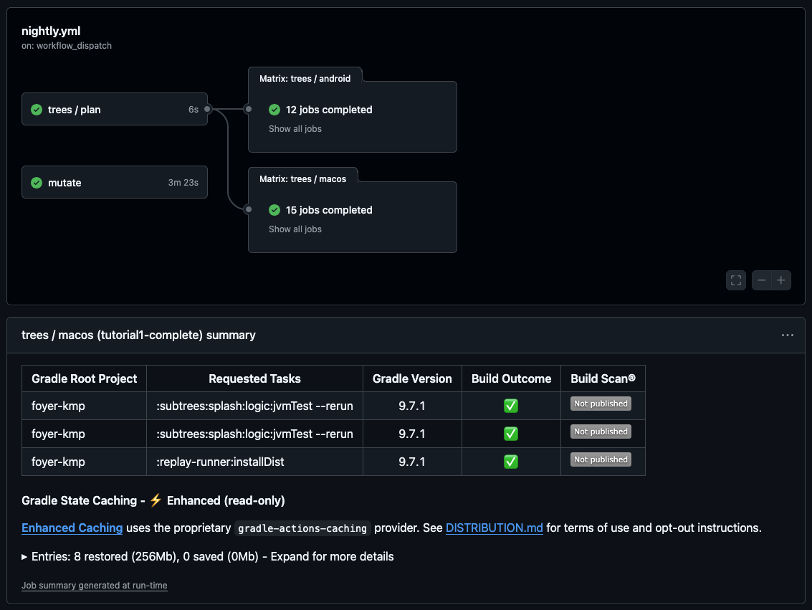

# Duet Tutorial 6: The Checks in CI

[Series overview](README.md) · [← Tutorial 5: Navigation as State](duet-05-navigation-as-state.md) · [Tutorial 7: Theming with Design Tokens →](duet-07-theming.md) · [On docs.modaal.dev](https://docs.modaal.dev/tutorials/duet-06-checks-in-ci)

Trees: [`tutorial6-start/`](../tutorial6-start) is what you open, [`tutorial6-complete/`](../tutorial6-complete) is what you have at the end. Run either tree's checks with `scripts/run-tree.sh tutorial6-start`.

In this tutorial you take the checks you have been running since [Tutorial 1](duet-01-first-feature.md) and make them the gate of a repository. You read the lanes the manifest derives and the list of what verify does not cover, learn what each command proves and what its red looks like, put every command into one workflow with three jobs and a scheduled fourth, and run the mutation drill in both directions: a row whose recording exists is caught, and a row that survives tells you which recording to write. The app does not change on this page; one recording joins it. This is the sixth page of the [nine-tutorial series](README.md), and Tutorials 7, 8 and 9 each start from this page's finished tree.

> [!NOTE]
> **The manual setup below is what Modaal automates.** Every tree this tutorial
> opens and every file it asks you to write is produced by the Duet templates in
> the [Modaal](https://modaal.dev) new-project wizard, and a coding agent working
> in Modaal writes the feature, records it and runs the checks for you. This
> series walks the same ground by hand so you know what the scaffold emits and
> why: [start a Duet project in the wizard](https://docs.modaal.dev/articles/new-project)
> when you would rather skip the setup.

## What will you build?

A repository whose main branch cannot go red silently. The checks are the ones [Tutorial 5](duet-05-navigation-as-state.md#run-both-apps) left you with, `tools/duet verify` and its neighbours; this page adds nothing to them and puts them where they run on every push. `parity/mutations.json` gains three rows, each an exact-string edit that seeds a defect into a reducer, and `tools/duet mutate` proves that the recordings catch every one. The third row survives on the tree you open, which is the exercise: the corpus does not pin the guard it deletes until you record the leaf that does. Expect about ninety minutes, most of it waiting for the first workflow run.

You will have at the end:

- The lanes report for the tree, and a table of the ten commands the checks are made of with what each proves.
- `.github/workflows/parity.yml` in a repository of your own: `checks`, `apple` and `android` green on a push, `mutate` on a nightly schedule with its receipt on the run's summary page.
- `parity/mutations.json` with three rows, and `tools/duet mutate` ending with `3/3 caught`.
- One new recording, `root.late-sign-in-inert`, 73 fixtures on the tree, and the exercise stub gone.

## Where do you start?

Open `tutorial6-start` from the [duet-tutorials repository](https://github.com/modaal-agent/duet-tutorials). It is Tutorial 5's finished tree plus one failing test, the closing exercise, and it resolves Duet 0.7.0, duet-tools 0.24.0, duet-services 0.11.1 and the KSP mock processor 0.2.1 with Tutorial 5's toolchain. Run the checks once before you edit anything:

```sh
tools/duet verify
```

The Kotlin lane reports one failure, `Tutorial6ExerciseSurvivingMutationTest` in the root module; that is the exercise, and everything else is green. `TUTORIAL_SKIP_STUBS=1 tools/duet verify` leaves the stub out and ends with `duet verify: PASS`.

## The steps

### Read the lanes the manifest derives

Every check on this tree is derived from `parity/manifest.yaml`: one entry per feature naming its implementation file, its state, action and effect types, the scenario its recordings are compiled from, and the recordings that pin it. The root's entry reads:

**`parity/manifest.yaml`**

```yaml parity/manifest.yaml
  root:
    kotlin: src-kmp/subtrees/root/logic/src/commonMain/kotlin/dev/modaal/foyer/root/RootFeature.kt
    state: RootState
    action: RootAction
    effectPayload: RootEffectPayload
    scenario: src-kmp/subtrees/root/logic/src/jvmTest/kotlin/dev/modaal/foyer/root/RootScenarioTest.kt
    fixtures:
      - root.splash-before-auth-holds
      - root.gate-after-splash
      - root.late-splash-inert
      - root.late-sign-in-inert
      - root.signed-in-skips-gate
      - root.gate-picks-onboarding
      - root.onboarding-completes-into-main
      - root.sign-out-returns-to-gate
      - root.session-expiry-returns-to-gate
      - root.entitlement-changes
      - root.link-forwards-under-main
      - root.link-waits-for-main
```

`tools/duet lanes` prints what the `duet` tool derives from the file and does not guess at anything else:

```text
duet lanes — derived from parity/manifest.yaml
  swift lane: none (no `swift:` paths)
  kotlin lane: src-kmp — unscoped task(s): :subtrees:account:logic:jvmTest :subtrees:editname:logic:jvmTest … :subtrees:welcome:logic:jvmTest
    a `./gradlew` line of your own reaches every declared module with: jvmTest
  per-feature:
    account: :subtrees:account:logic:jvmTest
    …
  chains (record via `duet record --chain <name>`):
    chain-root-splash: participants root, splash
    …
  protocol lane: duet protocol-run (runner: :replay-runner (Kotlin installDist)) — NOT run by `duet verify`
  outside the manifest — verify makes no coverage claim; run their suites in your workflow:
    gradle modules: :app :apple-umbrella :backend-local :ports :replay-runner
    swift packages: src-ios/Libraries/FoyerKit src-kmp/apple-umbrella/swift-consumer
```

Three lines decide the shape of the workflow. There is one lane, the Kotlin lane, because every feature declares a `kotlin:` path and none declares a `swift:` one; the Swift side is reached through the Apple boundary instead, which is a script and not a lane. The protocol lane is not part of verify, so it is a step of its own. And the last block is a list of modules verify makes no claim about: the two apps, the backend, the ports, the runner and the Swift packages. Each of those needs its own step, or its tests never run anywhere.

### Know what each command proves

The checks are ten commands. You have run most of them on earlier pages; this is the list with what each one proves and what its red names.

| Command | Proves | A red names |
| --- | --- | --- |
| `tools/duet version` | the pinned CLI resolves at `parity/duet-tools.ref`, checksum verified | the pin, or the checksum |
| `tools/duet lint` | the manifest parses and every path it names exists | the line and the missing path |
| `tools/duet doctor` | `.modaal/project.json` matches the tree, and no worker is stamped `@unchecked Sendable` | the declaration row, or the worker |
| `tools/duet verify` | the meta-checks, then every lane over every recording, then that every recording the manifest names was reported | the fixture and the step, then the lane |
| `tools/duet record --feature <f> --check` | the recordings on disk are what the scenario produces today | the fixture that drifted |
| `tools/duet mocks --check` | the generated Swift components and mocks match their inputs | the generated file |
| `tools/duet protocol-run` | the same corpus replays over the wire protocol into the runner binary | the fixture |
| `./gradlew :backend-local:jvmTest` | the on-device backend's own tests, which no lane reaches | the test |
| `parity/scripts/apple-boundary-lane.sh` | the core assembles, the recordings replay across the XCFramework, the Swift shells' suites pass | the phase, then the test |
| `./gradlew :app:testDebugUnitTest :app:assembleDebug` and `xcodebuild build` | the two apps build, and the Android unit tests pass | the compiler, or the test |

The order matters once: `verify` refuses to run a lane while a meta-check fails, so a manifest error is reported alone, and `record --check` after `verify` tells drift apart from a wrong reducer. You saw the shape of a verify red in [Tutorial 1's exercise](duet-01-first-feature.md#exercise-break-the-arming-guard), where deleting the arming guard failed one recording at one step; the drill below produces that red on purpose, many times.

### Run every check once, locally

Run the ten in the order the table lists them, from the tree's root. The two lines that take minutes are the boundary lane, which assembles the Kotlin core into an XCFramework before it replays anything, and the first Gradle invocation, which downloads the wrapper's distribution. Every later run is warm.

```sh
tools/duet version && tools/duet lint && tools/duet doctor && tools/duet verify
tools/duet record --feature root --check
tools/duet mocks --check
(cd src-kmp && ./gradlew :replay-runner:installDist -q) && tools/duet protocol-run --runner src-kmp/replay-runner/build/install/replay-runner/bin/replay-runner
(cd src-kmp && ./gradlew :backend-local:jvmTest :app:testDebugUnitTest :app:assembleDebug -q)
parity/scripts/apple-boundary-lane.sh
```

Each command ends with its own `PASS` line or with nothing, which for Gradle is the same. The tutorials repository wraps exactly this sequence in `scripts/run-tree.sh`, and its CI runs that script; the workflow you write next is the same sequence with a runner around each part.

### Put the checks in a workflow

`tutorial6-complete` carries `.github/workflows/parity.yml`, a workflow for a repository shaped like this tree. GitHub reads workflows at a repository's root, so the file does nothing where it sits inside the tutorials repository; it is the file you copy. Its header states the split:

**`.github/workflows/parity.yml`**

```yaml .github/workflows/parity.yml
# The checks, as one workflow for a repository shaped like this tree. Every
# step is a command you can run at the repository root; CI adds nothing the
# local loop does not have, and a red job names the command that went red.
#
# Four jobs:
#   checks   the toolchain gates on macOS: lint, doctor, verify (every lane
#            the manifest declares, plus its meta-checks and the per-fixture
#            coverage gate), the recording drift check, the generated-mock
#            fingerprints, the protocol lane and the backend's own tests
#   apple    the Apple boundary: the Kotlin core assembled into an
#            XCFramework, the same fixtures replayed across it, the Swift
#            shells' suites, and the iOS app built for a simulator
#   android  the Compose app's unit tests and a debug build, on ubuntu — the
#            hosted ubuntu image ships the Android SDK and the macOS image
#            does not
#   mutate   the mutation drill from parity/mutations.json, on the nightly
#            schedule and on demand; each row is a full suite run, so it does
#            not run per push
#
# The toolchain floors: Xcode 26.6 and a JDK 25, the versions the trees are
# verified against. The duet CLI arrives through tools/duet at the version in
# parity/duet-tools.ref; Gradle through the committed wrapper.
```

The `checks` job is the first eight commands with a comment above each. Two steps carry the shape you would otherwise get wrong. The recording check is scoped per feature and per chain, never unscoped, because an unscoped check refuses on a tree whose feature declares both lanes, and the scoped form checks the same fixtures on any tree:

**`.github/workflows/parity.yml`**

```yaml .github/workflows/parity.yml
      - name: tools/duet verify
        run: tools/duet verify

      # The drift gate: the recordings on disk are what the scenarios produce
      # today, checked per feature and per chain.
      - name: tools/duet record --check
        run: |
          plan="$(tools/duet lint --json)"
          for f in $(echo "$plan" | jq -r '.features | keys[]'); do
            tools/duet record --feature "$f" --check
          done
          for c in $(echo "$plan" | jq -r '.chains[]?'); do
            tools/duet record --chain "$c" --check
          done
```

The `android` job runs on ubuntu, because the hosted ubuntu image ships the Android SDK and the macOS image does not; it is the whole reason the workflow has two runners:

**`.github/workflows/parity.yml`**

```yaml .github/workflows/parity.yml
  android:
    if: github.event_name != 'schedule'
    runs-on: ubuntu-latest
    timeout-minutes: 30
    steps:
      - uses: actions/checkout@v7
      - uses: actions/setup-java@v6
        with:
          distribution: temurin
          java-version: "25"
      - uses: gradle/actions/setup-gradle@v6
      # The route restore, the back policy and the worker tests are here.
      - name: Android app: unit tests + assembleDebug
        run: (cd src-kmp && ./gradlew :app:testDebugUnitTest :app:assembleDebug --console=plain -q)
```

The `apple` job is the boundary lane and the iOS build behind a cache of the Kotlin/Native toolchain, keyed on the version catalog and saved even when the lane is red so the next run is warm. The `mutate` job is the subject of the last two steps.

To run it, make the tree a repository of its own and push it:

```sh
cp -R tutorial6-complete ~/foyer && cd ~/foyer
git init -b main && git add -A && git commit -q -m "Foyer at tutorial 6"
gh repo create foyer --private --source=. --push
```

The Actions tab shows one run with three jobs. For scale, the tutorials repository's own runs on this tree, which run the same commands as one macOS job and one ubuntu job, take about eight minutes on the macOS runner with the toolchain cache warm and under two on ubuntu; the first run downloads the Kotlin/Native toolchain and takes longer. Every step's name is the command it ran, so a red job reads the same as the same command red on your machine.

### Write the first mutation rows

The recordings are tests; the drill tests them. `parity/mutations.json` lists edits that each seed one defect into a reducer, and `tools/duet mutate` applies them one at a time, runs verify, and requires it to go red. A row that leaves verify green has found a behavior no recording pins. The first two rows target guards you know: the splash's arming guard from [Tutorial 1](duet-01-first-feature.md#write-the-reducer), and the root's hold on the phase while the session is unknown, from [Tutorial 3](duet-03-composing-features.md#write-the-root-level):

**`parity/mutations.json`**

```json parity/mutations.json
      "name": "splash-arming-guard",
      "file": "src-kmp/subtrees/splash/logic/src/commonMain/kotlin/dev/modaal/foyer/splash/SplashFeature.kt",
      "old": "if (state.isArmed) {",
      "new": "if (false) {",
      "seeds": "every Appeared arms a new safety net; a splash that reappears fires twice"
    },
    {
      "name": "root-splash-hold",
      "file": "src-kmp/subtrees/root/logic/src/commonMain/kotlin/dev/modaal/foyer/root/RootFeature.kt",
      "old": "next.awaitingAuth && action.auth != AuthSnapshot.Unknown ->",
      "new": "action.auth != AuthSnapshot.Unknown ->",
      "seeds": "the session's first report moves the phase while the splash is still on screen"
```

`old` must match the named file exactly once; `new` replaces it; `seeds` is the defect in one sentence, and the drill prints it beside the verdict. The first row turns the guard into a condition that is never true, so every `Appeared` arms a new net:

**`src-kmp/subtrees/splash/logic/src/commonMain/kotlin/dev/modaal/foyer/splash/SplashFeature.kt`**

```kotlin src-kmp/subtrees/splash/logic/src/commonMain/kotlin/dev/modaal/foyer/splash/SplashFeature.kt
    SplashAction.Appeared ->
      if (state.isArmed) {
        // The arming guard: a repeat `Appeared` writes nothing and emits nothing.
        Reduced(state)
      } else {
        Reduced(
          state.copy(isArmed = true),
          listOf(
            Effect.Run(
              SplashEffectPayload.ArmSafetyNet(SplashConfig.SAFETY_NET_MILLIS),
              id = SplashEffectIds.SAFETY_NET)))
      }
```

The second drops `next.awaitingAuth` from the root's `AuthChanged` arm, so the session's first report would move the phase with the splash still on screen:

**`src-kmp/subtrees/root/logic/src/commonMain/kotlin/dev/modaal/foyer/root/RootFeature.kt`**

```kotlin src-kmp/subtrees/root/logic/src/commonMain/kotlin/dev/modaal/foyer/root/RootFeature.kt
    is RootAction.AuthChanged -> {
      val next = state.copy(auth = action.auth)
      when {
        next.awaitingAuth && action.auth != AuthSnapshot.Unknown ->
          enter(next.copy(awaitingAuth = false), phaseAfterSplash(action.auth))
        state.phase.isSignedIn && action.auth == AuthSnapshot.SignedOut ->
          Reduced(next.copy(phase = RootPhase.SignIn))
        else -> Reduced(next)
      }
    }
```

Run one row by name while you write it:

```sh
tools/duet mutate splash-arming-guard
```

```text
duet mutate: verifying the clean tree is green first…
  seeding splash-arming-guard → src-kmp/subtrees/splash/logic/src/commonMain/kotlin/dev/modaal/foyer/splash/SplashFeature.kt
    (if interrupted, restore with: git checkout -- src-kmp/subtrees/splash/logic/src/commonMain/kotlin/dev/modaal/foyer/splash/SplashFeature.kt)
  ✓ splash-arming-guard: caught by [kotlin]
```

The drill verifies the clean tree first, because on a red tree every row would count as caught. It names the seeded file before the run, restores the exact prior bytes after it, and reports which lane went red. `splash.repeat-appear-inert` is the recording that caught this one; you deleted the same guard by hand in [Tutorial 1](duet-01-first-feature.md#exercise-break-the-arming-guard) and read the same red.

### Run the table, and read the row that survives

The third row targets the root's guard on a late sign-in completion: the `SignIn` arm ignores a `Completed` that arrives when the gate is not the mounted child. The row compares the wrong phase, so a completion under main would be accepted and would replace the session:

**`parity/mutations.json`**

```json parity/mutations.json
      "name": "root-late-signin-guard",
      "file": "src-kmp/subtrees/root/logic/src/commonMain/kotlin/dev/modaal/foyer/root/RootFeature.kt",
      "old": "if (state.phase != RootPhase.SignIn) {",
      "new": "if (state.phase == RootPhase.Splash) {",
      "seeds": "a sign-in completion that arrives after the gate is gone re-enters a phase and replaces the session"
```

**`src-kmp/subtrees/root/logic/src/commonMain/kotlin/dev/modaal/foyer/root/RootFeature.kt`**

```kotlin src-kmp/subtrees/root/logic/src/commonMain/kotlin/dev/modaal/foyer/root/RootFeature.kt
    is RootAction.SignIn ->
      when (val event = action.event) {
        is SignInDelegateEvent.Completed ->
          if (state.phase != RootPhase.SignIn) {
            Reduced(state)
          } else {
            val auth = AuthSnapshot.SignedIn(event.displayName, event.hasOnboarded)
            enter(state.copy(auth = auth), phaseAfterSplash(auth))
          }
      }
```

Run the whole table:

```sh
tools/duet mutate
```

```text
duet mutate: verifying the clean tree is green first…
  ✓ splash-arming-guard: caught by [kotlin]
  ✓ root-splash-hold: caught by [kotlin]
  ✗ root-late-signin-guard: SURVIVED — the corpus does not pin this behavior

| # | Mutation | Seeds | Result | Detail |
| --- | --- | --- | --- | --- |
| 1 | `splash-arming-guard` | every Appeared arms a new safety net; a splash that reappears fires twice | caught: kotlin | > Task :subtrees:splash:logic:jvmTest FAILED |
| 2 | `root-splash-hold` | the session's first report moves the phase while the splash is still on screen | caught: kotlin | > Task :subtrees:root:logic:jvmTest FAILED |
| 3 | `root-late-signin-guard` | a sign-in completion that arrives after the gate is gone re-enters a phase and replaces the session | SURVIVED | the corpus does not pin this behavior |

duet mutate: FAIL — 1 survived of 3 in 12.1s
```

The third row survives on the tree you opened: every root recording sends the gate's `Completed` while the gate is up, so a reducer that accepts it under main passes them all. The receipt table is the drill's output and the reason the `mutate` job in the workflow writes it to the run's summary page:

**`.github/workflows/parity.yml`**

```yaml .github/workflows/parity.yml
  mutate:
    if: github.event_name == 'schedule' || github.event_name == 'workflow_dispatch'
    runs-on: macos-26
    timeout-minutes: 60
    steps:
      - uses: actions/checkout@v7
      - uses: actions/setup-java@v6
        with:
          distribution: temurin
          java-version: "25"
      - uses: gradle/actions/setup-gradle@v6

      # Seeds each row of parity/mutations.json into the sources, runs verify,
      # and requires it to go red; restores the file before the next row. A
      # surviving row fails the job, and so does a stale one.
      - name: tools/duet mutate
        run: tools/duet mutate | tee mutate.log

      # The receipt table the drill prints, on the run's summary page.
      - name: receipt
        if: always()
        run: grep '^|' mutate.log >> "$GITHUB_STEP_SUMMARY" || true
```

The job runs on the schedule and on demand, never on a push: each row is a full verify, and the table grows with the app. Trigger it once from the Actions tab and read the table there; the third row is red until the exercise below is done.



*The tutorials repository's nightly run on the branch that added tutorial6-complete: the tree matrix and the mutate job green, the drill's first run on a hosted runner; Duet 0.7.0, duet-tools 0.24.0.*

## What you now have

- The lanes report read, and the list of modules verify makes no claim about, each with its own step in the workflow.
- Ten commands, each ending in its own pass line, run in one order locally and in the same order by the workflow.
- A repository of your own whose `checks`, `apple` and `android` jobs are green on a push, with the Kotlin/Native toolchain cached between runs.
- A mutation table with three rows and the drill's receipt on a nightly run's summary page; two rows caught, one surviving until the recording below exists.

## Exercise: record the leaf that catches the surviving row

`tutorial6-start` carries `Tutorial6ExerciseSurvivingMutationTest`, a failing placeholder in the root module. The surviving row deletes the guard that keeps a late sign-in completion inert, and no recording sends one. Add a branch to the root scenario that brings main up and then delivers a `Completed` from a gate that is gone:

**`src-kmp/subtrees/root/logic/src/jvmTest/kotlin/dev/modaal/foyer/root/RootScenarioTest.kt`**

```kotlin src-kmp/subtrees/root/logic/src/jvmTest/kotlin/dev/modaal/foyer/root/RootScenarioTest.kt
        branch("late sign-in inert") {
          whenAction("the host reports an onboarded session", RootAction.AuthChanged(onboardedAnn))
          whenAction("the splash completes", splashCompleted)
          then("main is up") { it.phase == RootPhase.Main }
          whenAction(
            "a sign-in completion arrives with the gate long gone",
            RootAction.SignIn(SignInDelegateEvent.Completed("mallory", hasOnboarded = false)))
          then("nothing changed: the phase and the session are as they were") {
            it.phase == RootPhase.Main && it.auth == onboardedAnn
          }
          thenEffects("nothing") { it.isEmpty() }
        }
```

List `root.late-sign-in-inert` in the manifest under the root's fixtures and in the root's feature spec, add its replay to the golden test, and delete the stub:

**`src-kmp/subtrees/root/logic/src/jvmTest/kotlin/dev/modaal/foyer/root/RootGoldenTest.kt`**

```kotlin src-kmp/subtrees/root/logic/src/jvmTest/kotlin/dev/modaal/foyer/root/RootGoldenTest.kt
  @Test fun lateSignInInertLeaf() = replay("root.late-sign-in-inert")
```

Run `tools/duet record --feature root`, then `tools/duet verify`, which replays 73 fixtures, then the drill:

```text
duet mutate: verifying the clean tree is green first…
  ✓ splash-arming-guard: caught by [kotlin]
  ✓ root-splash-hold: caught by [kotlin]
  ✓ root-late-signin-guard: caught by [kotlin]

duet mutate: PASS — 3/3 caught in 12.1s
```

`tutorial6-complete` carries the recording, the table and the workflow. A mutation that survives has told you exactly which recording is missing, and the recording you add is a test the drill will keep checking on every nightly run.

## Common questions

<details>
<summary><b>Why is the drill not part of verify?</b></summary>

Each row is a full verify run plus a baseline: seconds per row on a laptop with a warm Gradle daemon, as the output above shows, and under three minutes for the baseline and three rows on a hosted macOS runner that starts cold, with the table growing as the app does. The drill also edits source files while it runs, which a per-push gate must not do. The workflow gives it a schedule and a manual trigger, and the summary page carries its table, so a surviving row is read the next morning rather than blocking a push.

</details>

<details>
<summary><b>What if a row survives and no recording can catch it?</b></summary>

Then the guard the row deletes is unobservable, and the row does not belong in the table. The root has one such guard: the arm that ignores a splash `Completed` after the splash phase. Without it, a late completion re-enters the phase the session already implies, which is the phase the root is in, with no effect, so every recording passes with the guard gone and no recording can be written that fails. The guard stays as a statement of intent; the table holds only rows whose defect a recording can see.

</details>

<details>
<summary><b>Why does the workflow file inside tutorial6-complete not run?</b></summary>

GitHub reads workflow files from a repository's root `.github/workflows/` directory only. The tutorials repository is many trees in one repository, so the file in `tutorial6-complete/.github/workflows/` is inert there; the repository's own workflows run `scripts/run-tree.sh` over every tree, which runs the same ten commands. In a repository of your own the tree is the root, and the file runs as written.

</details>

<details>
<summary><b>Why two runners instead of one?</b></summary>

The macOS runner carries Xcode, which the Apple boundary lane and the iOS build need, and the hosted macOS image ships no Android SDK. The hosted ubuntu image ships the SDK and no Xcode. One job per runner, each with the steps that runner can carry, is the whole arrangement; the alternative is installing an SDK on every macOS run.

</details>

<details>
<summary><b>Why must `old` match exactly once?</b></summary>

A row targets source text, and source text moves. A row whose `old` no longer matches, or matches twice, would either seed nothing or seed the wrong site, and either way the verdict would be meaningless; the drill fails on it as a configuration error, so the table sweeps itself when a reducer is refactored. Recordings do not have this problem, which is why a row is a negative control for the recordings and not a replacement for them.

</details>

<details>
<summary><b>Why does the drill restore bytes instead of running git checkout?</b></summary>

Because you run it on a tree with uncommitted edits, while writing the next row. The drill reads the file, applies the substitution, runs the suite, and writes the bytes it read back, so your edits to that file survive. If the drill is interrupted mid-row the file is left mutated, which is why it prints the `git checkout` line before every run.

</details>

## Sources and further reading

- [The duet-tools repository](https://github.com/modaal-agent/duet-tools) — the verbs the checks are made of, `lanes`, `verify`, `record --check`, `mocks --check`, `protocol-run` and `mutate`, and `contracts/manifest.md`, the grammar the lanes derive from.
- [The duet-tutorials repository](https://github.com/modaal-agent/duet-tutorials) — `scripts/run-tree.sh`, the same commands as one script, and `.github/workflows/trees.yml` and `nightly.yml`, which run it over every tree.
- [GitHub Actions: Workflow syntax](https://docs.github.com/en/actions/writing-workflows/workflow-syntax-for-github-actions) — `on.schedule`, `concurrency`, `permissions` and the `if` expressions the jobs use.
- [GitHub Actions: Adding a job summary](https://docs.github.com/en/actions/writing-workflows/choosing-what-your-workflow-does/workflow-commands-for-github-actions#adding-a-job-summary) — `$GITHUB_STEP_SUMMARY`, where the drill's table lands.
- [GitHub Actions: Caching dependencies](https://docs.github.com/en/actions/writing-workflows/choosing-what-your-workflow-does/caching-dependencies-to-speed-up-workflows) — the restore and save steps around the Kotlin/Native toolchain.
- [The Duet glossary](https://docs.modaal.dev/articles/duet-glossary) — [the checks](https://docs.modaal.dev/articles/duet-glossary#gate), [lane](https://docs.modaal.dev/articles/duet-glossary#lane), [mutation drill](https://docs.modaal.dev/articles/duet-glossary#mutation-drill) and [golden recording](https://docs.modaal.dev/articles/duet-glossary#golden-fixture).

## Read next

- **[Tutorial 5: Navigation as State](duet-05-navigation-as-state.md)** — The tree this page puts under CI: the onboarding gate, the upgrade flow, the deep links and the route spine.
- **[Tutorial 7: Theming with Design Tokens](duet-07-theming.md)** — The cards move onto a token vocabulary generated for both platforms, and a high-contrast theme ships as one mapping with no feature-code change.
- **[Tutorial 8: Localizing the App](duet-08-localization.md)** — Every string moves into string catalogs on iOS and resources on Android, German joins as a second language, and no recording changes.
- **[Tutorial 9: Adding Analytics](duet-09-analytics.md)** — Seven events emitted by the reducers as effect data, a console sink worker on each platform, and the recordings checking every event.
- **[The Duet tutorial series](README.md)** — The nine tutorials, the app they build, the prerequisites and the versions they are verified against.
