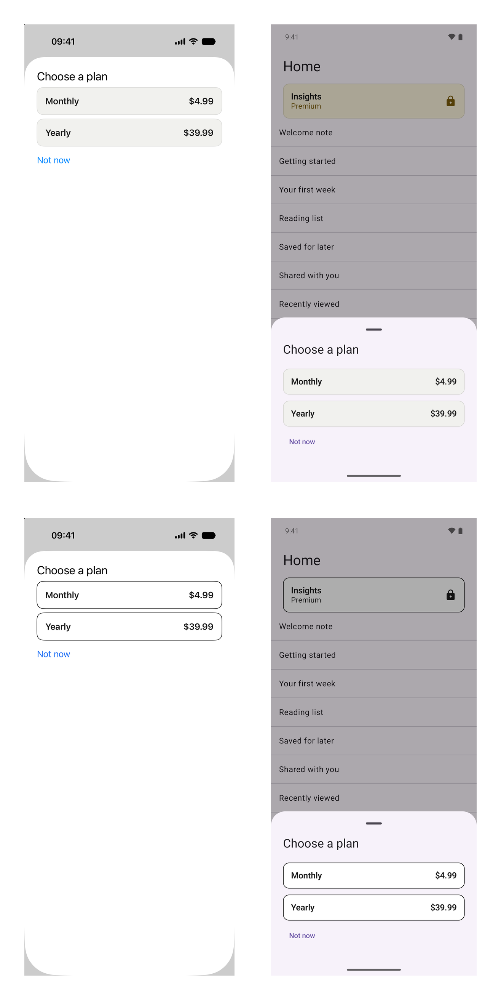

# Duet Tutorial 7: Theming with Design Tokens

[Series overview](README.md) · [← Tutorial 6: The Checks in CI](duet-06-checks-in-ci.md) · [Tutorial 8: Localizing the App →](duet-08-localization.md) · [On docs.modaal.dev](https://docs.modaal.dev/tutorials/duet-07-theming)

Trees: [`tutorial7-start/`](../tutorial7-start) is what you open, [`tutorial7-complete/`](../tutorial7-complete) is what you have at the end. Run either tree's checks with `scripts/run-tree.sh tutorial7-start`.

In this tutorial you move the app's cards off literal colors and onto a design-token vocabulary that lives in one file, `parity/design-tokens.yaml`, and is generated into both platforms by the `duet` command-line tool. You declare seven color tokens and two type styles, generate the vocabulary enums and the value tables for Swift and Kotlin, link the family's theme engines, bind the Insights card, the promo and the plan cards to the tokens, and then ship a second theme, high contrast, that the system's own accessibility setting selects. The second theme is one mapping per platform beside the generated tables; no feature module, no view and no recording changes for it. This is the seventh page of the [nine-tutorial series](README.md), and it starts from [Tutorial 6](duet-06-checks-in-ci.md)'s finished tree, as Tutorials 8 and 9 do.

> [!NOTE]
> **The manual setup below is what Modaal automates.** Every tree this tutorial
> opens and every file it asks you to write is produced by the Duet templates in
> the [Modaal](https://modaal.dev) new-project wizard, and a coding agent working
> in Modaal writes the feature, records it and runs the checks for you. This
> series walks the same ground by hand so you know what the scaffold emits and
> why: [start a Duet project in the wizard](https://docs.modaal.dev/articles/new-project)
> when you would rather skip the setup.

## What will you build?

A theming layer with one source of truth. `parity/design-tokens.yaml` names every color and type style the cards use, with a value per appearance; `tools/duet design-tokens` writes the Swift and Kotlin vocabularies and value tables from it, and `tools/duet design-tokens --check` joins the checks so a hand-edited or stale generated file is red. The views name tokens, `cardSurface`, `labelLocked`, `cardTitle`, and never a color. The main theme reads the generated table entry for entry; the high-contrast theme maps every token onto a stronger entry of the same table, so it carries no value of its own and cannot drift from the config. Expect about two hours, most of it in the two view files and the two theme files.

You will have at the end:

- `parity/design-tokens.yaml` with seven color tokens in three groups and two type tokens, and six generated files under `Generated/` on the two platforms.
- The theme engines linked: the `DuetTheming` product of duet-services in a new `Theming` target of the Swift package, and the `theming` artifact in a new `:theming` Gradle module.
- The Insights card, the promo and the plan cards bound to tokens on both platforms, with the recordings unchanged.
- A second theme, high contrast, selected by Increase Contrast on iOS and by the contrast setting on Android 14 and later, and a test that pins every label at WCAG level AAA under it.

## Where do you start?

Open `tutorial7-start` from the [duet-tutorials repository](https://github.com/modaal-agent/duet-tutorials). It is Tutorial 6's finished tree plus one failing test, the closing exercise, and it resolves Duet 0.7.0, duet-tools 0.24.0, duet-services 0.11.1 and the KSP mock processor 0.2.1 with Tutorial 6's toolchain. Tutorials 7, 8 and 9 all open this same tree. Run the checks once before you edit anything:

```sh
tools/duet verify
```

The Kotlin lane reports one failure, `Tutorial7ExerciseSecondThemeTest` in the home module; that is the exercise, and everything else is green. `TUTORIAL_SKIP_STUBS=1 tools/duet verify` leaves the stub out and ends with `duet verify: PASS`. The stub sits in the home module because the module the finished test lives in, `:theming`, does not exist yet; the exercise moves it.

## The steps

### Declare the vocabulary

Everything the cards need is seven colors and two type styles. Write them once, in `parity/design-tokens.yaml`, whose grammar is the toolchain's [`contracts/design-tokens.md`](https://github.com/modaal-agent/duet-tools/blob/main/contracts/design-tokens.md). The file starts with the two targets: where each language's generated files go, which engine they import, and the type the value table extends.

**`parity/design-tokens.yaml`**

```yaml parity/design-tokens.yaml
version: 1

swift:
  output: src-ios/Libraries/FoyerKit/Sources/Theming/Generated
  engine: DuetTheming
  theme: MainTheme

kotlin:
  output: src-kmp/theming/src/commonMain/kotlin/dev/modaal/foyer/theming/Generated
  package: dev.modaal.foyer.theming
  engine: dev.modaal.duet.services.theming
  palette: MainPalette
```

Then the colors, in groups. A token is named by what it means, never by what it looks like, and the name becomes an enum case in both languages. A color token states a `light:` and a `dark:` value, or one `value:` for both; alpha is a fraction on the appearance it belongs to. The `doc:` becomes the case's documentation comment; the `note:` becomes a comment on the value.

**`parity/design-tokens.yaml`**

```yaml parity/design-tokens.yaml
colors:
  - group: Surfaces
    tokens:
      - name: surface
        doc: >-
          The page. In the high-contrast theme every card sits directly on
          it.
        light: "#FFFFFF"
        dark: "#121212"
      - name: cardSurface
        doc: >-
          The ground of a card: the Insights card and the plan cards.
        light: "#F1F1EE"
        dark: "#262626"
      - name: lockedSurface
        doc: >-
          The ground of the Insights card while the entitlement is Free.
        note: >-
          A warm wash rather than a grey: the locked state is a state of the
          card, and a colour the eye reads before the lock glyph does.
        light: "#FBF3DC"
        dark: "#3B3320"

  - group: Labels
    tokens:
      - name: labelPrimary
        doc: >-
          Titles on cards: the card's name, the plan's name and price.
        light: "#1A1A1A"
        dark: "#EDEDED"
      - name: labelSecondary
        doc: >-
          Supporting text on cards, one step down: the teaser under the
          card's name.
        light: "#6A6A6A"
        dark: "#9C9C9C"
      - name: labelLocked
        doc: >-
          The lock glyph and the word under a locked card's name.
        light: "#7A5C0A"
        dark: "#E5C15C"

  - group: Chrome
    tokens:
      - name: cardBorder
        doc: >-
          The hairline around every card.
        note: >-
          Translucent, so it reads as a tint of whichever surface the card sits
          on; the high-contrast theme maps it onto the primary label, which
          makes it a solid line of ink.
        light: "#1A1A1A"
        lightAlpha: 0.12
        dark: "#EDEDED"
        darkAlpha: 0.16
```

A type token states the family, the CSS-scale weight, the size, the line height, and, because a `swift:` target is declared, the Dynamic Type style the cut scales against on iOS:

**`parity/design-tokens.yaml`**

```yaml parity/design-tokens.yaml
fonts:
  - group: The two card styles
    tokens:
      - name: cardTitle
        doc: >-
          The card's name, and the plan's name and price.
        family: sans
        weight: 600
        size: 17
        lineHeight: 22
        swift:
          textStyle: headline
      - name: cardBody
        doc: >-
          The teaser under a card's name.
        family: sans
        weight: 400
        size: 15
        lineHeight: 20
        swift:
          textStyle: subheadline
```

Generate:

```sh
tools/duet design-tokens
```

```text
duet design-tokens: wrote 6 token file(s):
  src-ios/Libraries/FoyerKit/Sources/Theming/Generated/SemanticColor.swift
  src-ios/Libraries/FoyerKit/Sources/Theming/Generated/SemanticFont.swift
  src-ios/Libraries/FoyerKit/Sources/Theming/Generated/MainThemePalette.swift
  src-kmp/theming/src/commonMain/kotlin/dev/modaal/foyer/theming/Generated/SemanticColor.kt
  src-kmp/theming/src/commonMain/kotlin/dev/modaal/foyer/theming/Generated/SemanticFont.kt
  src-kmp/theming/src/commonMain/kotlin/dev/modaal/foyer/theming/Generated/MainPalette.kt
review and commit the diff (generated token sources are committed build products)
```

### Read what was generated

Three files per language: the two vocabularies and the value table. The vocabulary is an enum with one case per token, the doc comments carried over, the groups as section headings. The two enums are emitted from one input in one declaration order, which is what makes them one vocabulary rather than two lists kept aligned by hand.

**`src-ios/Libraries/FoyerKit/Sources/Theming/Generated/SemanticColor.swift`**

```swift src-ios/Libraries/FoyerKit/Sources/Theming/Generated/SemanticColor.swift
public enum SemanticColor: ColorAssetable {

  // MARK: - Surfaces

  /// The page. In the high-contrast theme every card sits directly on it.
  case surface

  /// The ground of a card: the Insights card and the plan cards.
  case cardSurface

  /// The ground of the Insights card while the entitlement is Free.
  case lockedSurface

  // MARK: - Labels

  /// Titles on cards: the card's name, the plan's name and price.
  case labelPrimary

  /// Supporting text on cards, one step down: the teaser under the card's name.
  case labelSecondary

  /// The lock glyph and the word under a locked card's name.
  case labelLocked

  // MARK: - Chrome

  /// The hairline around every card.
  case cardBorder
}
```

**`src-kmp/theming/src/commonMain/kotlin/dev/modaal/foyer/theming/Generated/SemanticColor.kt`**

```kotlin src-kmp/theming/src/commonMain/kotlin/dev/modaal/foyer/theming/Generated/SemanticColor.kt
enum class SemanticColor {

  // Surfaces

  /**
   * The page. In the high-contrast theme every card sits directly on it.
   */
  surface,

  /**
   * The ground of a card: the Insights card and the plan cards.
   */
  cardSurface,

  /**
   * The ground of the Insights card while the entitlement is Free.
   */
  lockedSurface,

  // Labels

  /**
   * Titles on cards: the card's name, the plan's name and price.
   */
  labelPrimary,

  /**
   * Supporting text on cards, one step down: the teaser under the card's name.
   */
  labelSecondary,

  /**
   * The lock glyph and the word under a locked card's name.
   */
  labelLocked,

  // Chrome

  /**
   * The hairline around every card.
   */
  cardBorder,
}
```

The value table is written in each engine's own terms. On iOS it is an extension of `MainTheme`, the theme class you write in the next step, returning a `ColorSet` per token; the two-appearance form becomes `.auto(light:dark:)`, which resolves to a dynamic `UIColor` that follows a light/dark switch on its own. On Android it is an object of `ColorToken` entries in `0xAARRGGBB`, so the translucent border's `0.12` alpha is the `1F` byte:

**`src-ios/Libraries/FoyerKit/Sources/Theming/Generated/MainThemePalette.swift`**

```swift src-ios/Libraries/FoyerKit/Sources/Theming/Generated/MainThemePalette.swift
    case .lockedSurface:
      return ColorSet(.auto(light: tokenColor(0xFBF3DC), dark: tokenColor(0x3B3320)))

    // MARK: Labels

    case .labelPrimary:
      return ColorSet(.auto(light: tokenColor(0x1A1A1A), dark: tokenColor(0xEDEDED)))
    case .labelSecondary:
      return ColorSet(.auto(light: tokenColor(0x6A6A6A), dark: tokenColor(0x9C9C9C)))
    case .labelLocked:
      return ColorSet(.auto(light: tokenColor(0x7A5C0A), dark: tokenColor(0xE5C15C)))

    // MARK: Chrome

    // Translucent, so it reads as a tint of whichever surface the card sits on;
    // the high-contrast theme maps it onto the primary label, which makes it a
    // solid line of ink.
    case .cardBorder:
      return ColorSet(.auto(
        light: tokenColor(0x1A1A1A, alpha: 0.12),
        dark: tokenColor(0xEDEDED, alpha: 0.16)))
```

**`src-kmp/theming/src/commonMain/kotlin/dev/modaal/foyer/theming/Generated/MainPalette.kt`**

```kotlin src-kmp/theming/src/commonMain/kotlin/dev/modaal/foyer/theming/Generated/MainPalette.kt
      // Labels
      SemanticColor.labelPrimary -> ColorToken.auto(light = 0xFF1A1A1A, dark = 0xFFEDEDED)
      SemanticColor.labelSecondary -> ColorToken.auto(light = 0xFF6A6A6A, dark = 0xFF9C9C9C)
      SemanticColor.labelLocked -> ColorToken.auto(light = 0xFF7A5C0A, dark = 0xFFE5C15C)

      // Chrome
      // Translucent, so it reads as a tint of whichever surface the card sits
      // on; the high-contrast theme maps it onto the primary label, which makes
      // it a solid line of ink.
      SemanticColor.cardBorder -> ColorToken.auto(light = 0x1F1A1A1A, dark = 0x29EDEDED)
```

Each `switch` and each `when` is exhaustive over its vocabulary, so a token added to the config gets a value in the same generation. The type table has the same shape, a `FontToken` record per style on each side. The check regenerates every file in memory and compares whole files:

```sh
tools/duet design-tokens --check
```

```text
duet design-tokens --check: 6 generated token file(s) up to date
```

Edit a value in a generated file and the same command names the file as stale; drop a token from the config without regenerating and it names the leftover file as orphaned.

### Link the engines and declare the main theme

The generated files import an engine on each side, and the engines are two products of the duet-services release the tree already pins for [Tutorial 9](duet-09-analytics.md#link-the-grammar)'s telemetry. On iOS, `FoyerKit` gains a `Theming` target over the `DuetTheming` product, and the package gains its second family dependency, pinned exactly like the first:

**`src-ios/Libraries/FoyerKit/Package.swift`**

```swift src-ios/Libraries/FoyerKit/Package.swift
    .package(url: "https://github.com/modaal-agent/duet-services.git", exact: "0.11.1"),
```

**`src-ios/Libraries/FoyerKit/Package.swift`**

```swift src-ios/Libraries/FoyerKit/Package.swift
    // The theming layer: the vocabularies and the value table generated from
    // parity/design-tokens.yaml, the two themes over them, the call-site
    // accessors and the scope that picks the theme from the system setting.
    // iOS-only behind whole-file guards, as the engine is, so the target
    // compiles to nothing in the macOS slice the shells lane builds.
    .target(
      name: "Theming",
      dependencies: [
        .product(name: "DuetTheming", package: "duet-services")
      ],
      swiftSettings: strictConcurrency
    ),
```

The engine is iOS-only, and so is every file in this target; the package also builds for macOS, where the shells lane runs `swift test`, and there the target compiles to nothing. On Android, a `:theming` module with the JVM target alone, because the Android app consumes its JVM variant and the iOS app reads the same config through its own engine:

**`src-kmp/theming/build.gradle.kts`**

```kotlin src-kmp/theming/build.gradle.kts
plugins {
  alias(libs.plugins.kotlin.multiplatform)
}

base.archivesName.set("theming")

// The theming module: the token vocabularies and the value table generated
// from parity/design-tokens.yaml (`Generated/`, written by `tools/duet
// design-tokens` and gated by `tools/duet design-tokens --check`), and the
// two themes over them, hand-authored in Theme.kt. The JVM target is the only
// one: the Android app consumes this module's JVM variant, and the iOS app
// reads the same config through its own engine, so no Apple slice has a
// consumer.
kotlin {
  jvmToolchain(25)

  jvm()

  sourceSets {
    commonMain.dependencies {
      // ColorToken and FontToken, the value types the generated table is
      // written in.
      api(libs.duet.services.theming)
    }
    jvmTest.dependencies {
      implementation(kotlin("test"))
    }
  }
}

tasks.withType<Test>().configureEach { useJUnitPlatform() }
```

Include it in `settings.gradle.kts` and add `implementation(project(":theming"))` to the app module. The value types come from the artifact the version catalog already names, `duet-services-theming`.

Now the theme itself. The generator wrote the value table as an extension of a class it does not declare; you declare it. On iOS `MainTheme` is a `Themed, Assetable` class with the two asset families the app does not use set to `EmptyAsset`, and one method generation cannot write: how a type token becomes a face, which reads font resources the app owns. This app uses the system face at the token's weight and design, scaled by the token's Dynamic Type style:

**`src-ios/Libraries/FoyerKit/Sources/Theming/MainTheme.swift`**

```swift src-ios/Libraries/FoyerKit/Sources/Theming/MainTheme.swift
public class MainTheme: Themed, Assetable {
  public typealias _ImageAsset = EmptyAsset
  public typealias _GradientAsset = EmptyAsset
}
```

**`src-ios/Libraries/FoyerKit/Sources/Theming/MainTheme.swift`**

```swift src-ios/Libraries/FoyerKit/Sources/Theming/MainTheme.swift
  public func fontSet(for asset: _FontAsset) -> FontSet {
    let token = fontToken(for: asset)
    let scaled = UIFontMetrics(forTextStyle: token.textStyle).scaledFont(for: token.face)
    return FontSet(
      .static(scaled),
      fontMetrics: FontMetrics(
        pointSize: token.size,
        lineHeight: token.lineHeight,
        // The config states tracking as a fraction of the em; `.pct` is a
        // percentage of the point size, the same quantity times 100.
        letterSpacing: .pct(token.trackingEm * 100)
      )
    )
  }
```

The engine finds a theme by key and resolves both registrations by cast at the first lookup, so the two conformances live in one file. `Themes.swift` registers `.mainTheme` and, ahead of step 6, `.highContrast`:

**`src-ios/Libraries/FoyerKit/Sources/Theming/Themes.swift`**

```swift src-ios/Libraries/FoyerKit/Sources/Theming/Themes.swift
extension Theme: @retroactive Themeable {
  public static let mainTheme = Theme(key: "mainTheme")
  public static let highContrast = Theme(key: "highContrast")

  public func themed() -> Themed {
    switch self {
    case .mainTheme:
      return MainTheme()
    case .highContrast:
      return HighContrastTheme()
    default:
      fatalError("no theme is registered under the key \(key)")
    }
  }
}
```

On Android the theme is the app's own interface over the two vocabularies, and the main theme reads `MainPalette` entry for entry:

**`src-kmp/theming/src/commonMain/kotlin/dev/modaal/foyer/theming/Theme.kt`**

```kotlin src-kmp/theming/src/commonMain/kotlin/dev/modaal/foyer/theming/Theme.kt
interface Theme {
  fun color(token: SemanticColor): ColorToken

  fun font(token: SemanticFont): FontToken
}
```

**`src-kmp/theming/src/commonMain/kotlin/dev/modaal/foyer/theming/Theme.kt`**

```kotlin src-kmp/theming/src/commonMain/kotlin/dev/modaal/foyer/theming/Theme.kt
object MainTheme : Theme {
  override fun color(token: SemanticColor): ColorToken = MainPalette.color(token)

  override fun font(token: SemanticFont): FontToken = MainPalette.font(token)
}
```

The Kotlin module carries the theme tests, and the first one reads the table the way a screen will. Every token has a value in both appearances, and every label meets WCAG level AA, 4.5:1, on every surface it can sit on. The contrast ratio is fifteen lines in the test source set:

**`src-kmp/theming/src/jvmTest/kotlin/dev/modaal/foyer/theming/Contrast.kt`**

```kotlin src-kmp/theming/src/jvmTest/kotlin/dev/modaal/foyer/theming/Contrast.kt
fun contrastRatio(a: Long, b: Long): Double {
  val la = relativeLuminance(a)
  val lb = relativeLuminance(b)
  return (maxOf(la, lb) + 0.05) / (minOf(la, lb) + 0.05)
}
```

**`src-kmp/theming/src/jvmTest/kotlin/dev/modaal/foyer/theming/MainThemeTest.kt`**

```kotlin src-kmp/theming/src/jvmTest/kotlin/dev/modaal/foyer/theming/MainThemeTest.kt
  fun everyLabelReadsAtAaOnEveryCard() {
    for (appearance in ResolvedAppearance.entries) {
      for (surface in surfaces) {
        for (label in labels) {
          val ratio = MainTheme.contrast(label, surface, appearance)
          assertTrue(ratio >= 4.5, "$label on $surface at $appearance: ${"%.2f".format(ratio)}")
        }
      }
      val locked = MainTheme.contrast(SemanticColor.labelLocked, SemanticColor.lockedSurface, appearance)
      assertTrue(locked >= 4.5, "labelLocked on lockedSurface at $appearance: ${"%.2f".format(locked)}")
    }
  }
```

```sh
(cd src-kmp && ./gradlew :theming:jvmTest)
```

The module is no feature module, so `tools/duet verify` never reaches this test; `tools/duet lanes` lists `:theming` under "outside the manifest", and step 7 gives it a step of its own in the workflow.

### Write the accessors and publish the theme once

A view never touches the engine's lookup methods. Each platform gets two accessors that name a token and return what the view layer wants: a `Color` and a resolved type style. On iOS they are an extension of the engine's `ThemeProviding`, and the `View.font(_:)` overload applies the token's face, leading and tracking together:

**`src-ios/Libraries/FoyerKit/Sources/Theming/ThemeAccessors.swift`**

```swift src-ios/Libraries/FoyerKit/Sources/Theming/ThemeAccessors.swift
public extension ThemeProviding {
  /// A colour token as a SwiftUI `Color`. Under the system appearance the
  /// colour is dynamic, so a view holding it follows a light/dark switch on
  /// its own.
  func color(_ semanticColor: SemanticColor) -> Color {
    Color(color(for: semanticColor, preferredAppearance: nil, on: nil))
  }

  /// A type token resolved for rendering: the face, the line height and the
  /// tracking together. `.font(theme.font(.cardTitle))` applies all three.
  func font(_ semanticFont: SemanticFont) -> ThemedFont {
    let resolved = font(for: semanticFont, preferredAppearance: nil, on: nil)
    return ThemedFont(face: resolved.font, metrics: resolved.metrics)
  }
}
```

On Android they read two composition locals, the theme in effect and the resolved appearance, and turn a `FontToken` into a `TextStyle` in the platform's face for its family:

**`src-kmp/app/src/main/kotlin/dev/modaal/foyer/app/FoyerTheme.kt`**

```kotlin src-kmp/app/src/main/kotlin/dev/modaal/foyer/app/FoyerTheme.kt
/** A colour token's value under the theme in effect, at the resolved appearance. */
@Composable
@ReadOnlyComposable
fun SemanticColor.color(): Color = Color(LocalTheme.current.color(this).value(LocalAppearance.current))

/** A type token as a text style, in the platform's face for its family. */
@Composable
@ReadOnlyComposable
fun SemanticFont.textStyle(): TextStyle = LocalTheme.current.font(this).textStyle()
```

The theme is published once, at the root of each tree, and read below through the environment, so no view takes a theme parameter. Which theme is published is decided by the system: iOS exposes Increase Contrast to SwiftUI as `colorSchemeContrast`, and Android 14 exposes its contrast setting through `UiModeManager`. `FoyerThemeScope` wraps the engine's `ThemeScope` with that choice, over two providers built once. Nothing is persisted, because the setting is the user's and the system keeps it:

**`src-ios/Libraries/FoyerKit/Sources/Theming/FoyerThemeScope.swift`**

```swift src-ios/Libraries/FoyerKit/Sources/Theming/FoyerThemeScope.swift
public struct FoyerThemeScope<Content: View>: View {
  @Environment(\.colorSchemeContrast) private var contrast
  private let content: Content

  public init(@ViewBuilder content: () -> Content) {
    self.content = content()
  }

  public var body: some View {
    ThemeScope(contrast == .increased ? FoyerThemes.highContrast : FoyerThemes.main) { content }
  }
}
```

**`src-ios/Libraries/FoyerKit/Sources/Theming/FoyerThemeScope.swift`**

```swift src-ios/Libraries/FoyerKit/Sources/Theming/FoyerThemeScope.swift
@MainActor
enum FoyerThemes {
  static let main = provider(for: .mainTheme)
  static let highContrast = provider(for: .highContrast)

  private static func provider(for theme: Theme) -> ThemeProvider {
    ThemeProvider(persistentStorage: Unpersisted(), defaultTheme: theme, defaultPreferredAppearance: .system)
  }
}
```

The Compose twin provides the two locals and keeps Material's default scheme for the components this app does not draw itself:

**`src-kmp/app/src/main/kotlin/dev/modaal/foyer/app/FoyerTheme.kt`**

```kotlin src-kmp/app/src/main/kotlin/dev/modaal/foyer/app/FoyerTheme.kt
fun FoyerTheme(content: @Composable () -> Unit) {
  val dark = isSystemInDarkTheme()
  val theme = if (rememberSystemContrast() > 0f) HighContrastTheme else MainTheme
  CompositionLocalProvider(
    LocalTheme provides theme,
    LocalAppearance provides if (dark) ResolvedAppearance.Dark else ResolvedAppearance.Light,
  ) {
    MaterialTheme(colorScheme = if (dark) darkColorScheme() else lightColorScheme(), content = content)
  }
}
```

**`src-kmp/app/src/main/kotlin/dev/modaal/foyer/app/FoyerTheme.kt`**

```kotlin src-kmp/app/src/main/kotlin/dev/modaal/foyer/app/FoyerTheme.kt
private fun rememberSystemContrast(): Float {
  if (Build.VERSION.SDK_INT < Build.VERSION_CODES.UPSIDE_DOWN_CAKE) return 0f
  val context = LocalContext.current
  val manager = remember(context) { context.getSystemService(UiModeManager::class.java) }
  var contrast by remember(manager) { mutableFloatStateOf(manager.contrast) }
  DisposableEffect(manager) {
    val listener = UiModeManager.ContrastChangeListener { contrast = it }
    manager.addContrastChangeListener(context.mainExecutor, listener)
    onDispose { manager.removeContrastChangeListener(listener) }
  }
  return contrast
}
```

Each root wraps its tree in the scope. The scene delegate publishes to the hosting controller's view, and `AppRoot` replaces its `MaterialTheme` call:

**`src-ios/App/Foyer/SceneDelegate.swift`**

```swift src-ios/App/Foyer/SceneDelegate.swift
    // The theme is published once, here, to the whole tree: the scope picks
    // the main or the high-contrast theme from the system's contrast setting.
    window.rootViewController = UIHostingController(
      rootView: FoyerThemeScope { RootView(viewState: root.shell.viewState, shell: root.shell) })
```

**`src-kmp/app/src/main/kotlin/dev/modaal/foyer/app/AppRoot.kt`**

```kotlin src-kmp/app/src/main/kotlin/dev/modaal/foyer/app/AppRoot.kt
  FoyerTheme {
    Surface(Modifier.fillMaxSize(), color = MaterialTheme.colorScheme.background) {
      Box(Modifier.fillMaxSize().windowInsetsPadding(WindowInsets.safeDrawing)) {
        when (val current = child) {
          is RootChildMount.Splash -> SplashScreen(current.store)
          is RootChildMount.SignIn -> SignInScreen(current.store)
          is RootChildMount.Onboarding -> OnboardingScreen(current.mount)
          is RootChildMount.Main -> MainScreen(current.mount)
          null -> Unit
        }
      }
    }
  }
```

The app target gains the `Theming` product in `xcodegen.yml`, beside `RootShell`.

### Bind the cards

The Insights card is the one surface with a state of its own: locked or unlocked. It reads two surface tokens and two label tokens, and the locked state is a different token, not a different color. Every literal the card carried, the grey fill, `.secondary`, `.headline`, is gone:

**`src-ios/Libraries/FoyerKit/Sources/HomeShell/HomeView.swift`**

```swift src-ios/Libraries/FoyerKit/Sources/HomeShell/HomeView.swift
struct InsightsCard: View {
  @Environment(\.theme) private var theme
  let locked: Bool
  let onTap: () -> Void

  var body: some View {
    Button(action: onTap) {
      HStack {
        VStack(alignment: .leading, spacing: 4) {
          Text("Insights")
            .font(theme.font(.cardTitle))
            .foregroundStyle(theme.color(.labelPrimary))
          Text(locked ? "Premium" : "Your week at a glance")
            .font(theme.font(.cardBody))
            .foregroundStyle(theme.color(locked ? .labelLocked : .labelSecondary))
        }
        Spacer()
        if locked {
          Image(systemName: "lock.fill")
            .foregroundStyle(theme.color(.labelLocked))
        }
      }
      .padding(16)
      .background(theme.color(locked ? .lockedSurface : .cardSurface), in: RoundedRectangle(cornerRadius: 12))
      .overlay(RoundedRectangle(cornerRadius: 12).stroke(theme.color(.cardBorder), lineWidth: 1))
    }
    .buttonStyle(.plain)
  }
}
```

**`src-kmp/app/src/main/kotlin/dev/modaal/foyer/app/HomeScreen.kt`**

```kotlin src-kmp/app/src/main/kotlin/dev/modaal/foyer/app/HomeScreen.kt
private fun InsightsCard(entitlement: Entitlement, onClick: () -> Unit) {
  val locked = entitlement is Entitlement.Free
  val surface = if (locked) SemanticColor.lockedSurface else SemanticColor.cardSurface
  val teaser = if (locked) SemanticColor.labelLocked else SemanticColor.labelSecondary
  Card(
    onClick = onClick,
    modifier = Modifier.fillMaxWidth().padding(horizontal = 24.dp),
    colors = CardDefaults.cardColors(containerColor = surface.color()),
    border = BorderStroke(1.dp, SemanticColor.cardBorder.color()),
  ) {
    Row(Modifier.padding(16.dp), verticalAlignment = Alignment.CenterVertically) {
      Column(Modifier.weight(1f)) {
        Text("Insights", style = SemanticFont.cardTitle.textStyle(), color = SemanticColor.labelPrimary.color())
        Text(
          if (locked) "Premium" else "Your week at a glance",
          style = SemanticFont.cardBody.textStyle(),
          color = teaser.color(),
        )
      }
      if (locked) {
        Spacer(Modifier.width(12.dp))
        Icon(Icons.Filled.Lock, contentDescription = "Locked", tint = SemanticColor.labelLocked.color())
      }
    }
  }
}
```

The plan cards bind the same three tokens and the title style:

**`src-ios/Libraries/FoyerKit/Sources/UpgradeShell/UpgradeView.swift`**

```swift src-ios/Libraries/FoyerKit/Sources/UpgradeShell/UpgradeView.swift
        ForEach(viewState.cards, id: \.name) { card in
          Button {
            shell.selectPlan(card.plan)
          } label: {
            HStack {
              Text(card.name)
                .font(theme.font(.cardTitle))
              Spacer()
              Text(card.price)
                .font(theme.font(.cardTitle))
            }
            .foregroundStyle(theme.color(.labelPrimary))
            .padding(16)
            .background(theme.color(.cardSurface), in: RoundedRectangle(cornerRadius: 12))
            .overlay(RoundedRectangle(cornerRadius: 12).stroke(theme.color(.cardBorder), lineWidth: 1))
```

**`src-kmp/app/src/main/kotlin/dev/modaal/foyer/app/UpgradeSheet.kt`**

```kotlin src-kmp/app/src/main/kotlin/dev/modaal/foyer/app/UpgradeSheet.kt
  offers.forEach { offer ->
    Card(
      onClick = { store.send(UpgradeAction.PlanSelected(offer.plan)) },
      modifier = Modifier.fillMaxWidth().padding(vertical = 6.dp),
      colors = CardDefaults.cardColors(containerColor = SemanticColor.cardSurface.color()),
      border = BorderStroke(1.dp, SemanticColor.cardBorder.color()),
    ) {
      Row(Modifier.padding(16.dp), verticalAlignment = Alignment.CenterVertically) {
        Text(
          offer.plan.planName,
          style = SemanticFont.cardTitle.textStyle(),
          color = SemanticColor.labelPrimary.color(),
          modifier = Modifier.weight(1f),
        )
        Text(offer.price, style = SemanticFont.cardTitle.textStyle(), color = SemanticColor.labelPrimary.color())
      }
    }
  }
```

The promo binds its two labels the same way. On iOS the two view files gain `import Theming` and a whole-file `#if os(iOS)` guard, and so do `MainView.swift` and `RootView.swift`, which render them; the shells lane builds the package for macOS and tests the view shells, which carry no theming, so nothing under test disappears. The two shell targets gain `Theming` and `DuetTheming` as dependencies in `Package.swift`.

Two checks tell you the binding is a view change and nothing else. The mock generator fingerprints every source file in a shell's directory, so the edited views make `tools/duet mocks --check` red until you run `tools/duet mocks`, which rewrites the fingerprints and leaves the generated bodies as they were. And `tools/duet record --feature home --check` still reports the fixtures up to date, because nothing about a color ever entered a reducer: the state says `Free`, and the view picks the token.

```sh
tools/duet mocks && tools/duet verify
```

### Ship the second theme

The second theme has no values. It is a mapping over the vocabulary onto the main palette's stronger entries: every surface collapses onto the page, every label and the card border onto the primary label. A card in the high-contrast theme is the page's color with a solid line of ink around it, and nothing on it is grey. On iOS the mapping is a second `Themed, Assetable` class that delegates to `MainTheme`; on Android it is a second object over `MainPalette`. Both are exhaustive, so a token added to the config is a compile error in the second theme until it says where the token maps:

**`src-ios/Libraries/FoyerKit/Sources/Theming/HighContrastTheme.swift`**

```swift src-ios/Libraries/FoyerKit/Sources/Theming/HighContrastTheme.swift
public final class HighContrastTheme: Themed, Assetable {
  public typealias _ImageAsset = EmptyAsset
  public typealias _GradientAsset = EmptyAsset

  private let main = MainTheme()

  public func colorSet(for asset: SemanticColor) -> ColorSet {
    main.colorSet(for: asset.highContrastSource)
  }

  public func fontSet(for asset: SemanticFont) -> FontSet {
    main.fontSet(for: asset)
  }
}
```

**`src-kmp/theming/src/commonMain/kotlin/dev/modaal/foyer/theming/Theme.kt`**

```kotlin src-kmp/theming/src/commonMain/kotlin/dev/modaal/foyer/theming/Theme.kt
object HighContrastTheme : Theme {
  override fun color(token: SemanticColor): ColorToken = MainPalette.color(token.highContrastSource)

  override fun font(token: SemanticFont): FontToken = MainPalette.font(token)
}
```

**`src-ios/Libraries/FoyerKit/Sources/Theming/HighContrastTheme.swift`**

```swift src-ios/Libraries/FoyerKit/Sources/Theming/HighContrastTheme.swift
extension SemanticColor {
  /// The main-palette entry a token reads in the high-contrast theme.
  var highContrastSource: SemanticColor {
    switch self {
    case .surface, .cardSurface, .lockedSurface:
      return .surface
    case .labelPrimary, .labelSecondary, .labelLocked, .cardBorder:
      return .labelPrimary
    }
  }
}
```

**`src-kmp/theming/src/commonMain/kotlin/dev/modaal/foyer/theming/Theme.kt`**

```kotlin src-kmp/theming/src/commonMain/kotlin/dev/modaal/foyer/theming/Theme.kt
internal val SemanticColor.highContrastSource: SemanticColor
  get() =
    when (this) {
      SemanticColor.surface,
      SemanticColor.cardSurface,
      SemanticColor.lockedSurface -> SemanticColor.surface
      SemanticColor.labelPrimary,
      SemanticColor.labelSecondary,
      SemanticColor.labelLocked,
      SemanticColor.cardBorder -> SemanticColor.labelPrimary
    }
```

That is the whole second theme: this file and this object, plus the one line in each scope from step 4 that selects it. Run both apps, open the upgrade flow, and raise the contrast setting while they run. On the simulator that is Settings, Accessibility, Display & Text Size, Increase Contrast, or one command. On an Android device it is Settings, Accessibility, Color and motion, Color contrast; the emulator image's Settings app lists no such entry, and the setting's key does the same:

```sh
xcrun simctl ui booted increase_contrast enabled
adb shell settings put secure contrast_level 1
```

Both apps re-render in place: the scope publishes the other provider on iOS, and the contrast listener recomposes on Android.



*The upgrade flow's plans step in the main theme (top) and the high-contrast theme (bottom), iPhone 17 simulator on the left and Pixel 8 emulator, API 36, on the right; the same token names on every card, the bottom row through the second theme's mapping; tutorial7-complete at Duet 0.7.0, duet-tools 0.24.0, duet-services 0.11.1.*

Compare the tree against `tutorial6-complete` to see what the theme cost: no file under `src-kmp/subtrees`, no recording, and no view changed for it. The views changed in step 5, once, to name tokens; every theme after that is a mapping.

### Put the two new checks in the workflow

[Tutorial 6](duet-06-checks-in-ci.md#put-the-checks-in-a-workflow)'s workflow gains two steps in its `checks` job, the token drift gate after the mocks check and the theme tests after the backend's:

**`.github/workflows/parity.yml`**

```yaml .github/workflows/parity.yml
      - name: tools/duet design-tokens --check
        run: tools/duet design-tokens --check
```

**`.github/workflows/parity.yml`**

```yaml .github/workflows/parity.yml
      - name: theming tests
        run: (cd src-kmp && ./gradlew :theming:jvmTest --console=plain -q)
```

The tutorials repository's `scripts/run-tree.sh` runs the same two on any tree that carries `parity/design-tokens.yaml` and `src-kmp/theming`.

## What you now have

- One file, `parity/design-tokens.yaml`, that names every color and type style the cards use, and six generated files that `tools/duet design-tokens --check` holds to it.
- The two theme engines linked, a `MainTheme` on each platform over the generated table, and accessors that let a view name a token and nothing else.
- The Insights card, the promo and the plan cards on tokens on both platforms, with the recordings byte for byte as Tutorial 6 left them.
- A high-contrast theme that the system's setting selects, written as one mapping per platform, and a main-theme test at WCAG level AA.

## Exercise: pin what the second theme promises

`tutorial7-start` carries `Tutorial7ExerciseSecondThemeTest`, a failing placeholder in the home module. The high-contrast theme exists so that every label reads at WCAG level AAA, 7:1, on every surface, in both appearances; nothing checks that yet. Delete the stub and write the test in the `:theming` module, over the helper from step 3:

**`src-kmp/theming/src/jvmTest/kotlin/dev/modaal/foyer/theming/HighContrastThemeTest.kt`**

```kotlin src-kmp/theming/src/jvmTest/kotlin/dev/modaal/foyer/theming/HighContrastThemeTest.kt
class HighContrastThemeTest {
  private val labels = listOf(SemanticColor.labelPrimary, SemanticColor.labelSecondary, SemanticColor.labelLocked)
  private val surfaces = listOf(SemanticColor.surface, SemanticColor.cardSurface, SemanticColor.lockedSurface)

  @Test
  fun everyLabelReadsAtAaaOnEveryCard() {
    for (appearance in ResolvedAppearance.entries) {
      for (surface in surfaces) {
        for (label in labels) {
          val ratio = HighContrastTheme.contrast(label, surface, appearance)
          assertTrue(ratio >= 7.0, "$label on $surface at $appearance: ${"%.2f".format(ratio)}")
        }
      }
    }
  }

  @Test
  fun theCardBorderIsOpaqueInk() {
    for (appearance in ResolvedAppearance.entries) {
      val border = HighContrastTheme.color(SemanticColor.cardBorder).value(appearance)
      assertEquals(0xFFL, (border shr 24) and 0xFF, "the border is opaque at $appearance")
      assertEquals(HighContrastTheme.color(SemanticColor.labelPrimary).value(appearance), border)
    }
  }

  @Test
  fun theTypeStylesAreTheMainThemes() {
    for (token in SemanticFont.entries) {
      assertEquals(MainTheme.font(token).sizeSp, HighContrastTheme.font(token).sizeSp, "$token")
      assertEquals(MainTheme.font(token).weight, HighContrastTheme.font(token).weight, "$token")
    }
  }
}
```

```sh
(cd src-kmp && ./gradlew :theming:jvmTest) && tools/duet verify
```

`tutorial7-complete` carries the test. Change `labelSecondary`'s light value in the config to a lighter grey, regenerate, and the main-theme test from step 3 goes red at 4.5:1 while the high-contrast test stays green, because the second theme reads `labelPrimary` for that token and never sees the change.

## Common questions

<details>
<summary><b>Why generate the vocabulary instead of writing two enums?</b></summary>

Two enums written by hand are two lists kept aligned by review. One config emitted into both languages in one declaration order cannot disagree with itself, and `tools/duet design-tokens --check` holds the files to it on every push. The check is a whole-file comparison against an in-memory regeneration, so a hand-edit anywhere in a generated file is red, with the file named.

</details>

<details>
<summary><b>Why does the second theme carry no values of its own?</b></summary>

Because the config is the one place a value is written. A theme with its own hex values in Swift and Kotlin would be two more tables to keep aligned, outside the generator's reach. A mapping over the vocabulary keeps every value in `parity/design-tokens.yaml`, and the exhaustive `switch` and `when` make a new token a compile error in the second theme until it is placed. A theme that needs values the main palette lacks adds them to the config as tokens and maps onto those.

</details>

<details>
<summary><b>Why does the theme follow the system setting rather than an in-app picker?</b></summary>

A picker is feature state: a value to store, restore and reach from a screen. The contrast setting already exists on both platforms, the user owns it, and it is what a high-contrast theme is for. An in-app picker is a small addition when you want one: the engine's `ThemeProvider` takes a `ThemePersistentStorage` and a `setTheme(with:)` call on iOS, and a `MutableStateFlow` over the theme choice replaces the contrast listener on Android. On iOS, re-publish the provider after the change; the provider is not observable, so an already-rendered tree does not re-render on `setTheme` alone.

</details>

<details>
<summary><b>Why are four view files now iOS-only?</b></summary>

The theme engine is UIKit-backed and compiles for iOS only, and the Swift package also builds for macOS so the shells lane can run as plain `swift test` with no simulator. A view that reads the theme cannot compile in the macOS slice, so the two themed views and the two views that render them carry a whole-file guard. The shells lane tests the view shells, which carry no theming; the iOS app build, which the checks also run, compiles the views.

</details>

<details>
<summary><b>Why did the recordings not change?</b></summary>

A recording captures state, actions and effects, and none of them carries a color. The reducer says the entitlement is `Free`; the view chooses `lockedSurface` for that. [Tutorial 8](duet-08-localization.md#make-what-the-logic-says-a-value) rests on the same rule for strings: the state keeps semantic values, and the presentation is the shell's. That is also why `tools/duet mocks --check` was the check that noticed the edit, not `record --check`: the mock generator fingerprints the shell's source directory, the recording check reads the reducer.

</details>

<details>
<summary><b>How do Material's own components follow the theme?</b></summary>

They do not, on this tree: the buttons, the navigation bar and the sheet keep Material's default scheme, and only the surfaces this app draws itself read tokens. The `theming` artifact carries the bridge for the rest, `DuetThemeSpec`, an interface that binds every slot of Material's `ColorScheme` and `Typography` to a token, and a `ResolvedPalette` a Compose layer turns into a scheme. The [duet-services README](https://github.com/modaal-agent/duet-services) shows the binding; it is the hand-authored half the contract names, because Material's slots and Apple's roles are different sets.

</details>

## Sources and further reading

- [The duet-tools repository: `contracts/design-tokens.md`](https://github.com/modaal-agent/duet-tools/blob/main/contracts/design-tokens.md) — the config grammar, what is generated and what stays hand-authored, and the check.
- [The duet-services repository](https://github.com/modaal-agent/duet-services) — `DuetTheming` and the `theming` artifact: `Themed`, `Assetable`, `ThemeScope`, `ColorToken`, `FontToken` and the Material binding.
- [Apple: `colorSchemeContrast`](https://developer.apple.com/documentation/swiftui/environmentvalues/colorschemecontrast) — the environment value Increase Contrast sets; [`UIFontMetrics`](https://developer.apple.com/documentation/uikit/uifontmetrics) — scaling a face by a Dynamic Type style.
- [Android: `UiModeManager.getContrast()`](https://developer.android.com/reference/android/app/UiModeManager#getContrast()) — the contrast setting and its change listener; [Locally scoped data with CompositionLocal](https://developer.android.com/develop/ui/compose/compositionlocal) — the locals the accessors read.
- [WCAG 2.2: contrast (minimum)](https://www.w3.org/TR/WCAG22/#contrast-minimum) and [contrast (enhanced)](https://www.w3.org/TR/WCAG22/#contrast-enhanced) — the 4.5:1 and 7:1 thresholds the two tests assert, and the [relative luminance](https://www.w3.org/TR/WCAG22/#dfn-relative-luminance) formula the helper implements.
- [The Duet glossary](https://docs.modaal.dev/articles/duet-glossary) — [shell](https://docs.modaal.dev/articles/duet-glossary#shell), [the checks](https://docs.modaal.dev/articles/duet-glossary#gate) and [golden recording](https://docs.modaal.dev/articles/duet-glossary#golden-fixture).

## Read next

- **[Tutorial 6: The Checks in CI](duet-06-checks-in-ci.md)** — The tree this page opens, and the workflow the two new checks join.
- **[Tutorial 8: Localizing the App](duet-08-localization.md)** — Every string moves into string catalogs on iOS and resources on Android, German joins as a second language, and no recording changes.
- **[Tutorial 9: Adding Analytics](duet-09-analytics.md)** — The same tree, seven events emitted by the reducers as effect data, a console sink worker on each platform, and the recordings checking every event.
- **[The Duet tutorial series](README.md)** — The nine tutorials, the app they build, the prerequisites and the versions they are verified against.
