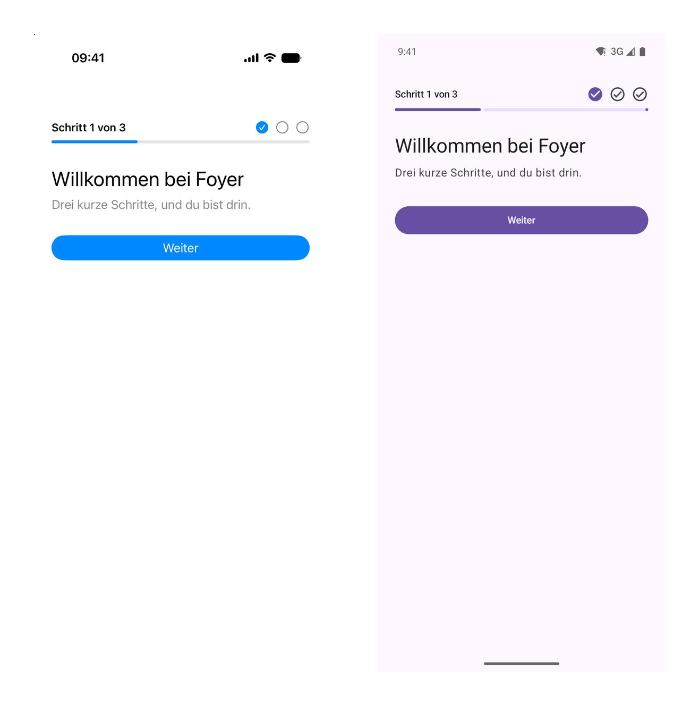
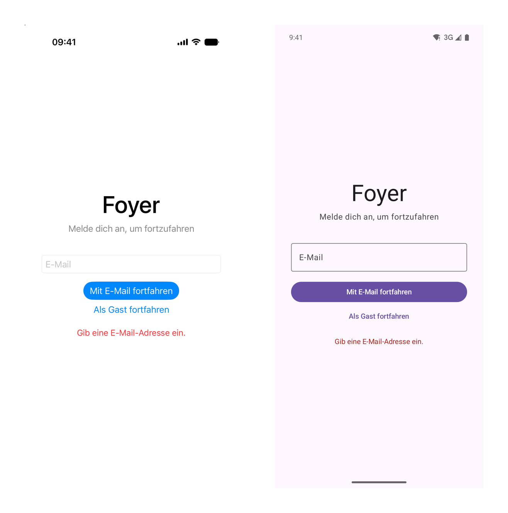

# Duet Tutorial 8: Localizing the App

[Series overview](README.md) · [← Tutorial 7: Theming with Design Tokens](duet-07-theming.md) · [Tutorial 9: Adding Analytics →](duet-09-analytics.md) · [On docs.modaal.dev](https://docs.modaal.dev/tutorials/duet-08-localization)

Trees: [`tutorial8-start/`](../tutorial8-start) is what you open, [`tutorial8-complete/`](../tutorial8-complete) is what you have at the end. Run either tree's checks with `scripts/run-tree.sh tutorial8-start`.

In this tutorial you localize Foyer, and the first thing you localize is not a view. Five messages in the shared core are English sentences today: the two refusals of a display name, the two refusals of a sign-in, and a declined purchase. They sit in state, they sit in six recordings, and a translator cannot reach them. You turn each into a value the reducer writes and the view names, re-record the features that carry them, and then move every string the two apps show into each platform's own localization system: one string catalog per shell target on iOS, with accessors generated by the xcstrings-tool plugin at build time, and string resources on Android. Then you add German on both and take the receipt: after the migration, a translation changes no recording. This is the eighth page of the [nine-tutorial series](README.md), and it starts from [Tutorial 6](duet-06-checks-in-ci.md)'s finished tree, as Tutorials 7 and 9 do.

> [!NOTE]
> **The manual setup below is what Modaal automates.** Every tree this tutorial
> opens and every file it asks you to write is produced by the Duet templates in
> [Modaal](https://modaal.dev), and a coding agent working in Modaal writes the
> feature, records it and runs the checks for you. This series walks the same
> ground by hand so you know what the scaffold emits and why:
> [start a Duet project in Modaal](https://docs.modaal.dev/articles/new-project)
> when you would rather skip the setup.

## What will you build?

A localized app on both platforms, with the rule that makes it cheap: the shared logic carries values, the views carry strings, and nothing in between carries either. The reducers already say `Free`, `Monthly`, `Guest`, `digest`, and after this tutorial they also say `NameValidation.Empty`, `SignInFailure.NoAccount` and `PurchaseFailure.Declined` where they said "Enter a name.", "No account for that address." and "Payment declined." The views say every sentence, through a catalog or a resource. Two view shells that projected strings into their view state stop doing so, and the tests that compared those strings compare values instead. Expect about two and a half hours: the core change is small, the string moves are many.

You will have at the end:

- Three sealed values in the core, `NameValidation`, `SignInFailure` and `PurchaseFailure`, in place of five English sentences, with six recordings re-recorded to carry a case where they carried a string.
- Nine `Localizable.xcstrings` catalogs, one per shell target, with the xcstrings-tool plugin generating a `String.Localizable` accessor per key on every build; `values/strings.xml` on Android with sixty-five strings and one plural.
- German on both platforms, with a test on each that holds the second language to the first: every key translated, every placeholder matched.
- The two apps running in German from one command each, refusals included, and a test in the root module that fails if a recording ever carries a string the resources own.

## Where do you start?

Open `tutorial8-start` from the [duet-tutorials repository](https://github.com/modaal-agent/duet-tutorials). It is Tutorial 6's finished tree plus one failing test, the closing exercise, and it resolves Duet 0.7.0, duet-tools 0.24.0, duet-services 0.11.1 and the KSP mock processor 0.2.1 with Tutorial 6's toolchain. Tutorials 7, 8 and 9 all open this same tree. Run the checks once before you edit anything:

```sh
tools/duet verify
```

The Kotlin lane reports one failure, `Tutorial8ExerciseRecordingsUnchangedTest` in the root module; that is the exercise, and everything else is green. `TUTORIAL_SKIP_STUBS=1 tools/duet verify` leaves the stub out and ends with `duet verify: PASS`.

## The steps

### Find every string

Before a catalog exists, count what goes into it. The SwiftUI views under `src-ios/Libraries/FoyerKit/Sources` hold forty string literals and the Compose screens under `src-kmp/app` hold thirty-eight: titles, buttons, placeholders, the tab labels, three accessibility labels, the promo, the plan cards, the insights rows. Then look at what the core says. The entitlement is `Free` or `Premium(plan)`, the plan is `Monthly` or `Yearly`, the provider is `Email` or `Guest`, a preference is its key, `digest`; the price is a string the purchases port formats. None of those is a sentence. Five things the core says are sentences:

```sh
grep -rn '"[A-Z][a-z].*\."' src-kmp/subtrees/*/logic/src/commonMain src-kmp/ports/src/commonMain src-kmp/backend-local/src/commonMain
```

The editor's validator returns "Enter a name." or "Keep it to 40 characters or fewer."; the sign-in gate writes "Enter an email address." into state and the auth port answers "No account for that address."; the purchases port answers "Payment declined." Each ends in a state field, `validation` or `failure`, that a view prints as it is, and each is in a recording: `name.empty-name-rejected`, both `editname.*-rejected` fixtures, `signin.empty-address-fails`, `signin.port-failure-lands` and `upgrade.purchase-failure-lands` carry the English sentence in their expected state. A German user gets those five in English, and a translator who fixes the wording changes a recording. That is what step 2 removes. Step 3 then moves the views' forty and thirty-eight, and step 4 the last three strings that live between the core and the views: the profile shell projects `planLabel`, the preferences shell projects a `label` per toggle, and the upgrade view compares one string to another to choose the billing line:

```swift
Text("\(price), billed \(planName == "Monthly" ? "every month" : "once a year").")
```

In German the plan's name is "Monatlich" and that comparison is wrong on every card.

### Make what the logic says a value

A refusal is a fact the reducer knows: the draft was empty, the address has no account, the payment was declined. The sentence that tells the user is the view's, in the user's language. So each message becomes a sealed value, coded like the ports' other sum types, with one case per reason. The name validator lives in the editor's module, where [Tutorial 5](duet-05-navigation-as-state.md#write-the-onboarding-level-and-its-steps) put it so the editor and the onboarding name step share one rule, and it moves first:

**`src-kmp/subtrees/editname/logic/src/commonMain/kotlin/dev/modaal/foyer/editname/EditNameFeature.kt`**

```kotlin src-kmp/subtrees/editname/logic/src/commonMain/kotlin/dev/modaal/foyer/editname/EditNameFeature.kt
@Serializable(with = NameValidationSerializer::class)
sealed interface NameValidation {
  @Serializable @SerialName("empty") data object Empty : NameValidation

  @Serializable @SerialName("tooLong") data object TooLong : NameValidation
}

/**
 * The one validation of a display name: the refusal for a draft the app
 * rejects, or null for one it accepts. The editor and the onboarding name
 * step both call it, so the two screens never disagree.
 */
fun validateDisplayName(draft: String): NameValidation? {
  val name = draft.trim()
  return when {
    name.isEmpty() -> NameValidation.Empty
    name.length > EditNameConfig.MAX_LENGTH -> NameValidation.TooLong
    else -> null
  }
}
```

The two refusals of a sign-in and the one refusal of a purchase go into the ports module, because the port's answer carries them: `SignInOutcome.Failed(reason: SignInFailure)` and `PurchaseOutcome.Failed(reason: PurchaseFailure)`.

**`src-kmp/ports/src/commonMain/kotlin/dev/modaal/foyer/ports/Ports.kt`**

```kotlin src-kmp/ports/src/commonMain/kotlin/dev/modaal/foyer/ports/Ports.kt
@Serializable(with = SignInFailureSerializer::class)
sealed interface SignInFailure {
  /** The gate refuses an empty address before it reaches the port. */
  @Serializable @SerialName("emptyAddress") data object EmptyAddress : SignInFailure

  /** The port knows no account for the address. */
  @Serializable @SerialName("noAccount") data object NoAccount : SignInFailure
}
```

Each gets a `CanonicalSumSerializer` beside the others, and the state fields change type: `validation: NameValidation?` on the name step and the editor, `failure: SignInFailure?` on the gate, `failure: PurchaseFailure?` on the flow. The reducers do not change. The name step still writes whatever the validator returned, the gate still writes `SignInFailure.EmptyAddress` where it wrote the constant, and both still write the port's `reason` through:

**`src-kmp/subtrees/name/logic/src/commonMain/kotlin/dev/modaal/foyer/name/NameFeature.kt`**

```kotlin src-kmp/subtrees/name/logic/src/commonMain/kotlin/dev/modaal/foyer/name/NameFeature.kt
    NameAction.ContinueTapped ->
      when (val validation = validateDisplayName(state.draft)) {
        null ->
          Reduced(
            state,
            listOf(
              Effect.Run(
                NameEffectPayload.NotifyHost(NameDelegateEvent.Continued(state.draft.trim())))))
        else -> Reduced(state.copy(validation = validation))
```

The on-device backend answers with a case instead of a sentence, and the scenarios compare cases:

**`src-kmp/subtrees/signin/logic/src/jvmTest/kotlin/dev/modaal/foyer/signin/SignInScenarioTest.kt`**

```kotlin src-kmp/subtrees/signin/logic/src/jvmTest/kotlin/dev/modaal/foyer/signin/SignInScenarioTest.kt
          then("the reason is shown, the latch released") {
            it.failure == SignInFailure.NoAccount && !it.isSigningIn
```

Now re-record the four features. This is the one point in the tutorial where a recording changes, and the diff says exactly what moved:

```sh
for f in name editname signin upgrade; do tools/duet record --feature $f; done
git diff --stat -- parity/fixtures
```

```diff
 "expectedState": {
   "draft": "",
   "isReady": false,
-  "validation": "Enter a name."
+  "validation": {
+    "case": "empty"
+  }
 },
```

Six recordings change like this, a string replaced by a case; seven more of the same features change only in the scenario line numbers their steps cite, which `tools/duet record --check` treats as metadata. Nothing else on the tree moved: no action, no effect, no other field. The feature specs under `parity/feature-specs` name the new types in their state tables, and `tools/duet verify` is green again.

Two things now hold. A translator can change every one of those five sentences without touching the core, because the core no longer has them. And the shells on both platforms receive a case and must name it, which is the next two steps.

### Write the catalogs and link the generator

On iOS a string catalog is a JSON file, `Localizable.xcstrings`, that Xcode edits as a table and the build compiles into the resource bundle. Each shell target gets its own, beside its views, and the [xcstrings-tool plugin](https://github.com/liamnichols/xcstrings-tool-plugin) turns every key into a Swift accessor at build time. The package manifest declares the source language, adds the plugin as its second dependency, pinned exactly like the first, and gives every shell target its catalog as a resource and the plugin as a build tool:

**`src-ios/Libraries/FoyerKit/Package.swift`**

```swift src-ios/Libraries/FoyerKit/Package.swift
    .package(url: "https://github.com/modaal-agent/duet.git", exact: "0.7.0"),
    // The string-catalog accessor generator: a build-tool plugin that writes
    // `String.Localizable` from each shell's Localizable.xcstrings at build
    // time. Pinned exactly, as every dependency of this tree is.
    .package(url: "https://github.com/liamnichols/xcstrings-tool-plugin.git", exact: "1.2.0"),
```

**`src-ios/Libraries/FoyerKit/Package.swift`**

```swift src-ios/Libraries/FoyerKit/Package.swift
      name: "OnboardingShell",
      dependencies: [
        "FoyerBridge",
        .target(name: "FoyerKit"),
        .product(name: "DuetShells", package: "duet"),
      ],
      // The shell's strings, and, after the settings, the plugin that
      // generates their accessors.
      resources: [.process("Localizable.xcstrings")],
      swiftSettings: strictConcurrency,
      plugins: [.plugin(name: "XCStringsToolPlugin", package: "xcstrings-tool-plugin")]
```

The manifest also gains `defaultLocalization: "en"` at the top. A catalog entry is a key, a state, and one string unit per language; the key is lowerCamelCase because it becomes a Swift identifier. This is the onboarding shell's progress line, with the German it gets in step 5 already in place, and `%lld` where an integer goes:

**`src-ios/Libraries/FoyerKit/Sources/OnboardingShell/Localizable.xcstrings`**

```json src-ios/Libraries/FoyerKit/Sources/OnboardingShell/Localizable.xcstrings
    "stepOf" : {
      "extractionState" : "manual",
      "localizations" : {
        "de" : {
          "stringUnit" : {
            "state" : "translated",
            "value" : "Schritt %lld von %lld"
          }
        },
        "en" : {
          "stringUnit" : {
            "state" : "translated",
            "value" : "Step %lld of %lld"
          }
        }
      }
    },
```

Build once and the plugin writes one file per catalog under `.build/plugins/outputs`, never into the tree. The first build on a machine asks you to trust the plugin, in Xcode's dialog or in `swift build`'s prompt; a CI runner has no one to answer, so the workflow's `xcodebuild` line passes `-skipPackagePluginValidation`, and `scripts/run-tree.sh` does the same. For that entry it generates a function, with one `Int` parameter per specifier; a key without specifiers becomes a static property:

```swift
/// Source localization: Step %lld of %lld
internal static func stepOf(_ arg1: Int, _ arg2: Int) -> Localizable {
    Localizable(
        key: "stepOf",
        arguments: [
            .int(arg1),
            .int(arg2)
        ],
        table: "Localizable"
    )
}
```

The same file gives you `Text(localizable:)` for SwiftUI, which resolves the string through the target's own resource bundle, and `String(localized: .localizable(…))` for an API that wants a `String`: a text field's prompt, a button's title, an accessibility label. The generated type is internal to its target, which is why the catalog lives beside the views that read it. The progress row and the welcome step now read:

**`src-ios/Libraries/FoyerKit/Sources/OnboardingShell/OnboardingView.swift`**

```swift src-ios/Libraries/FoyerKit/Sources/OnboardingShell/OnboardingView.swift
struct ProgressRowView: View {
  @ObservedObject var viewState: ProgressViewState
  let shell: ProgressViewShell

  var body: some View {
    VStack(alignment: .leading, spacing: 8) {
      HStack {
        Text(localizable: .stepOf(viewState.stepNumber, viewState.stepCount))
          .font(.subheadline.weight(.semibold))
        Spacer()
        ForEach(1...viewState.stepCount, id: \.self) { number in
          Image(systemName: viewState.readySteps.contains(number) ? "checkmark.circle.fill" : "circle")
            .foregroundStyle(viewState.readySteps.contains(number) ? Color.accentColor : Color.secondary)
            .accessibilityLabel(
              String(localized: .localizable(viewState.readySteps.contains(number) ? .stepReady(number) : .stepNotReady(number))))
        }
      }
      ProgressView(value: Double(viewState.stepNumber), total: Double(viewState.stepCount))
    }
    .onAppear { shell.appeared() }
  }
}
```

**`src-ios/Libraries/FoyerKit/Sources/OnboardingShell/OnboardingView.swift`**

```swift src-ios/Libraries/FoyerKit/Sources/OnboardingShell/OnboardingView.swift
struct WelcomeStepView: View {
  let shell: WelcomeViewShell

  var body: some View {
    VStack(alignment: .leading, spacing: 8) {
      Text(localizable: .welcomeTitle)
        .font(.title)
      Text(localizable: .welcomeBody)
        .foregroundStyle(.secondary)
      Button {
        shell.continueTapped()
      } label: {
        Text(localizable: .continueAction)
          .frame(maxWidth: .infinity)
      }
      .buttonStyle(.borderedProminent)
      .padding(.top, 24)
    }
    .onAppear { shell.appeared() }
  }
}
```

Do the same in the other eight shells. The refusals from step 2 arrive in the view state as the reducer's value; each view gains one extension that names the case, and prints that instead of a string it never had:

**`src-ios/Libraries/FoyerKit/Sources/EditNameShell/EditNameView.swift`**

```swift src-ios/Libraries/FoyerKit/Sources/EditNameShell/EditNameView.swift
/// The refusal's string, from its case: the reducer says why, the view says it.
extension NameValidation {
  var message: String.Localizable {
    switch onEnum(of: self) {
    case .empty: .validationEmpty
    case .tooLong: .validationTooLong
    }
  }
```

The editor's view shows it with `Text(localizable: validation.message)`; the onboarding name step has the same extension over the same type, the sign-in view one over `SignInFailure`, the upgrade view one over `PurchaseFailure`. Three shell specs that compared the message compare the case now, `XCTAssertTrue(child.shell.viewState.validation is NameValidationEmpty)`. One string on the insights screen is a count, "4 days", and a count is a plural: the catalog entry carries a `one` and an `other` variation instead of one unit, and the accessor takes the number:

**`src-ios/Libraries/FoyerKit/Sources/HomeShell/Localizable.xcstrings`**

```json src-ios/Libraries/FoyerKit/Sources/HomeShell/Localizable.xcstrings
    "streakDays" : {
      "extractionState" : "manual",
      "localizations" : {
        "de" : {
          "variations" : {
            "plural" : {
              "one" : {
                "stringUnit" : {
                  "state" : "translated",
                  "value" : "%lld Tag"
                }
              },
              "other" : {
                "stringUnit" : {
                  "state" : "translated",
                  "value" : "%lld Tage"
                }
              }
            }
          }
        },
        "en" : {
          "variations" : {
            "plural" : {
              "one" : {
                "stringUnit" : {
                  "state" : "translated",
                  "value" : "%lld day"
                }
              },
              "other" : {
                "stringUnit" : {
                  "state" : "translated",
                  "value" : "%lld days"
                }
              }
            }
          }
        }
      }
    },
```

**`src-ios/Libraries/FoyerKit/Sources/HomeShell/HomeView.swift`**

```swift src-ios/Libraries/FoyerKit/Sources/HomeShell/HomeView.swift
        InsightRow(label: String(localized: .localizable(.itemsReadThisWeek)), value: "7")
        InsightRow(label: String(localized: .localizable(.longestStreak)), value: String(localized: .localizable(.streakDays(4))))
        InsightRow(label: String(localized: .localizable(.mostRead)), value: String(localized: .localizable(.readingList)))
```

```sh
(cd src-ios/Libraries/FoyerKit && swift build)
```

The build prints one `Output written to` line per catalog, nine in all, and compiles without a string literal left in a view.

### Move the shells' strings into the views

A view shell projects state into view state; a string in view state is a string the shell chose, in a language the shell does not know, and a string the shell's tests then compare. The three cases from step 1 each become a value. The upgrade shell's confirm step carried the plan's name; it carries a key now, and the view names the plan and the billing line from it, so nothing compares two strings:

**`src-ios/Libraries/FoyerKit/Sources/UpgradeShell/UpgradeViewShell.swift`**

```swift src-ios/Libraries/FoyerKit/Sources/UpgradeShell/UpgradeViewShell.swift
/// A plan, as the view names it. The Kotlin `Plan` crosses the bridge as a
/// class; this key is what the view switches on and what the tests compare.
/// The view picks the plan's name and its billing line from it, so no string
/// is ever compared to another.
public enum PlanKey: Hashable {
  case monthly
  case yearly
}

/// The step, as the view switches on it.
public enum UpgradeStepKey: Equatable {
  case plans
  case confirm(plan: PlanKey, price: String)
  case done
}

/// One plan card.
public struct PlanCard {
  public let plan: Plan
  public let key: PlanKey
  public let price: String
}
```

**`src-ios/Libraries/FoyerKit/Sources/UpgradeShell/UpgradeView.swift`**

```swift src-ios/Libraries/FoyerKit/Sources/UpgradeShell/UpgradeView.swift
      case .confirm(let plan, let price):
        Text(localizable: .confirmPlan(String(localized: .localizable(plan.name))))
          .font(.title2)
        Text(localizable: plan == .monthly ? .billedMonthly(price) : .billedYearly(price))
          .foregroundStyle(.secondary)
```

**`src-ios/Libraries/FoyerKit/Sources/UpgradeShell/UpgradeView.swift`**

```swift src-ios/Libraries/FoyerKit/Sources/UpgradeShell/UpgradeView.swift
/// The plan's name, from its key. The view names the string; the shell never
/// projects one, so nothing downstream can compare two names.
extension PlanKey {
  var name: String.Localizable {
    switch self {
    case .monthly: .planMonthly
    case .yearly: .planYearly
    }
  }
```

The profile shell's `planLabel` becomes `plan`, a three-case value, with the same mapping at the end of the view file; the preferences shell's row keeps the key and drops the label, and the view names the toggle from the key:

**`src-ios/Libraries/FoyerKit/Sources/ProfileShell/ProfileViewShell.swift`**

```swift src-ios/Libraries/FoyerKit/Sources/ProfileShell/ProfileViewShell.swift
/// The plan row's value, as the view names it. The Kotlin `Entitlement`
/// crosses the bridge as a class; this key is what the view switches on and
/// what the tests compare. The shell projects no string for it.
public enum PlanLabel: Equatable {
  case free
  case premiumMonthly
  case premiumYearly
}
```

**`src-ios/Libraries/FoyerKit/Sources/OnboardingShell/StepShells.swift`**

```swift src-ios/Libraries/FoyerKit/Sources/OnboardingShell/StepShells.swift
/// One toggle, as the view lists it: the key the reducer knows, and whether
/// it is on. The view names the toggle from the key.
public struct PreferenceRow: Equatable {
  public let key: String
  public let isOn: Bool
}
```

**`src-ios/Libraries/FoyerKit/Sources/OnboardingShell/OnboardingView.swift`**

```swift src-ios/Libraries/FoyerKit/Sources/OnboardingShell/OnboardingView.swift
  /// The toggle's label, from its key; a key the catalog does not name shows as itself.
  private func label(for key: String) -> Text {
    switch key {
    case "digest": Text(localizable: .preferenceDigest)
    case "reminders": Text(localizable: .preferenceReminders)
    case "tips": Text(localizable: .preferenceTips)
    default: Text(key)
    }
  }
```

Four assertions in the shell specs compared the projected strings; they compare the values now, in `MainViewShellSpec` and `RootCompositionSpec`:

**`src-ios/Libraries/FoyerKit/Tests/MainShellTests/MainViewShellSpec.swift`**

```swift src-ios/Libraries/FoyerKit/Tests/MainShellTests/MainViewShellSpec.swift
    XCTAssertEqual(shell.profile?.shell.viewState.plan, .free)
    entitlement.project(EntitlementPremium(plan: PlanYearly.shared))
    XCTAssertEqual(shell.home?.shell.viewState.isInsightsLocked, false)
    XCTAssertEqual(shell.profile?.shell.viewState.plan, .premiumYearly)
```

That is the whole Swift side: no shell resolves a string, no test compares one, and `swift test` on the package runs its thirty-five shell specs as before. The reason the shells must not resolve strings is not only tidiness; a Common question below has the build fact behind it.

### Write the resources

Android has had this system since its first release: `res/values/strings.xml` is the source language, the resource compiler generates `R.string` and `R.plurals` from it, and a Compose screen reads a resource with `stringResource`. The one file the app already had held the launcher label; it holds every string now, and the screens read it by name:

**`src-kmp/app/src/main/res/values/strings.xml`**

```xml src-kmp/app/src/main/res/values/strings.xml
<?xml version="1.0" encoding="utf-8"?>
<!-- Every string the Compose screens show, in the source language. A screen
     names a resource; a translation is another values-<lang>/ directory with
     the same names. The state never carries one of these. -->
<resources>
  <string name="app_name">Foyer</string>
  <string name="splash_tagline">One core, two apps</string>
  <string name="sign_in_failure_empty_address">Enter an email address.</string>
  <string name="sign_in_failure_no_account">No account for that address.</string>
  <string name="sign_in_title">Sign in to continue</string>
  <string name="sign_in_email">Email</string>
  <string name="sign_in_continue_with_email">Continue with email</string>
  <string name="sign_in_continue_as_guest">Continue as guest</string>
```

**`src-kmp/app/src/main/kotlin/dev/modaal/foyer/app/OnboardingScreen.kt`**

```kotlin src-kmp/app/src/main/kotlin/dev/modaal/foyer/app/OnboardingScreen.kt
private fun ProgressRow(store: ProgressStore) {
  val state by store.state.collectAsState()
  LaunchedEffect(Unit) { store.send(ProgressAction.Appeared) }
  Column {
    Row(Modifier.fillMaxWidth(), verticalAlignment = Alignment.CenterVertically) {
      Text(
        stringResource(R.string.onboarding_step_of, state.page.stepNumber, STEP_COUNT),
        style = MaterialTheme.typography.labelLarge,
        modifier = Modifier.weight(1f),
      )
      OnboardingPage.entries.forEach { page ->
        val ready = state.readiness[page] == true
        Icon(
          if (ready) Icons.Filled.CheckCircle else Icons.Outlined.CheckCircle,
          contentDescription =
            stringResource(if (ready) R.string.onboarding_step_ready else R.string.onboarding_step_not_ready, page.stepNumber),
          tint =
            if (ready) MaterialTheme.colorScheme.primary
            else MaterialTheme.colorScheme.onSurfaceVariant,
          modifier = Modifier.padding(start = 8.dp),
        )
      }
    }
    Spacer(Modifier.height(8.dp))
    LinearProgressIndicator(
      progress = { state.page.stepNumber.toFloat() / STEP_COUNT },
      modifier = Modifier.fillMaxWidth(),
    )
  }
}
```

**`src-kmp/app/src/main/kotlin/dev/modaal/foyer/app/OnboardingScreen.kt`**

```kotlin src-kmp/app/src/main/kotlin/dev/modaal/foyer/app/OnboardingScreen.kt
private fun WelcomeStep(store: WelcomeStore) {
  LaunchedEffect(Unit) { store.send(WelcomeAction.Appeared) }
  Column(Modifier.fillMaxSize()) {
    Text(stringResource(R.string.welcome_title), style = MaterialTheme.typography.headlineMedium)
    Spacer(Modifier.height(8.dp))
    Text(
      stringResource(R.string.welcome_body),
      style = MaterialTheme.typography.bodyLarge,
      color = MaterialTheme.colorScheme.onSurfaceVariant,
    )
    Spacer(Modifier.height(32.dp))
    Button(onClick = { store.send(WelcomeAction.ContinueTapped) }, modifier = Modifier.fillMaxWidth()) {
      Text(stringResource(R.string.action_continue))
    }
  }
}
```

Placeholders are positional, `%1$d` and `%2$d`, so a translation can reorder them; the count on the insights screen is a `<plurals>` resource read with `pluralStringResource`, which takes the number twice, once to pick the form and once to print:

**`src-kmp/app/src/main/res/values/strings.xml`**

```xml src-kmp/app/src/main/res/values/strings.xml
  <plurals name="streak_days">
    <item quantity="one">%1$d day</item>
    <item quantity="other">%1$d days</item>
  </plurals>
```

**`src-kmp/app/src/main/kotlin/dev/modaal/foyer/app/HomeScreen.kt`**

```kotlin src-kmp/app/src/main/kotlin/dev/modaal/foyer/app/HomeScreen.kt
      InsightRow(stringResource(R.string.insight_items_read), "7")
      InsightRow(stringResource(R.string.insight_longest_streak), pluralStringResource(R.plurals.streak_days, 4, 4))
      InsightRow(stringResource(R.string.insight_most_read), stringResource(R.string.insight_reading_list))
```

The refusals get their names the same way, a resource id per case, and the text field prints the resource:

**`src-kmp/app/src/main/kotlin/dev/modaal/foyer/app/EditNameScreen.kt`**

```kotlin src-kmp/app/src/main/kotlin/dev/modaal/foyer/app/EditNameScreen.kt
/** The refusal's string, from its case: the reducer says why, the screen says it. */
val NameValidation.messageRes: Int
  @StringRes
  get() =
    when (this) {
      NameValidation.Empty -> R.string.validation_empty
      NameValidation.TooLong -> R.string.validation_too_long
    }
```

**`src-kmp/app/src/main/kotlin/dev/modaal/foyer/app/EditNameScreen.kt`**

```kotlin src-kmp/app/src/main/kotlin/dev/modaal/foyer/app/EditNameScreen.kt
      supportingText = state.validation?.let { refusal -> { Text(stringResource(refusal.messageRes)) } },
```

The Compose side has the same three helpers the Swift side had, and they change the same way: the plan's name and its billing line become resource ids chosen from the `Plan` value, and the toggle's label becomes a composable over its key:

**`src-kmp/app/src/main/kotlin/dev/modaal/foyer/app/UpgradeSheet.kt`**

```kotlin src-kmp/app/src/main/kotlin/dev/modaal/foyer/app/UpgradeSheet.kt
/** The plan's name, as a resource: the screen names it and never compares it. */
val Plan.nameRes: Int
  @StringRes
  get() =
    when (this) {
      Plan.Monthly -> R.string.plan_monthly
      Plan.Yearly -> R.string.plan_yearly
    }

/** The confirm step's billing line, with the price as its one argument. */
private val Plan.billedRes: Int
  @StringRes
  get() =
    when (this) {
      Plan.Monthly -> R.string.upgrade_billed_monthly
      Plan.Yearly -> R.string.upgrade_billed_yearly
    }
```

**`src-kmp/app/src/main/kotlin/dev/modaal/foyer/app/UpgradeSheet.kt`**

```kotlin src-kmp/app/src/main/kotlin/dev/modaal/foyer/app/UpgradeSheet.kt
  Text(stringResource(R.string.upgrade_confirm_plan, stringResource(plan.nameRes)), style = MaterialTheme.typography.headlineSmall)
  Spacer(Modifier.height(8.dp))
  Text(stringResource(plan.billedRes, price), color = MaterialTheme.colorScheme.onSurfaceVariant)
```

**`src-kmp/app/src/main/kotlin/dev/modaal/foyer/app/OnboardingScreen.kt`**

```kotlin src-kmp/app/src/main/kotlin/dev/modaal/foyer/app/OnboardingScreen.kt
/** The toggle's label, from its key; a key the resources do not name shows as itself. */
@Composable
fun String.preferenceLabel(): String =
  when (this) {
    "digest" -> stringResource(R.string.preference_digest)
    "reminders" -> stringResource(R.string.preference_reminders)
    "tips" -> stringResource(R.string.preference_tips)
    else -> this
  }
```

```sh
(cd src-kmp && ./gradlew :app:assembleDebug)
```

### Add the second language and hold it complete

German is one more string unit per catalog entry on iOS, `de` beside `en`, as the entries above already show, and one more directory on Android, `values-de/`, with the same names:

**`src-kmp/app/src/main/res/values-de/strings.xml`**

```xml src-kmp/app/src/main/res/values-de/strings.xml
<?xml version="1.0" encoding="utf-8"?>
<!-- German. Every name in values/strings.xml, translated; the test
     TranslationsCompleteTest holds the two files to the same names and
     placeholders. -->
<resources>
  <string name="app_name">Foyer</string>
  <string name="splash_tagline">Ein Kern, zwei Apps</string>
  <string name="sign_in_failure_empty_address">Gib eine E-Mail-Adresse ein.</string>
  <string name="sign_in_failure_no_account">Kein Konto für diese Adresse.</string>
  <string name="sign_in_title">Melde dich an, um fortzufahren</string>
  <string name="sign_in_email">E-Mail</string>
  <string name="sign_in_continue_with_email">Mit E-Mail fortfahren</string>
  <string name="sign_in_continue_as_guest">Als Gast fortfahren</string>
```

Each system also needs to be told the language exists. iOS picks an app's language from the app bundle's declared localizations, not from what the package's resource bundles happen to contain, so the app's `Info.plist` lists both; Android 13 and later show a per-app language row in Settings for the languages a `locale-config` names:

**`src-ios/App/xcodegen.yml`**

```yaml src-ios/App/xcodegen.yml
        # The languages the app offers. The strings live in the shells'
        # catalogs, inside the package's resource bundle; iOS picks the app's
        # language from this list, so a language missing here is never
        # chosen, however complete its catalog entries are.
        CFBundleLocalizations:
        - en
        - de
```

**`src-kmp/app/src/main/res/xml/locales_config.xml`**

```xml src-kmp/app/src/main/res/xml/locales_config.xml
<?xml version="1.0" encoding="utf-8"?>
<!-- The languages the app ships, for the per-app language setting Android 13
     and later show under Settings. A values-<lang>/ directory without a row
     here still resolves when the system language matches; it just cannot be
     chosen for this app alone. -->
<locale-config xmlns:android="http://schemas.android.com/apk/res/android">
  <locale android:name="en" />
  <locale android:name="de" />
</locale-config>
```

**`src-kmp/app/src/main/AndroidManifest.xml`**

```xml src-kmp/app/src/main/AndroidManifest.xml
      android:supportsRtl="true"
      android:localeConfig="@xml/locales_config"
      android:theme="@style/Theme.Foyer">
```

Neither platform fails a build over a missing translation: the source language fills in, and the gap shows up on a device in the second language. So each side gets a test that holds the second language to the first. The Swift one reads all nine catalogs through `#filePath` and checks that every key has a German unit marked translated, for every plural category of the source, with the same format specifiers; the Kotlin one parses the two resource files and checks the names and the positional placeholders:

**`src-ios/Libraries/FoyerKit/Tests/RootShellTests/SecondLanguageSpec.swift`**

```swift src-ios/Libraries/FoyerKit/Tests/RootShellTests/SecondLanguageSpec.swift
final class SecondLanguageSpec: XCTestCase {
  private static let sources = URL(fileURLWithPath: #filePath)
    .deletingLastPathComponent()  // this file
    .deletingLastPathComponent()  // RootShellTests
    .deletingLastPathComponent()  // Tests
    .appendingPathComponent("Sources")

  func testEveryKeyInEveryCatalogHasATranslatedGermanEntry() throws {
    let catalogs = try FileManager.default
      .contentsOfDirectory(at: Self.sources, includingPropertiesForKeys: nil)
      .map { $0.appendingPathComponent("Localizable.xcstrings") }
      .filter { FileManager.default.fileExists(atPath: $0.path) }
    XCTAssertEqual(catalogs.count, 9, "one catalog per shell target")

    for catalog in catalogs {
      let name = catalog.deletingLastPathComponent().lastPathComponent
      let document = try JSONSerialization.jsonObject(with: Data(contentsOf: catalog)) as! [String: Any]
      let strings = document["strings"] as! [String: [String: Any]]
      for (key, entry) in strings {
        let localizations = entry["localizations"] as! [String: [String: Any]]
        let source = try XCTUnwrap(localizations["en"], "\(name) \(key): no source entry")
        let german = try XCTUnwrap(localizations["de"], "\(name) \(key): no German entry")
        for (category, unit) in units(of: source) {
          let translated = try XCTUnwrap(units(of: german)[category], "\(name) \(key): no German \(category)")
          XCTAssertEqual(translated["state"] as? String, "translated", "\(name) \(key) \(category)")
          XCTAssertEqual(
            try specifiers(unit["value"] as! String), try specifiers(translated["value"] as! String),
            "\(name) \(key) \(category): format specifiers")
        }
      }
    }
  }

  /// The string units of one localization: one for a plain string, one per
  /// plural category for a plural, keyed by the category.
  private func units(of localization: [String: Any]) -> [String: [String: Any]] {
    if let unit = localization["stringUnit"] as? [String: Any] { return ["string": unit] }
    let plural = (localization["variations"] as! [String: Any])["plural"] as! [String: [String: Any]]
    return plural.mapValues { $0["stringUnit"] as! [String: Any] }
  }

  /// The format specifiers of one value, in order: `%lld`, `%@`.
  private func specifiers(_ value: String) throws -> [String] {
    try value.ranges(of: Regex("%(lld|@)")).map { String(value[$0]) }
  }
}
```

**`src-kmp/app/src/test/kotlin/dev/modaal/foyer/app/TranslationsCompleteTest.kt`**

```kotlin src-kmp/app/src/test/kotlin/dev/modaal/foyer/app/TranslationsCompleteTest.kt
class TranslationsCompleteTest {
  private val source = entries(File("src/main/res/values/strings.xml"))
  private val german = entries(File("src/main/res/values-de/strings.xml"))

  @Test
  fun everyNameHasAGermanEntryAndNoGermanEntryIsAnOrphan() {
    assertEquals(source.keys, german.keys)
  }

  @Test
  fun everyPairCarriesTheSamePlaceholders() {
    for ((name, value) in source) {
      assertEquals(placeholders(value), placeholders(german.getValue(name)), "placeholders of $name")
    }
  }

  /** name → value for each `<string>`; name/quantity → value for each `<plurals>` item. */
  private fun entries(file: File): Map<String, String> {
    val document = DocumentBuilderFactory.newInstance().newDocumentBuilder().parse(file)
    val out = linkedMapOf<String, String>()
    val strings = document.getElementsByTagName("string")
    for (i in 0 until strings.length) {
      val string = strings.item(i) as Element
      out[string.getAttribute("name")] = string.textContent
    }
    val plurals = document.getElementsByTagName("plurals")
    for (i in 0 until plurals.length) {
      val plural = plurals.item(i) as Element
      val items = plural.getElementsByTagName("item")
      for (j in 0 until items.length) {
        val item = items.item(j) as Element
        out["${plural.getAttribute("name")}/${item.getAttribute("quantity")}"] = item.textContent
      }
    }
    return out
  }

  /** The positional placeholders of one value: `%1$s`, `%2$d`. */
  private fun placeholders(value: String): Set<String> =
    Regex("""%\d+\$[sd]""").findAll(value).map { it.value }.toSet()
}
```

```sh
(cd src-ios/Libraries/FoyerKit && swift test --filter SecondLanguageSpec)
(cd src-kmp && ./gradlew :app:testDebugUnitTest --tests '*TranslationsCompleteTest')
```

Both join the checks where they are: the Swift one runs in the shells lane with the other specs, the Kotlin one in the Android job's unit tests.

### Run both apps in German

Neither app has a language picker, because both systems have one. On a device it is Settings, then the app, then Language, on both platforms. From the terminal, a simulator app takes its language as launch arguments, and an emulator app takes a per-app locale from the locale manager:

```sh
xcrun simctl launch booted dev.modaal.foyer -AppleLanguages "(de)" -AppleLocale de_DE
adb shell cmd locale set-app-locales dev.modaal.foyer --locales de-DE
```

Launch each app fresh and continue as a guest. The onboarding gate opens on the welcome step:



*The welcome step in German, iPhone 17 simulator on the left and Pixel 8 emulator, API 36, on the right; the progress line is a format string with two integer arguments on both, the body copy one entry per catalog and per resource file; tutorial8-complete at Duet 0.7.0, duet-tools 0.24.0.*

Every screen behind it is German too, the plan cards read "Monatlich" and "Jährlich", the confirm step's billing line follows the plan and not the name, and the insights screen says "4 Tage". Then go back to the gate and press the email button with the field empty. The refusal is the sign-in reducer's `SignInFailure.EmptyAddress`, the same case in the same recording on both platforms, and each view says it in German:



*The sign-in gate's refusal of an empty address, in German, on the iPhone 17 simulator and the Pixel 8 emulator; the reducer wrote emptyAddress, the recording signin.empty-address-fails carries that case, and each view named it from its own catalog or resource file.*

### Take the receipt

Compare the tree against `tutorial6-complete`. Under `src-kmp`, the core changed in step 2 and nowhere else: three sealed types, four state fields, one backend line, and the scenarios that compare cases. Under `parity/fixtures`, thirteen files differ, six of them by the case that replaced a sentence and seven by scenario line numbers only. Everything after step 2 is under `src-ios/Libraries/FoyerKit/Sources`, `src-ios/App` and `src-kmp/app`, plus the tests. Adding German in step 6 changed nothing under `parity`:

```sh
tools/duet record --check
diff -rq ../tutorial6-complete/parity/fixtures parity/fixtures | wc -l
```

```text
duet record --check: fixtures are up to date with their scenarios
13
```

One check does go red on the way: `tools/duet mocks --check`, because the mock generator fingerprints every source file in a shell's directory, and every shell's directory changed. `tools/duet mocks` rewrites the fingerprints; the generated bodies are as they were, since no shell's interface changed. Then `tools/duet verify` is green, `record --check` is green, and the tree's own workflow runs the two translation tests in the lanes they already run.

## What you now have

- A core that says why and never how: `NameValidation`, `SignInFailure` and `PurchaseFailure` where five English sentences were, and six recordings that carry the case.
- Every string the apps show in a string catalog or a resource file, read by name from the views, with the accessors generated on each platform by that platform's own tooling.
- No view shell that resolves a string and no test that compares one; the three places that did carry values now.
- German on both platforms, refusals included, held complete by a test on each side, and both apps running in it from one command.

## Exercise: pin the receipt

`tutorial8-start` carries `Tutorial8ExerciseRecordingsUnchangedTest`, a failing placeholder in the root module. Step 2 found the five sentences by reading; make the checks find the next one. After step 5 the resources hold every sentence the app shows, and the recordings hold every value the reducers write, so the two sets must be disjoint: no string in any recording's state, action or effect may equal a resource's value. Delete the stub and write the test in its place:

**`src-kmp/subtrees/root/logic/src/jvmTest/kotlin/dev/modaal/foyer/root/RecordingsHoldNoDisplayTextTest.kt`**

```kotlin src-kmp/subtrees/root/logic/src/jvmTest/kotlin/dev/modaal/foyer/root/RecordingsHoldNoDisplayTextTest.kt
class RecordingsHoldNoDisplayTextTest {
  private val fixtures = File("../../../../parity/fixtures")
  private val resources = File("../../../app/src/main/res/values/strings.xml")

  @Test
  fun noRecordingCarriesAStringTheResourcesOwn() {
    val copy = displayText(resources)
    assertTrue(copy.size > 50, "the resources hold the app's copy (${copy.size} values)")
    val files = fixtures.listFiles { file -> file.name.endsWith(".fixture.json") }!!.sorted()
    assertTrue(files.size > 70, "the tree's recordings are on disk (${files.size} files)")

    val leaks = mutableListOf<String>()
    for (file in files) {
      val recorded = mutableListOf<String>()
      val document = Json.parseToJsonElement(file.readText()).jsonObject
      for (field in RECORDED) document[field]?.let { collect(it, recorded) }
      for (step in document.getValue("steps").jsonArray) {
        for (field in RECORDED) step.jsonObject[field]?.let { collect(it, recorded) }
      }
      for (value in recorded) if (value in copy) leaks += "${file.name}: \"$value\""
    }
    assertTrue(leaks.isEmpty(), "display text in recordings:\n" + leaks.joinToString("\n"))
  }

  /** Every string value under one element, depth first. */
  private fun collect(element: JsonElement, into: MutableList<String>) {
    when (element) {
      is JsonObject -> element.values.forEach { collect(it, into) }
      is JsonArray -> element.forEach { collect(it, into) }
      is JsonPrimitive -> if (element.isString) into += element.content
    }
  }

  /** The values of every `<string>` and `<plurals>` item, unescaped. */
  private fun displayText(xml: File): Set<String> =
    Regex("<(?:string|item)[^>]*>([^<]*)</")
      .findAll(xml.readText())
      .map { it.groupValues[1].replace("\\'", "'") }
      .toSet()

  private companion object {
    /** The fields that carry the reducer's values, at the top of a fixture and on each step. */
    val RECORDED = listOf("initialState", "initialStates", "action", "expectedState", "expectedEffects")
  }
}
```

```sh
tools/duet verify
```

`tutorial8-complete` carries the test. To see it work, copy `tutorial6-complete`'s `name.empty-name-rejected.fixture.json` over the tree's and run `tools/duet verify`: the test names the fixture and "Enter a name.", which is now a resource value. Restore the fixture. A reducer that writes a sentence into state after this fails the same way on its next recording, and its own scenario stays green, because a scenario cannot tell copy from a value.

## Common questions

<details>
<summary><b>Why one catalog per shell target, and not one for the app?</b></summary>

The plugin generates one accessor type per target, and the type is internal to it, so a catalog beside its views is the shape that needs no configuration. One catalog for the whole package would be a `Strings` target with an `xcstrings-tool-config.yaml` setting `accessLevel: public`, a dependency from every shell, and one file that every feature edits. Nine files that each change with their own views is the same shape the shells already have for their mocks and their tests.

</details>

<details>
<summary><b>Why must a view shell not resolve a string?</b></summary>

Two reasons, and the second is a build fact. A shell's tests compare its view state, so a projected string is a string the tests pin in one language. And the package's `swift test` runs on macOS through Swift Package Manager, which copies `Localizable.xcstrings` into the resource bundle as it is; only Xcode compiles a catalog into the tables the runtime reads. On that lane a shell that resolved `.planFree` would see the key, not "Free", and the spec would fail. Views are never rendered in the shells lane and the app is built by Xcode, so a string resolved in a view is always resolved against a compiled catalog.

</details>

<details>
<summary><b>Why is a refusal a value and not a message?</b></summary>

Because a message is a language, and a language in state is a language in every recording that carries it. With "Enter a name." in state, the German user reads English on the name step, a translator who improves the wording re-records three features, and the same sentence lives in the core and in nothing a translator's tools can see. With `NameValidation.Empty` in state, the reducer says why, the recording pins why, and each platform's view says it in the user's language from the same catalog or resource file as every other sentence. The port's reason is the same case: a backend that returns error codes maps them to `SignInFailure` at the port, and a backend that returns sentences has no place to put them.

</details>

<details>
<summary><b>What about the guest's name?</b></summary>

A guest session seeds `displayName` with "Guest", the same value on both platforms, and it is in four recordings. It stays: it is the account's saved name until the user sets one, a stored value the account port owns, not a sentence the view chooses, and the name step replaces it before the main screen shows. A name the app invents for a user is data with a default, and the default is the port's.

</details>

<details>
<summary><b>Why not put the strings in the shared Kotlin core?</b></summary>

Because the core would then carry a language, and every recording of a feature that shows text would carry it too; a changed translation would be a changed fixture, and a translator's edit would need a re-record. Kept in the shells, the strings live in the two systems the platforms' own tools, editors and translators already handle, string catalogs and string resources, and the core stays the one place that never has to know what language the user reads.

</details>

<details>
<summary><b>How is the language chosen?</b></summary>

By the system, on both platforms: the device language, or since iOS 13 and Android 13 a per-app language the user picks in Settings. iOS offers that row for every language in `CFBundleLocalizations`; Android offers it for every language the manifest's `localeConfig` names, and the `set-app-locales` command from step 6 sets the same preference. An app that wants its own picker sets `AppleLanguages` in its defaults on iOS and calls `AppCompatDelegate.setApplicationLocales` on Android; that is a preference the shell stores, not feature state.

</details>

<details>
<summary><b>What about plurals, and word order?</b></summary>

Both platforms resolve plural forms from the language's rules at run time, given a resource with one string per category; step 2 and step 4 each have one. German uses the same two categories as English, so the completeness tests, which compare the source's categories to the translation's, pass without special cases; a language with more categories adds them to its own entry. Word order is why placeholders are positional: "Confirm %@" is "%@ bestätigen" in the German catalog, and "Confirm %1$s" is "%1$s bestätigen" in the German resources, with the argument list unchanged at the call site.

</details>

## Sources and further reading

- [xcstrings-tool](https://github.com/liamnichols/xcstrings-tool) and its [Swift package plugin](https://github.com/liamnichols/xcstrings-tool-plugin) — the generator, its configuration file, and the generated API.
- [Apple: Localizing and varying text with a string catalog](https://developer.apple.com/documentation/xcode/localizing-and-varying-text-with-a-string-catalog) — the catalog format, plural variations, and the editor; [`LocalizedStringResource`](https://developer.apple.com/documentation/foundation/localizedstringresource) — the type the accessors resolve through.
- [Android: Localize your app](https://developer.android.com/guide/topics/resources/localization) — resource directories per language; [Per-app language preferences](https://developer.android.com/guide/topics/resources/app-languages) — `localeConfig` and the Settings row; [Quantity strings](https://developer.android.com/guide/topics/resources/string-resource#Plurals) — the `<plurals>` resource.
- [The Duet glossary](https://docs.modaal.dev/articles/duet-glossary) — [shell](https://docs.modaal.dev/articles/duet-glossary#shell), [golden recording](https://docs.modaal.dev/articles/duet-glossary#golden-fixture) and [the checks](https://docs.modaal.dev/articles/duet-glossary#gate).

## Read next

- **[Tutorial 6: The Checks in CI](duet-06-checks-in-ci.md)** — The tree this page opens, and the workflow the two translation tests run in.
- **[Tutorial 7: Theming with Design Tokens](duet-07-theming.md)** — The same tree, the same rule for colors: the state says locked, the view picks the token.
- **[Tutorial 9: Adding Analytics](duet-09-analytics.md)** — The same tree, seven events emitted by the reducers as effect data, a console sink worker on each platform, and the recordings checking every event.
- **[The Duet tutorial series](README.md)** — The nine tutorials, the app they build, the prerequisites and the versions they are verified against.
